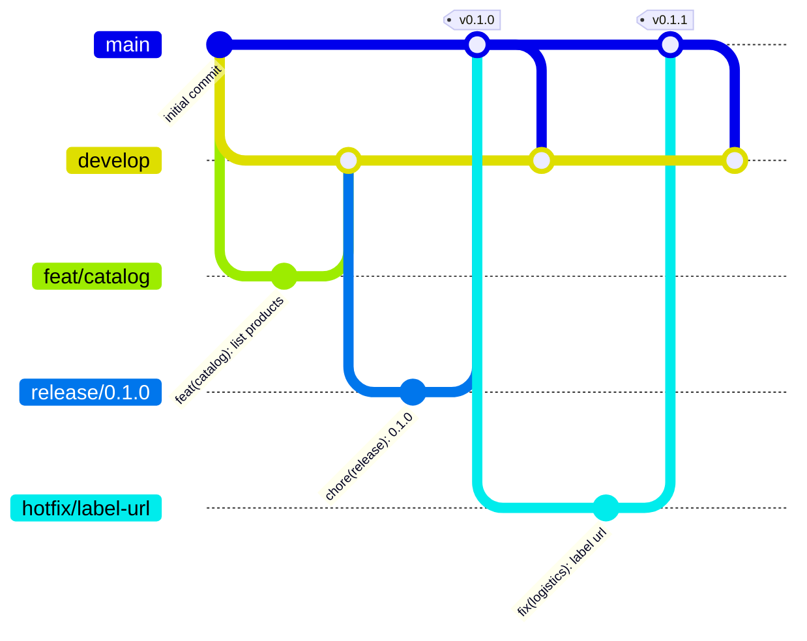

# Como contribuir

O projeto segue **Git Flow** com **Conventional Commits**. A regra de ouro é simples: o histórico precisa contar a evolução do sistema sem ruído, e nenhuma mudança entra sem passar pelo CI.

## Branches

| Branch | Para quê | Nasce de | Volta para |
|---|---|---|---|
| `main` | o que foi liberado; cada merge vira uma tag `vX.Y.Z` | — | — |
| `develop` | integração do que já está pronto | `main` | `main`, via `release/*` |
| `feat/<escopo>` | funcionalidade nova | `develop` | `develop` |
| `fix/<escopo>` | correção de algo que ainda não foi liberado | `develop` | `develop` |
| `chore/<escopo>` | infraestrutura, build, docs, dependências | `develop` | `develop` |
| `release/<x.y.z>` | estabilizar e fechar uma versão | `develop` | `main` e depois `develop` |
| `hotfix/<escopo>` | correção urgente do que já está na `main` | `main` | `main` e depois `develop` |

Nomes curtos, em inglês e em kebab-case: `feat/shipment-state-machine`, `fix/outbox-retry`, `chore/local-infra`.



## Commits

Conventional Commits, curtos, em inglês e no imperativo. Corpo só quando ajuda de verdade.

```text
feat(logistics): add carrier selection chain
fix(commerce): release stock when payment fails
chore: bump kafka to 3.9.2
test(shipping): cover failed delivery attempts
```

Tipos aceitos: `feat`, `fix`, `chore`, `docs`, `test`, `refactor`, `perf`, `ci`, `build`, `revert`.

## Pull requests

- `main` e `develop` são protegidas: tudo entra por PR.
- O título do PR segue Conventional Commits (o CI valida).
- O check `ci-ok` precisa estar verde para o merge.
- Usamos *merge commit* (equivalente ao `--no-ff` do Git Flow) para preservar a história de cada branch.
- A branch é apagada automaticamente depois do merge.

O workflow `pr-policy` garante as regras de origem e destino:

| Destino | Origens permitidas |
|---|---|
| `develop` | `feat/*`, `fix/*`, `chore/*`, `release/*`, `hotfix/*` e `main` (back-merge) |
| `main` | `release/x.y.z` e `hotfix/*` |

## Release

```bash
git switch develop && git pull
git switch -c release/0.2.0
# mover "Unreleased" para "0.2.0" no CHANGELOG.md e ajustar o que faltar
git commit -am "chore(release): 0.2.0"
gh pr create --base main --title "chore(release): 0.2.0"
```

Depois do merge na `main`:

```bash
git switch main && git pull
git tag -a v0.2.0 -m "v0.2.0" && git push origin v0.2.0   # dispara o workflow de release
gh pr create --base develop --head main --title "chore: back-merge v0.2.0"
```

## Hotfix

Mesmo fluxo da release, mas partindo da `main` e subindo só o *patch* (`v0.2.1`). Depois do merge, a `main` volta para a `develop` pelo back-merge.

## Definition of Done

- testes passando, lint e análise estática sem erros;
- documentação e diagramas atualizados quando a mudança mexe em arquitetura ou contratos;
- ADR registrado para decisões que alguém vai questionar daqui a seis meses;
- `CHANGELOG.md` atualizado na seção **Unreleased**.

As convenções de código estão em [`docs/engineering/conventions.md`](docs/engineering/conventions.md).
