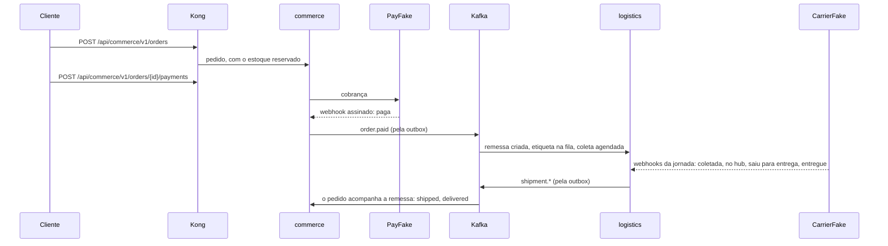

# chaos_playground

Passei cinco anos no Java e no Kotlin. Este é o laboratório onde reaprendo PHP moderno (Laravel, Lumen e Swoole) e Node.js, e onde treino system design e engenharia do caos. Em vez de exemplos soltos, montei um sistema inteiro para ter onde quebrar as coisas e medir o que acontece: a **Tucano**, um e-commerce fictício com entrega própria, a Tucano Express.

Tudo roda na minha máquina, num Docker Compose só, e cada decisão tem o porquê escrito em [`docs/`](docs/README.md).

## O que roda aqui

| Serviço | Stack | O que faz |
|---|---|---|
| [commerce](services/commerce/README.md) | Laravel 13, PHP 8.4 | pedidos, reserva de estoque, pagamento com circuit breaker e conciliação com o PSP |
| [logistics](services/logistics/README.md) | Laravel 13, PHP 8.4 | remessas com máquina de estados, etiqueta pela fila, jornada contada pelas transportadoras, conciliação com o histórico delas, alerta de jornadas paradas e página de rastreio |
| [catalog](services/catalog/README.md) | Lumen 11, PHP 8.3 | produtos com cache-aside, no papel de serviço legado |
| [tracking](services/tracking/README.md) | Swoole 6, PHP 8.4 | a base do tempo real da frota: HTTP e WebSocket num processo de longa duração |
| [bff](services/bff/README.md) | Node 24, Fastify | a porta da web |
| [partners-sim](services/partners-sim/README.md) | Node 24, Fastify | o mundo lá fora: o PayFake (o PSP) e a CarrierFake (as transportadoras), com caos sob comando |

Em volta deles: Kong na frente de tudo; Kafka com ZooKeeper entre os contextos; PostgreSQL e MySQL para escrever (ACID), MongoDB e DynamoDB para ler (BASE); Redis; Floci como AWS local (S3, SQS, DynamoDB e SES); Toxiproxy entre cada serviço e cada dependência, para o caos alcançar qualquer conexão; flagd para as feature flags; e Mailpit para os e-mails.

## Subindo

Numa máquina nova, o Ansible faz tudo: confere o disco e a memória, instala o Colima, o Docker e o que mais faltar, liga a VM e sobe a stack até os health checks passarem.

```bash
brew install ansible     # no Linux: pipx install --include-deps ansible
make setup
```

Com o Docker já pronto (uma VM de 4 CPUs e 4 GB basta), são dois comandos:

```bash
make doctor              # confere o disco do Mac, a memória e as CPUs da VM
make up                  # constrói o que falta, sobe e espera tudo ficar saudável
```

A primeira vez demora, porque as imagens do PHP compilam extensões. Depois, a stack sobe do zero em uns 20 segundos. Deixe pelo menos 10 GB livres no disco: no Mac, o disco da VM cresce dentro dele, e aprendi do jeito difícil o que acontece quando ele enche (o [setup com Ansible](infra/ansible/README.md) conta a história).

## Um pedido do começo ao fim



Para ver acontecer:

```bash
ORDER=$(curl -s -X POST localhost:8000/api/commerce/v1/orders \
  -H 'Content-Type: application/json' -H "Idempotency-Key: $(uuidgen)" \
  -d '{
    "customer": {"id": "0199a2b4-6f1c-7a3e-9b2d-5c8e1f4a7d20", "name": "Ana Souza", "email": "ana@example.com"},
    "shippingAddress": {
      "thoroughfare": {"type": "Rua", "name": "da Bahia"}, "number": "1200", "complement": "apto 42",
      "divisions": [
        {"kind": "state", "code": "MG", "name": "Minas Gerais"},
        {"kind": "municipality", "code": "3106200", "name": "Belo Horizonte"},
        {"kind": "neighborhood", "name": "Centro"}
      ],
      "postalCode": "30160-011"
    },
    "items": [{"sku": "BOOK-DDD-001", "quantity": 1}]
  }' | jq -r .orderId)

curl -s -X POST "localhost:8000/api/commerce/v1/orders/$ORDER/payments" \
  -H 'Content-Type: application/json' -H "Idempotency-Key: $(uuidgen)" -d '{"cardToken": "tok_visa"}'

for i in $(seq 20); do curl -s "localhost:8000/api/commerce/v1/orders/$ORDER" | jq -r .status; sleep 3; done
```

O status passa por `placed`, `paid`, `shipped` e `delivered` em menos de um minuto. Enquanto isso, `make consume t=logistics.shipments.v2` mostra a remessa andando pelo Kafka, e o endereço vira `Rua da Bahia, 1200` porque logradouro, número e divisões territoriais são peças separadas ([ADR 0020](docs/adr/0020-address-by-thoroughfare-and-divisions.md)).

## Os laboratórios

Cada um provoca uma falha de propósito, mede o que acontece e conta o que mudou no código por causa disso.

| Laboratório | O que eu quebro |
|---|---|
| [Overselling](docs/labs/overselling.md) | cinco estratégias de reserva de estoque disputando a mesma unidade |
| [Circuit breaker](docs/labs/circuit-breaker.md) | o PSP fica lento, e o checkout precisa continuar respondendo |
| [Conciliação de pagamentos](docs/labs/payment-reconciliation.md) | webhooks descartados e cobranças que somem no PSP |
| [Banco fora do ar](docs/labs/database-outage.md) | o PostgreSQL cai com consumers e o relay da outbox no meio do trabalho |
| [Fila de etiquetas](docs/labs/label-queue.md) | o bucket falha, e o job tenta de novo até desistir com dignidade |
| [Webhooks perdidos](docs/labs/lost-carrier-events.md) | a transportadora derruba avisos, e as remessas travam no meio da jornada |

As ferramentas do caos são o Toxiproxy (`make proxies`) para latência e cortes de rede, as flags `chaos.*` (`make flag key=... variant=...`) para falhas dentro dos serviços, e a API `/_chaos` do partners-sim para o PSP e as transportadoras.

## O que pratico aqui

- **Arquitetura**: DDD com um serviço por subdomínio, hexágono com package-by-feature, casos de uso de Cockburn com ports `For...`, e máquinas de estados com enum e guards, sem booleanos soltos.
- **Mensageria**: outbox e inbox, CloudEvents com contratos versionados, retry com backoff e jitter, DLQ só para o que é defeito, e evolução de contrato por tópico novo.
- **Dados**: escrita ACID no SQL e leitura BASE no NoSQL, UUIDv7 para identidade e Snowflake para números que as pessoas leem, `SKIP LOCKED` para dividir trabalho entre workers.
- **Resiliência**: timeouts em toda chamada, circuit breaker, idempotência de ponta a ponta, conciliação com a fonte de verdade e alerta para o que nenhuma tentativa resolve.
- **Operação**: configuração só por variável de ambiente ([Twelve-Factor](docs/operations/configuration.md)), feature flags por ambiente com OpenFeature, logs JSON com correlation id, e setup reproduzível com Ansible.
- **Engenharia**: Git Flow, Conventional Commits, SemVer, C4 e Mermaid, ADRs, e fitness functions que quebram o CI quando a documentação e o código se desencontram.

## Onde está cada coisa

| Pasta | O que tem |
|---|---|
| `services/` | os seis serviços, cada um com o seu README |
| `packages/php/` | o que os serviços PHP dividem: shared kernel (Money, Address, Snowflake), mensageria (outbox, inbox, retry), feature flags e read models |
| `contracts/` | os eventos em JSON Schema e as APIs dos parceiros em OpenAPI |
| `infra/` | a configuração de cada peça de infraestrutura, e o setup com Ansible |
| `docs/` | arquitetura, ADRs, casos de uso, laboratórios e operação |
| `scripts/` | o `doctor`, a checagem da configuração e os scripts do CI |

## Comandos do dia a dia

| Comando | O que faz |
|---|---|
| `make help` | lista todos os comandos |
| `make up` e `make down` | sobe e desce a stack, mantendo os dados |
| `make logs s=logistics` | segue os logs de um serviço |
| `make check s=commerce` | lint, análise estática, arquitetura e testes de um serviço, contra a stack |
| `make consume t=commerce.orders.v2` | lê um tópico do começo, com chave e headers |
| `make psql db=logistics` | abre o psql com o role do serviço |
| `make flags` | mostra o valor de cada feature flag |
| `make stalled` | roda agora a vigia das jornadas paradas |
| `make config-check` | confere que compose, código e a referência de configuração concordam |
| `make trim` | devolve ao Mac o espaço liberado dentro da VM do Colima |

Os endereços de tudo (Kong, bancos, Kafka UI, Mailpit, Toxiproxy) estão no [guia do ambiente local](docs/operations/local-environment.md).

## Por onde começar a ler

A [documentação](docs/README.md) tem uma ordem de leitura, de cima para baixo: convenções, arquitetura, operação, laboratórios, casos de uso e decisões. O [CONTRIBUTING](CONTRIBUTING.md) explica o fluxo de Git, e o [CHANGELOG](CHANGELOG.md) conta o que mudou em cada versão.

Ainda em construção: a web em React e o tempo real da frota vêm depois. O andamento de cada parte está na [tabela da arquitetura](docs/architecture/README.md).
