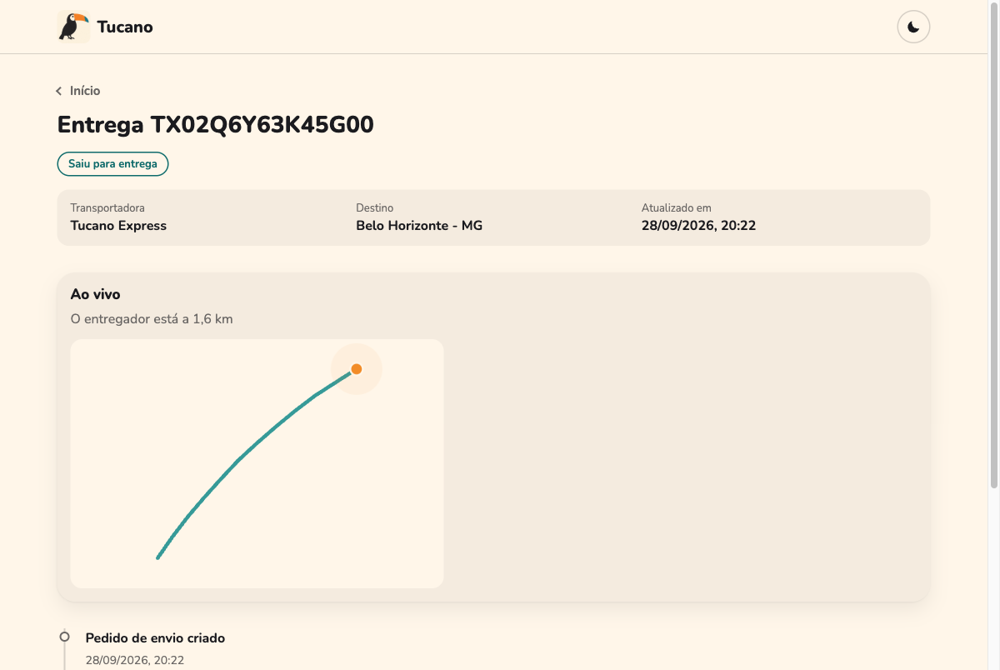
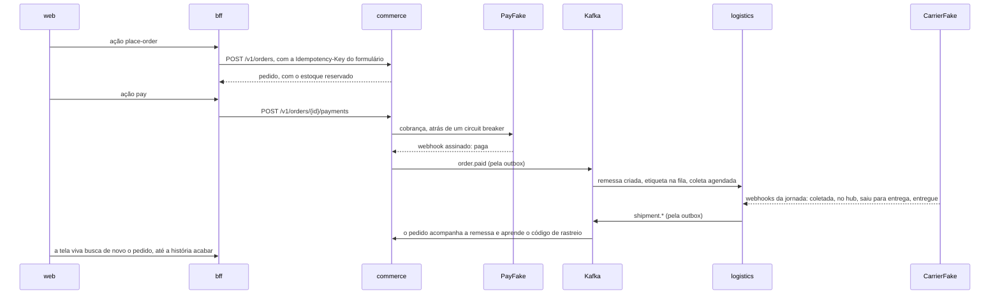

<p align="center">
  
</p>

# Tucano — laboratório de engenharia do caos

[](https://github.com/flaviotinococoutinho/chaos_playground/actions/workflows/ci.yml)
[](https://github.com/flaviotinococoutinho/chaos_playground/releases)
[](LICENSE)

**Este projeto é um piloto de estudo e experimentação em sistemas distribuídos.** A ideia é calibrar o conhecimento com o comportamento observado: ganhar familiaridade com as versões das tecnologias utilizadas, explorar seus limites e entender o que acontece quando elas trabalham em conjunto. A **Tucano**, um e-commerce fictício com entrega própria, a Tucano Express, dá um contexto concreto a esse aprendizado: comprar, pagar e acompanhar uma entrega enquanto partes do sistema ficam lentas ou indisponíveis.

Passei um tempo usando mais stacks como Java, Kotlin e seus frameworks. Este projeto é também meu reencontro com o PHP e o Node: recuperar o tato, conhecer a evolução dessas tecnologias e confrontar expectativas com experimentos. Quem chega pode usar o mesmo laboratório para estudar os runtimes e frameworks, sua integração com Kafka, Kong, bancos, caches e outras ferramentas, e as consequências de cada configuração.

O objetivo é observar **regras funcionais**, como preservar um pedido e evitar efeitos duplicados, junto de **requisitos não funcionais**, como latência, disponibilidade, consistência e recuperação. É um ambiente de aprendizado com parceiros simulados; seus resultados precisam ser interpretados dentro da versão, da carga e dos recursos usados em cada execução.

## Em três perguntas

### O que isso faz?

Você abre a loja, escolhe um livro, paga com um cartão de teste e acompanha a entrega até a porta de casa, em menos de um minuto, sem recarregar a página. Quando a encomenda sai com a frota própria, dá para ver o entregador chegando, ao vivo. Por trás disso, seis serviços em PHP e Node conversam por Kafka, um PSP e três transportadoras simulados respondem por webhook, e o Toxiproxy fica no meio de cada fio, pronto para cortar qualquer um deles. E os experimentos de caos rodam com um comando e dizem, com números, se o sistema aguentou.

### Por onde eu começo?

| Se você quer | Comece por |
|---|---|
| ver funcionando | [subir a stack](#subindo) e abrir `http://localhost:8000`: dois comandos |
| entender as decisões | [como eu penso esse tipo de sistema](docs/guia/00-como-eu-penso.md), o capítulo 0 do guia |
| ver o caos | `make experiment e=commerce-database-out`, o experimento que pegou um bug enquanto eu escrevia a documentação |
| comparar versões e configurações | [o que investigar](#o-que-investigar-nas-tecnologias-e-no-conjunto) e [como comparar](#como-comparar-sem-perder-o-contexto) |
| conversar sobre o projeto | o [roteiro de apresentação](docs/guia/08-como-apresentar.md), do pitch de um minuto à conversa técnica longa |

### Por que foi feito assim?

Porque cada escolha tem um porquê escrito, com o ganho e o custo, num [ADR](docs/adr/README.md). Três ideias atravessam tudo:

- **Nada de bala de prata.** Quando uma decisão parece de graça, eu ainda não entendi o que ela cobra.
- **Integridade conceitual.** O mesmo problema tem a mesma solução em todo lugar: um jeito de errar (RFC 9457), um jeito de publicar evento (outbox), um jeito de chamar outro contexto (port e adapter).
- **O que importa, um computador confere.** Direção das dependências, fronteiras entre pacotes, contratos, configuração, onde um dado pessoal pode aparecer e até as hipóteses de resiliência: cada regra é um teste ou um experimento que quebra quando alguém a quebra.

O [guia](docs/guia/README.md) conta a história inteira como um passeio, em capítulos que cabem numa leitura de café.

## Da teoria do caos à engenharia do caos

A **teoria do caos** estuda, entre outros fenômenos, sistemas dinâmicos determinísticos não lineares sensíveis às condições iniciais: pequenas diferenças no ponto de partida podem produzir trajetórias muito diferentes ao longo do tempo. O trabalho de [Edward Lorenz, de 1963](#referências-para-o-estudo), é uma referência fundamental. Essa ideia ajuda a formular perguntas sobre interações e efeitos desproporcionais, mas uma falha em cascata no software, por si só, não demonstra caos no sentido matemático.

A prática aplicada aqui é a **engenharia do caos**: formular uma hipótese sobre o comportamento do sistema, introduzir uma perturbação controlada e procurar evidências que contrariem a hipótese. A pergunta precisa dizer algo verificável, por exemplo: “se o banco do commerce cair, o checkout responde com indisponibilidade dentro do prazo e o catálogo continua acessível?”. Os [Principles of Chaos Engineering](https://principlesofchaos.org/) orientam esse método.

No laboratório, o interesse está também nas interações: um timeout maior pode manter conexões ocupadas por mais tempo; retries em várias camadas podem multiplicar chamadas; um consumidor bloqueado pode atrasar uma projeção usada pela interface. São situações para investigar com medições, como discutem os capítulos sobre [sobrecarga](https://sre.google/sre-book/handling-overload/) e [falhas em cascata](https://sre.google/sre-book/addressing-cascading-failures/) do Google SRE.

### O que investigar nas tecnologias e no conjunto

| Dimensão | Perguntas para explorar |
|---|---|
| Versões de runtimes, frameworks e bibliotecas | O que mudou no comportamento, nas APIs, nos padrões de configuração e no uso de recursos entre duas versões? |
| Limites de cada componente | Em qual carga ou duração da falha aparecem saturação, filas, timeouts ou crescimento de memória? |
| Integração entre ferramentas | Como os prazos do gateway, do BFF, dos serviços e dos SDKs se combinam? Onde uma tentativa pode virar várias? |
| Dados e mensageria | O que acontece com pedidos, eventos e projeções durante uma queda e depois da retomada? Há atraso, perda ou duplicação de efeitos? |
| Resiliência e experiência | Circuit breakers, reconciliação e fallbacks preservam quais jornadas? O cliente recebe uma resposta útil dentro do prazo? |
| Alternativas e evolução | Uma nova configuração, versão ou ferramenta melhora qual medida, e qual custo ou complexidade acrescenta? |

Essas perguntas orientam o estudo; a cobertura já implementada está nos [experimentos](chaos/README.md) e no [mapa de modos de falha](docs/architecture/failure-modes.md). A stack atual é um ponto de partida: não há uma matriz automática de benchmarks entre todas as versões ou ferramentas.

### Como comparar sem perder o contexto

1. **Registre o ponto de partida:** commit, versões efetivamente instaladas, imagens e seus digests, configuração, CPU, memória, dados e carga. O [`compose.yaml`](compose.yaml), os Dockerfiles e os lockfiles dos serviços ajudam a localizar as dependências.
2. **Defina hipótese e medida:** qual jornada deve continuar funcionando, qual degradação é aceitável e quais limites de tempo, erros ou integridade serão avaliados. Comece pela stack saudável.
3. **Altere uma variável por vez:** uma versão, um timeout ou uma falha. Repita com a mesma carga e recursos; explore combinações depois, identificando os fatores que mudaram.
4. **Observe a falha e a recuperação:** registre respostas, latência, filas e efeitos nos dados conforme a hipótese. Nos experimentos existentes, preserve os diários e logs de `chaos/results/` antes da próxima execução; planeje a reversão e confira se a stack voltou ao estado esperado.
5. **Escreva a conclusão com seu alcance:** compare o observado com o esperado, registre a decisão e repita o cenário depois da correção. Diferencie hipótese, resultado medido e limitação do experimento.

Uma execução local bem-sucedida aumenta a confiança naquele cenário. Capacidade máxima, comportamento com várias réplicas e equivalência com serviços reais exigem experimentos próprios. Comparar duas versões com cargas ou recursos diferentes também não permite atribuir a diferença somente à versão.

## A loja

| | |
|---|---|
|  |  |
|  |  |
|  | Enquanto a encomenda sai com a frota própria, a página de rastreio mostra o entregador chegando: o aparelho dele informa a posição a cada segundo, e o tracking a empurra por WebSocket. Sem o WebSocket, a página avisa e segue se atualizando sozinha. |

A tela do pedido se atualiza sozinha enquanto algo está para acontecer: "Confirmando o pagamento", "Pagamento aprovado", "A caminho", "Entregue". Com o cartão de teste recusado, ela termina em "Cancelado" e diz por quê.

## Caos com hipótese

Os [laboratórios](#os-laboratórios) contam o que eu quebrei e o que mudou no código. Os [experimentos](chaos/README.md) repetem as falhas mais importantes sozinhos, no formato do Chaos Toolkit: a hipótese é conferida antes da falha e de novo com ela ativa, e os rollbacks rodam sempre.

| Experimento | A falha | O que precisa continuar verdade |
|---|---|---|
| `psp-slow` | 3 s de latência no PSP | pagar responde em até 1 s, aceito ou recusado com `Retry-After` |
| `lost-psp-webhooks` | o PSP cobra, mas nenhum webhook sai | todo pagamento chega a um desfecho, pela conciliação |
| `commerce-cut-from-the-web` | o BFF perde o commerce | só as telas do commerce recusam, e o catálogo continua abrindo |
| `catalog-slow-for-the-web` | 7 s de latência no catálogo | o BFF desiste em 5 s e diz quando tentar de novo |
| `commerce-database-out` | o commerce perde o banco | fechar um pedido recusa na hora, com `503` e `Retry-After` |
| `tracking-without-its-database` | a logística perde o banco | o rastreio continua respondendo, pela cópia no DynamoDB |
| `tracking-without-its-copy` | a cópia do rastreio no DynamoDB some | a página recusa na hora, com `503` e `Retry-After`, em vez de pendurar |
| `tracking-without-the-timeline` | o MongoDB da linha do tempo interna some | a página pública segue a encomenda até entregue, com todos os passos |
| `kafka-out-and-back` | o Kafka some por 30 s, com um pedido pago no meio | a entrega nasce e chega a entregue quando o Kafka volta |

O `commerce-database-out` tem história. Eu ia escrever no guia que, sem o banco, a loja recusa um pedido com honestidade. Medi antes de escrever, e ela respondia um `500` que não dizia nada. A frase virou o experimento, o experimento pegou a fraqueza na primeira execução, e a correção virou o [ADR 0026](docs/adr/0026-a-database-outage-is-unavailability.md). O [mapa de modos de falha](docs/architecture/failure-modes.md) junta tudo isso numa tabela, com a prova de cada reação e a lista do que ainda não tem prova.

## O que roda aqui

| Serviço | Stack | O que faz |
|---|---|---|
| [web](services/web/README.md) | React 19, TypeScript, Vite | a loja: um intérprete das telas do BFF, com tela viva, o entregador ao vivo quando a tela oferece, acessibilidade e tema claro e escuro |
| [bff](services/bff/README.md) | Node 24, Fastify 5 | a porta da web: cada tela em Siren, com as palavras em português, prazo e 503 com `Retry-After` por serviço |
| [commerce](services/commerce/README.md) | Laravel 13, PHP 8.4 | pedidos, reserva de estoque, pagamento com circuit breaker e conciliação com o PSP |
| [logistics](services/logistics/README.md) | Laravel 13, PHP 8.4 | remessas com máquina de estados, etiqueta pela fila, jornada contada pelas transportadoras, conciliação com o histórico delas, alerta de jornadas paradas e página de rastreio |
| [catalog](services/catalog/README.md) | Lumen 11, PHP 8.3 | produtos com cache-aside, no papel de serviço legado |
| [tracking](services/tracking/README.md) | Swoole 6, PHP 8.4 | a entrega ao vivo: recebe a posição assinada do aparelho de cada entregador da frota própria e a empurra, por WebSocket, para quem acompanha aquele código, num processo de longa duração |
| [partners-sim](services/partners-sim/README.md) | Node 24, Fastify 5 | o mundo lá fora: o PayFake (o PSP), a CarrierFake (as transportadoras) e o aparelho de cada entregador da frota própria, com caos sob comando |

Em volta deles: Kong na frente de tudo; Kafka com ZooKeeper entre os contextos; PostgreSQL e MySQL para escrever (ACID), MongoDB e DynamoDB para ler (BASE); Redis; Floci como AWS local (S3, SQS e DynamoDB); Toxiproxy entre cada serviço e cada dependência; flagd para as feature flags; e Mailpit para os e-mails.

## Subindo

Numa máquina nova, o Ansible faz tudo: confere o disco e a memória, instala o Colima, o Docker e o que mais faltar, liga a VM e sobe a stack até os health checks passarem.

```bash
brew install ansible     # no Linux: pipx install --include-deps ansible
make setup
```

Com o Docker já pronto (uma VM de 4 CPUs e 4 GB basta), são dois comandos:

```bash
make doctor              # confere o disco do Mac, a memória e as CPUs da VM
make up                  # constrói o que falta, sobe e espera tudo ficar saudável
open http://localhost:8000
```

A primeira vez demora, porque as imagens do PHP compilam extensões. Depois, a stack sobe do zero em uns 20 segundos. Deixe pelo menos 10 GB livres no disco: no Mac, o disco da VM cresce dentro dele, e aprendi do jeito difícil o que acontece quando ele enche (o [setup com Ansible](infra/ansible/README.md) conta a história).

## Um pedido do começo ao fim



<details>
<summary>O mesmo pedido pela API, sem a web</summary>

```bash
ORDER=$(curl -s -X POST localhost:8000/api/commerce/v1/orders \
  -H 'Content-Type: application/json' -H "Idempotency-Key: $(uuidgen)" \
  -d '{
    "customer": {"id": "0199a2b4-6f1c-7a3e-9b2d-5c8e1f4a7d20", "name": "Ana Souza", "email": "ana@example.com"},
    "shippingAddress": {
      "thoroughfare": {"type": "Rua", "name": "da Bahia"}, "number": "1200", "complement": "apto 42",
      "divisions": [
        {"kind": "state", "code": "MG", "name": "Minas Gerais"},
        {"kind": "municipality", "code": "3106200", "name": "Belo Horizonte"},
        {"kind": "neighborhood", "name": "Centro"}
      ],
      "postalCode": "30160-011"
    },
    "items": [{"sku": "BOOK-DDD-001", "quantity": 1}]
  }' | jq -r .orderId)

curl -s -X POST "localhost:8000/api/commerce/v1/orders/$ORDER/payments" \
  -H 'Content-Type: application/json' -H "Idempotency-Key: $(uuidgen)" -d '{"cardToken": "tok_visa"}'

for i in $(seq 20); do curl -s "localhost:8000/api/commerce/v1/orders/$ORDER" | jq -r '.status + " " + (.trackingCode // "")'; sleep 3; done
```

O status passa por `pending_payment`, `paid`, `shipped` e `delivered` em menos de um minuto, e o código de rastreio aparece na coleta. Enquanto isso, `make consume t=logistics.shipments.v2` mostra a remessa andando pelo Kafka.

</details>

## Os laboratórios

Cada um provoca uma falha de propósito, mede o que acontece e conta o que mudou no código por causa disso.

| Laboratório | O que eu quebro |
|---|---|
| [Overselling](docs/labs/overselling.md) | cinco estratégias de reserva de estoque disputando a mesma unidade |
| [Circuit breaker](docs/labs/circuit-breaker.md) | o PSP fica lento, e o checkout precisa continuar respondendo |
| [Conciliação de pagamentos](docs/labs/payment-reconciliation.md) | webhooks descartados e cobranças que somem no PSP |
| [Banco fora do ar](docs/labs/database-outage.md) | o PostgreSQL cai com consumers e o relay da outbox no meio do trabalho |
| [Fila de etiquetas](docs/labs/label-queue.md) | o bucket falha, e o job tenta de novo até desistir com dignidade |
| [Webhooks perdidos](docs/labs/lost-carrier-events.md) | a transportadora derruba avisos, e as remessas travam no meio da jornada |

As ferramentas do caos são o Toxiproxy (`make proxies`) para latência e cortes de rede, as flags `chaos.*` (`make flag key=... variant=...`) para falhas dentro dos serviços, e a API `/_chaos` do partners-sim para o PSP e as transportadoras.

## O guia

0. [Como eu penso esse tipo de sistema](docs/guia/00-como-eu-penso.md): informação, normalização, regra no banco, pureza nos atributos, abstração, escala e entropia
1. [A Tucano e a jornada de um pedido](docs/guia/01-a-tucano.md)
2. [Stacks e ferramentas transversais](docs/guia/02-stacks.md)
3. [A natureza da informação](docs/guia/03-informacao.md), com o CAP escolhido operação por operação
4. [O playground do caos](docs/guia/04-caos.md)
5. [Abstrações que seguram a entropia](docs/guia/05-abstracoes.md)
6. [Conceitos, ganhos e custos](docs/guia/06-conceitos.md), de Brooks, Parnas e Dijkstra a Kleppmann, Vernon, Greg Young e Brewer
7. [Padrões e RFCs](docs/guia/07-padroes.md)
8. [Como apresentar o projeto](docs/guia/08-como-apresentar.md)

Depois do guia, a [documentação](docs/README.md) tem a referência: convenções, arquitetura, operação, caos, casos de uso e decisões. O [CONTRIBUTING](CONTRIBUTING.md) explica o fluxo de Git, e o [CHANGELOG](CHANGELOG.md) conta o que mudou em cada versão.

## Onde está cada coisa

| Pasta | O que tem |
|---|---|
| `services/` | os seis serviços e a web, cada um com o seu README |
| `packages/php/` | o que os serviços PHP dividem: shared kernel (Money, Address, Snowflake, Sensitive), mensageria (outbox, inbox, retry), feature flags e read models |
| `contracts/` | os eventos em JSON Schema, as telas do BFF em Siren, os tipos de problema, e as APIs dos parceiros em OpenAPI |
| `infra/` | a configuração de cada peça de infraestrutura, e o setup com Ansible |
| `docs/` | o guia, a arquitetura, os ADRs, os casos de uso, os laboratórios e a operação |
| `scripts/` | o `doctor`, a checagem da configuração e os scripts do CI |

## Comandos do dia a dia

| Comando | O que faz |
|---|---|
| `make help` | lista todos os comandos |
| `make up` e `make down` | sobe e desce a stack, mantendo os dados |
| `make logs s=logistics` | segue os logs de um serviço |
| `make check s=commerce` | lint, análise estática, arquitetura e testes de um serviço, contra a stack |
| `make consume t=commerce.orders.v2` | lê um tópico do começo, com chave e headers |
| `make psql db=logistics` | abre o psql com o role do serviço |
| `make flags` | mostra o valor de cada feature flag |
| `make stalled` | roda agora a vigia das jornadas paradas |
| `make experiments` | lista os experimentos de caos, cada um com a hipótese que defende |
| `make experiment e=psp-slow` | roda um experimento contra a stack; os rollbacks rodam sempre |
| `make web-art` | gera as imagens da web a partir dos originais em `docs/assets` |
| `make config-check` | confere que compose, código e a referência de configuração concordam |
| `make trim` | devolve ao Mac o espaço liberado dentro da VM do Colima |

Os endereços de tudo (Kong, bancos, Kafka UI, Mailpit, Toxiproxy) estão no [guia do ambiente local](docs/operations/local-environment.md). Ainda em construção: o despacho da frota, que escolheria o entregador mais perto de cada remessa. O andamento de cada parte está na [tabela da arquitetura](docs/architecture/README.md).

## Para onde ele vai

- **Os próximos experimentos**, na ordem do [mapa de modos de falha](docs/architecture/failure-modes.md#o-que-ainda-não-tem-prova): o Redis junto com o PSP lento, a entrega ao vivo sem o tracking ou sem o Redis, e o BFF sem a logistics.
- **O despacho da frota** (UC-TRK-02): achar o entregador disponível mais perto de cada remessa, com o Redis GEO que o ADR 0013 previu. Hoje a posição ao vivo segue o código de rastreio, porque ninguém designa um entregador.
- **O que muda num sistema de verdade**, e quando: OpenTelemetry no lugar do correlation id caseiro, captura de mudanças (CDC) no lugar do relay, login e sessão no lugar do cliente convidado. A tabela está no [capítulo 0](docs/guia/00-como-eu-penso.md#soluções-para-o-momento).

## Referências para o estudo

| Referência | Como contribui para o laboratório |
|---|---|
| Edward N. Lorenz, **Deterministic Nonperiodic Flow** (1963), *Journal of the Atmospheric Sciences*, 20(2), 130–141 — [artigo](https://journals.ametsoc.org/view/journals/atsc/20/2/1520-0469_1963_020_0130_dnf_2_0_co_2.xml) | Fundamento para entender sensibilidade às condições iniciais e os limites de previsão em sistemas determinísticos não lineares. |
| **[Principles of Chaos Engineering](https://principlesofchaos.org/)** | Hipóteses mensuráveis, perturbações representativas e controle do alcance dos experimentos. |
| Google, **Site Reliability Engineering** — [Handling Overload](https://sre.google/sre-book/handling-overload/) e [Addressing Cascading Failures](https://sre.google/sre-book/addressing-cascading-failures/) | Sobrecarga, retries e propagação de falhas: referências para investigar o comportamento do conjunto. |
| **Chaos Toolkit** — [conceitos](https://chaostoolkit.org/reference/concepts/) e [fluxo de execução](https://chaostoolkit.org/reference/tutorials/run-flow/) | Vocabulário e execução dos experimentos: hipótese de estado estável, sondas, ações e rollbacks. |

As referências dão o fundamento; os [ADRs](docs/adr/README.md), os [laboratórios](docs/labs) e os [experimentos](chaos/README.md) mostram como as ideias foram aplicadas aqui e quais evidências já existem.
