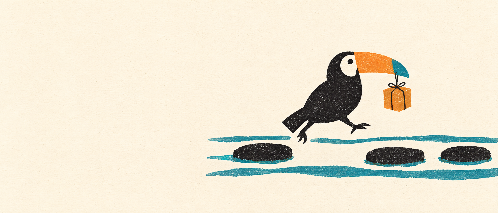
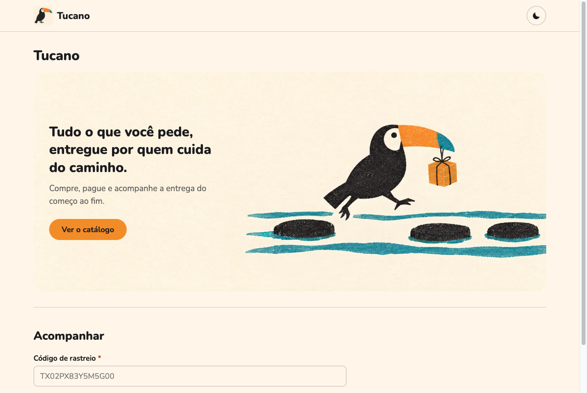
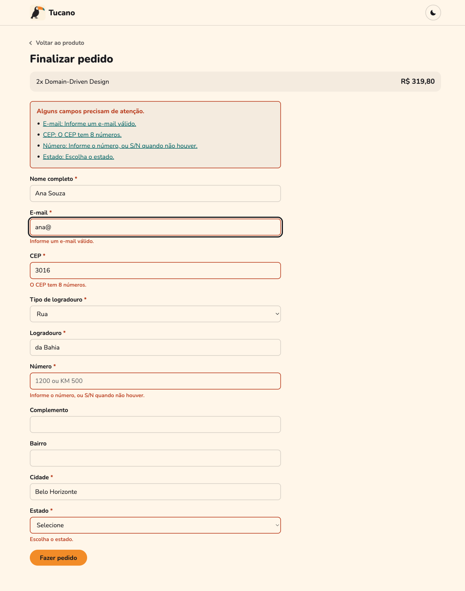
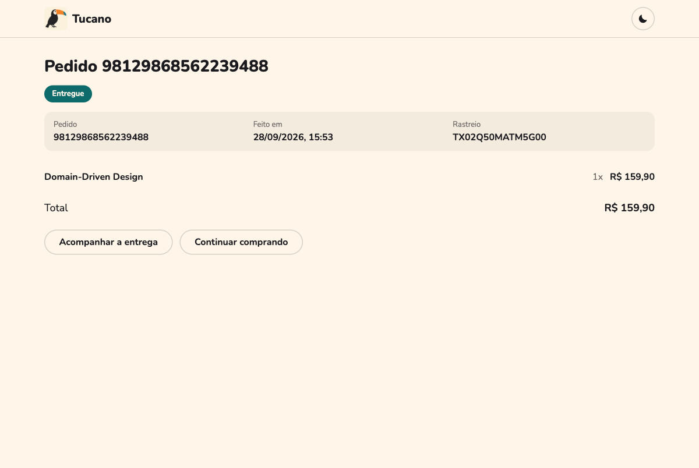
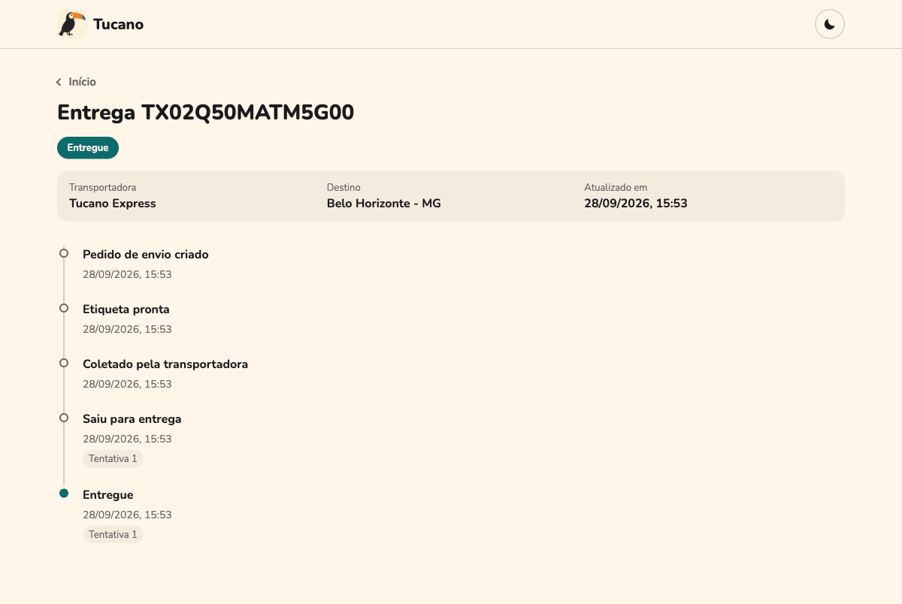
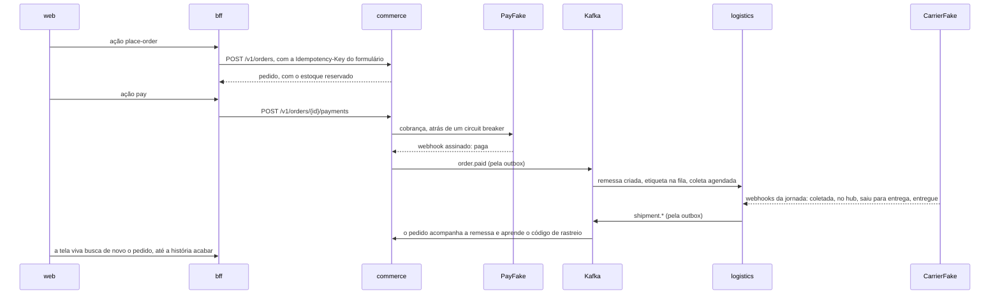

<p align="center">
  
</p>

# chaos_playground

Passei cinco anos no Java e no Kotlin. Este é o laboratório onde reaprendo PHP moderno (Laravel, Lumen e Swoole) e Node.js, e onde treino system design e engenharia do caos. Em vez de exemplos soltos, montei um sistema inteiro para ter onde quebrar as coisas e medir o que acontece: a **Tucano**, um e-commerce fictício com entrega própria, a Tucano Express.

O projeto calibra e relembra stacks. Cada linguagem está onde o trabalho dela faz mais sentido, cada ferramenta entrou porque um problema pedia, e cada decisão tem o porquê escrito, com o ganho e o custo. Nada aqui é bala de prata.

## Por que olhar este projeto

- **Um sistema de verdade, não um tutorial.** Seis serviços e uma web num Docker Compose só, conversando por Kafka com outbox e inbox, com PostgreSQL para escrever e MongoDB e DynamoDB para ler. Um pedido atravessa estoque, pagamento com PSP, etiqueta, coleta, hubs e a porta de casa.
- **Caos com número.** O Toxiproxy fica entre cada serviço e cada dependência, os parceiros são simulados e aceitam comandos de falha, e [seis laboratórios](docs/guia/04-caos.md) contam o que eu quebrei, o que medi e o que mudou no código por causa disso.
- **A web é um intérprete.** O BFF manda cada tela em hipermídia (Siren), com os próximos passos dentro dela, e a web só desenha e segue. O fluxo inteiro mora no servidor ([ADR 0023](docs/adr/0023-server-driven-ui-with-siren.md)).
- **Integridade conceitual cobrada pelo CI.** Direção das dependências, fronteiras entre pacotes, casos de uso documentados, configuração, contratos de eventos e de telas, e até onde um dado pessoal pode aparecer: cada regra é um teste que quebra o build ([abstrações](docs/guia/05-abstracoes.md)).
- **Padrões antes de invenção.** RFC 9457 para erro, 9110 para status, 7240 para preferência, 8288 para links, 3339 para tempo, o draft de `Idempotency-Key`, CloudEvents, JSON Schema, WCAG 2.2, LGPD e PCI DSS ([padrões](docs/guia/07-padroes.md)).

## A loja

| | |
|---|---|
|  |  |
|  |  |

A tela do pedido se atualiza sozinha enquanto algo está para acontecer: "Confirmando o pagamento", "Pagamento aprovado", "A caminho", "Entregue". Com o cartão de teste recusado, ela termina em "Cancelado" e diz por quê.

## O que roda aqui

| Serviço | Stack | O que faz |
|---|---|---|
| [web](services/web/README.md) | React 19, TypeScript, Vite | a loja: um intérprete das telas do BFF, com tela viva, acessibilidade e tema claro e escuro |
| [bff](services/bff/README.md) | Node 24, Fastify 5 | a porta da web: cada tela em Siren, com as palavras em português, prazo e 503 com `Retry-After` por serviço |
| [commerce](services/commerce/README.md) | Laravel 13, PHP 8.4 | pedidos, reserva de estoque, pagamento com circuit breaker e conciliação com o PSP |
| [logistics](services/logistics/README.md) | Laravel 13, PHP 8.4 | remessas com máquina de estados, etiqueta pela fila, jornada contada pelas transportadoras, conciliação com o histórico delas, alerta de jornadas paradas e página de rastreio |
| [catalog](services/catalog/README.md) | Lumen 11, PHP 8.3 | produtos com cache-aside, no papel de serviço legado |
| [tracking](services/tracking/README.md) | Swoole 6, PHP 8.4 | a base do tempo real da frota: HTTP e WebSocket num processo de longa duração |
| [partners-sim](services/partners-sim/README.md) | Node 24, Fastify 5 | o mundo lá fora: o PayFake (o PSP) e a CarrierFake (as transportadoras), com caos sob comando |

Em volta deles: Kong na frente de tudo; Kafka com ZooKeeper entre os contextos; PostgreSQL e MySQL para escrever (ACID), MongoDB e DynamoDB para ler (BASE); Redis; Floci como AWS local (S3, SQS e DynamoDB); Toxiproxy entre cada serviço e cada dependência; flagd para as feature flags; e Mailpit para os e-mails.

## Subindo

Numa máquina nova, o Ansible faz tudo: confere o disco e a memória, instala o Colima, o Docker e o que mais faltar, liga a VM e sobe a stack até os health checks passarem.

```bash
brew install ansible     # no Linux: pipx install --include-deps ansible
make setup
```

Com o Docker já pronto (uma VM de 4 CPUs e 4 GB basta), são dois comandos:

```bash
make doctor              # confere o disco do Mac, a memória e as CPUs da VM
make up                  # constrói o que falta, sobe e espera tudo ficar saudável
open http://localhost:8000
```

A primeira vez demora, porque as imagens do PHP compilam extensões. Depois, a stack sobe do zero em uns 20 segundos. Deixe pelo menos 10 GB livres no disco: no Mac, o disco da VM cresce dentro dele, e aprendi do jeito difícil o que acontece quando ele enche (o [setup com Ansible](infra/ansible/README.md) conta a história).

## Um pedido do começo ao fim



Para ver pela API, sem a web:

```bash
ORDER=$(curl -s -X POST localhost:8000/api/commerce/v1/orders \
  -H 'Content-Type: application/json' -H "Idempotency-Key: $(uuidgen)" \
  -d '{
    "customer": {"id": "0199a2b4-6f1c-7a3e-9b2d-5c8e1f4a7d20", "name": "Ana Souza", "email": "ana@example.com"},
    "shippingAddress": {
      "thoroughfare": {"type": "Rua", "name": "da Bahia"}, "number": "1200", "complement": "apto 42",
      "divisions": [
        {"kind": "state", "code": "MG", "name": "Minas Gerais"},
        {"kind": "municipality", "code": "3106200", "name": "Belo Horizonte"},
        {"kind": "neighborhood", "name": "Centro"}
      ],
      "postalCode": "30160-011"
    },
    "items": [{"sku": "BOOK-DDD-001", "quantity": 1}]
  }' | jq -r .orderId)

curl -s -X POST "localhost:8000/api/commerce/v1/orders/$ORDER/payments" \
  -H 'Content-Type: application/json' -H "Idempotency-Key: $(uuidgen)" -d '{"cardToken": "tok_visa"}'

for i in $(seq 20); do curl -s "localhost:8000/api/commerce/v1/orders/$ORDER" | jq -r '.status + " " + (.trackingCode // "")'; sleep 3; done
```

O status passa por `pending_payment`, `paid`, `shipped` e `delivered` em menos de um minuto, e o código de rastreio aparece na coleta. Enquanto isso, `make consume t=logistics.shipments.v2` mostra a remessa andando pelo Kafka.

## Os laboratórios

Cada um provoca uma falha de propósito, mede o que acontece e conta o que mudou no código por causa disso.

| Laboratório | O que eu quebro |
|---|---|
| [Overselling](docs/labs/overselling.md) | cinco estratégias de reserva de estoque disputando a mesma unidade |
| [Circuit breaker](docs/labs/circuit-breaker.md) | o PSP fica lento, e o checkout precisa continuar respondendo |
| [Conciliação de pagamentos](docs/labs/payment-reconciliation.md) | webhooks descartados e cobranças que somem no PSP |
| [Banco fora do ar](docs/labs/database-outage.md) | o PostgreSQL cai com consumers e o relay da outbox no meio do trabalho |
| [Fila de etiquetas](docs/labs/label-queue.md) | o bucket falha, e o job tenta de novo até desistir com dignidade |
| [Webhooks perdidos](docs/labs/lost-carrier-events.md) | a transportadora derruba avisos, e as remessas travam no meio da jornada |

As ferramentas do caos são o Toxiproxy (`make proxies`) para latência e cortes de rede, as flags `chaos.*` (`make flag key=... variant=...`) para falhas dentro dos serviços, e a API `/_chaos` do partners-sim para o PSP e as transportadoras.

## Por onde começar a ler

O [guia](docs/guia/README.md) conta a história na ordem em que ela faz sentido, em capítulos curtos:

1. [A Tucano e a jornada de um pedido](docs/guia/01-a-tucano.md)
2. [Stacks e ferramentas transversais](docs/guia/02-stacks.md)
3. [A natureza da informação](docs/guia/03-informacao.md)
4. [O playground do caos](docs/guia/04-caos.md)
5. [Abstrações que seguram a entropia](docs/guia/05-abstracoes.md)
6. [Conceitos, ganhos e custos](docs/guia/06-conceitos.md), de Brooks, Parnas e Dijkstra a Fielding, Helland e Nygard
7. [Padrões e RFCs](docs/guia/07-padroes.md)
8. [Como apresentar o projeto](docs/guia/08-como-apresentar.md)

Depois do guia, a [documentação](docs/README.md) tem a referência: convenções, arquitetura, operação, laboratórios, casos de uso e decisões. O [CONTRIBUTING](CONTRIBUTING.md) explica o fluxo de Git, e o [CHANGELOG](CHANGELOG.md) conta o que mudou em cada versão.

## Onde está cada coisa

| Pasta | O que tem |
|---|---|
| `services/` | os seis serviços e a web, cada um com o seu README |
| `packages/php/` | o que os serviços PHP dividem: shared kernel (Money, Address, Snowflake, Sensitive), mensageria (outbox, inbox, retry), feature flags e read models |
| `contracts/` | os eventos em JSON Schema, as telas do BFF em Siren, os tipos de problema, e as APIs dos parceiros em OpenAPI |
| `infra/` | a configuração de cada peça de infraestrutura, e o setup com Ansible |
| `docs/` | o guia, a arquitetura, os ADRs, os casos de uso, os laboratórios e a operação |
| `scripts/` | o `doctor`, a checagem da configuração e os scripts do CI |

## Comandos do dia a dia

| Comando | O que faz |
|---|---|
| `make help` | lista todos os comandos |
| `make up` e `make down` | sobe e desce a stack, mantendo os dados |
| `make logs s=logistics` | segue os logs de um serviço |
| `make check s=commerce` | lint, análise estática, arquitetura e testes de um serviço, contra a stack |
| `make consume t=commerce.orders.v2` | lê um tópico do começo, com chave e headers |
| `make psql db=logistics` | abre o psql com o role do serviço |
| `make flags` | mostra o valor de cada feature flag |
| `make stalled` | roda agora a vigia das jornadas paradas |
| `make config-check` | confere que compose, código e a referência de configuração concordam |
| `make trim` | devolve ao Mac o espaço liberado dentro da VM do Colima |

Os endereços de tudo (Kong, bancos, Kafka UI, Mailpit, Toxiproxy) estão no [guia do ambiente local](docs/operations/local-environment.md). Ainda em construção: o tempo real da frota por WebSocket, que o `tracking` já sabe servir e a web ainda não usa. O andamento de cada parte está na [tabela da arquitetura](docs/architecture/README.md).
