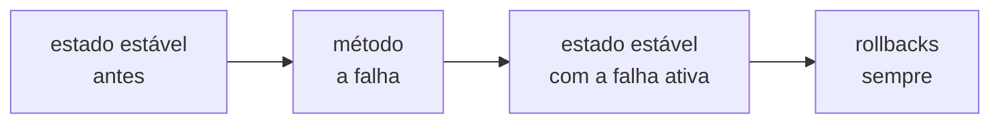

# Experimentos de caos

Os [laboratórios](../docs/labs) contam o que eu quebrei e o que aprendi. Esta pasta transforma os mais importantes em **experimentos que rodam sozinhos**: cada um diz, antes de quebrar qualquer coisa, qual estado estável o sistema precisa manter, provoca a falha, confere de novo com a falha ainda ativa e desfaz tudo no final. Quem roda não precisa lembrar de nenhum `curl`, e o resultado não depende de alguém ter olhado para o lugar certo na hora certa.

Eles seguem o formato do [Chaos Toolkit](https://chaostoolkit.org), a ferramenta aberta que virou referência para experimento de caos como código ([ADR 0025](../docs/adr/0025-chaos-experiments-as-code.md)).

## Rodando

Com a stack no ar:

```bash
make experiments                          # lista cada experimento e o estado estável que ele defende
make experiment e=commerce-cut-from-the-web
```

O `make experiment` roda o Chaos Toolkit num container com a versão fixa, na rede do compose, e guarda o diário da execução (`<nome>.json`) e o log (`<nome>.log`) em `chaos/results/`, fora do Git. Os rollbacks rodam sempre, até quando a hipótese falha: um experimento nunca deixa a stack quebrada para o próximo.

O veredito vem do diário, não do código de saída do Chaos Toolkit. O `chaos run` sai com erro quando a hipótese desvia com a falha ativa, mas, com os rollbacks sempre ligados, ele sai com 0 e escreve `completed` quando a hipótese nem vale antes da falha, o caso de uma stack que já começa doente. Descobri isso medindo um experimento novo, que falhou na primeira conferência e passou verde. Agora o `make experiment` lê o diário e só aceita uma execução completa, com a hipótese valendo antes e depois da falha.

## Como um experimento pensa



1. **O estado estável** é a hipótese, em sondas que respondem sim ou não. Ela é conferida antes da falha: se o sistema já está doente, não há o que concluir.
2. **O método** provoca uma falha do mundo real, pela mesma alavanca que um laboratório usaria: um toxic no Toxiproxy, um corte de rede, um controle de caos do partners-sim.
3. **O estado estável de novo**, com a falha ainda ativa. É aqui que o experimento dá o veredito: a hipótese se manteve ou o sistema se desviou.
4. **Os rollbacks** tiram a falha e devolvem o estado estável, não só a configuração de antes. O `psp-slow` espera 25 s depois de tirar a latência: o circuito que ele abriu fica aberto 20 s depois que o PSP volta, e o experimento seguinte encontraria o sistema ainda se recuperando. Foi o `lost-psp-webhooks` que acusou isso, recusando começar com o pagamento ainda em `503`.

As sondas compram na loja do jeito que a web compra: abrem as telas do BFF e seguem os links e as ações que vêm nelas, sem montar nenhum endereço. Elas pagam com o cartão de teste recusado, então cada pedido cancela e devolve o estoque, e dá para rodar os experimentos o dia inteiro sem esvaziar prateleira nenhuma. As exceções são os dois experimentos do rastreio, que precisam de uma encomenda coletada: cada execução compra e entrega uma caneca, de um estoque de 200.

## Os experimentos

| Experimento | A falha | O estado estável que precisa se manter | O que mediu, em 28/09/2026 |
|---|---|---|---|
| [`psp-slow`](experiments/psp-slow.json) | 3 s de latência entre o commerce e o PSP, com o timeout do commerce em 2 s | pagar responde em até 1 s, aceito ou recusado com `Retry-After`, e o catálogo continua abrindo | antes, pagar respondia `202` em 0,15 s. As cinco tentativas com o PSP lento levaram 2,1 s cada, e o circuit breaker abriu: depois delas, pagar respondeu `503` em 0,10 s, com "tente em 20 s" |
| [`commerce-cut-from-the-web`](experiments/commerce-cut-from-the-web.json) | o BFF perde a conexão com o commerce | toda tela responde em até 6 s, com o conteúdo ou com `503` e `Retry-After`, e o catálogo continua abrindo | a tela do pedido respondeu `503` em 0,02 s, com "tente em 5 s"; o catálogo, `200` em 0,07 s |
| [`catalog-slow-for-the-web`](experiments/catalog-slow-for-the-web.json) | 7 s de latência entre o BFF e o catálogo, com o prazo do BFF em 5 s | a tela do catálogo responde em até 6 s, com o catálogo ou com `503` e `Retry-After`, e a do pedido continua respondendo | a tela do catálogo desistiu em 5,06 s e disse quando tentar de novo; a do pedido abriu em 0,06 s |
| [`commerce-database-out`](experiments/commerce-database-out.json) | o commerce perde o PostgreSQL | fechar um pedido responde em até 2 s, com o pedido ou com `503` e `Retry-After`, e o catálogo continua abrindo | a primeira execução pegou uma fraqueza: `500` em 0,19 s, sem dizer quando voltar. Depois da correção ([ADR 0026](../docs/adr/0026-a-database-outage-is-unavailability.md)), `503` em 0,13 s, com "tente em 5 s" |
| [`tracking-without-its-database`](experiments/tracking-without-its-database.json) | a logistics perde o PostgreSQL, onde a remessa é escrita | a página de rastreio de uma encomenda coletada responde em até 1 s | a transportadora coletou em 13,2 s; com o banco fora, o rastreio respondeu `200` em 0,03 s, lendo a cópia no DynamoDB |
| [`tracking-without-its-copy`](experiments/tracking-without-its-copy.json) | o DynamoDB, onde mora a cópia do rastreio, some (com o S3 e o SQS do Floci) | a página de rastreio responde em até 1 s, com a entrega ou com `503` e `Retry-After` | a primeira execução pegou a página pendurada até o BFF desistir: `503` em 5,05 s. A logistics levava 12,4 s e respondia `500`, porque o SDK repetia a leitura com espera entre as tentativas. Depois da correção, a leitura tem uma tentativa só, de até 800 ms, e a página recusa em 0,06 s, com "tente em 5 s" |
| [`tracking-without-the-timeline`](experiments/tracking-without-the-timeline.json) | o MongoDB, onde mora a linha do tempo interna das remessas, some | uma encomenda comprada durante a queda chega a entregue na página pública, com todos os passos, em até 90 s | a primeira execução pegou uma cascata: o projetor escrevia no MongoDB antes do DynamoDB, esgotava as tentativas e mandava a jornada inteira para a DLQ, e a página ficou sem nenhum passo. Depois da correção ([ADR 0027](../docs/adr/0027-one-consumer-group-per-read-model.md)), cada read model lê num grupo próprio, e a página chegou a entregue em 14,6 s, com o MongoDB ainda fora |
| [`kafka-out-and-back`](experiments/kafka-out-and-back.json) | o Kafka some por 30 s, e uma caneca é comprada e paga no meio da queda | depois que o Kafka volta, a encomenda chega a entregue na página pública em até 90 s, com todos os passos | o `order.paid` esperou na outbox. Com o Kafka de volta, a remessa nasceu em 8,6 s, o pedido ganhou o link de rastreio em 14,7 s e a página chegou a entregue em 18,8 s, contra 8,3 s e 14,5 s sem falha nenhuma. A volta ainda entregou o `order.paid` duas vezes, e a inbox da logistics descartou a repetição |
| [`lost-psp-webhooks`](experiments/lost-psp-webhooks.json) | o PSP cobra, mas nenhum webhook sai | todo pagamento chega a um desfecho em até 100 s, com ou sem webhook | com webhook, o pedido chegou ao desfecho em 2,1 s; sem nenhum, a conciliação o trouxe em 62,4 s, logo depois do silêncio de 60 s que ela espera antes de perguntar ao PSP |

Cada número vem de uma execução de verdade contra a stack local. Eles mudam de máquina para máquina; a hipótese não. Os tempos de entrega da tabela foram medidos antes de a frota própria ganhar o trajeto de 20 s até a porta, em que o entregador aparece ao vivo ([ADR 0028](../docs/adr/0028-live-delivery-by-tracking-code.md)). Com ele, a encomenda chega a entregue uns 20 s mais tarde: 33,0 s no `tracking-without-the-timeline` e 37,2 s depois da volta do Kafka no `kafka-out-and-back`, ainda dentro dos 90 s das hipóteses.

## Escrevendo um experimento novo

Um experimento é um JSON em `experiments/`, no formato do Chaos Toolkit:

- `steady-state-hypothesis`: o título diz, em português, o que precisa continuar verdade; cada sonda é uma função de `tucano_chaos.probes` que devolve `true` ou `false` e escreve no log o que mediu.
- `method`: a falha. Para o Toxiproxy e para o partners-sim, uma ação HTTP direta no JSON basta; quando a falha precisa de mais de uma chamada (abrir o circuit breaker, por exemplo), ela vira uma função de `tucano_chaos.actions`.
- `rollbacks`: o caminho de volta de cada falha do método, na ordem inversa.
- Os endereços vêm do ambiente (`TOXIPROXY_URL`, `PARTNERS_SIM_URL` e `TUCANO_STORE`), com os padrões da rede do compose, então o mesmo experimento roda de dentro de um container ou do Mac.

Antes de abrir o PR, `make experiment e=<nome>` contra a stack, e o CI confere que todo experimento é válido para o Chaos Toolkit. Um experimento novo entra sozinho no portão da `main`: o workflow `stability` sobe a stack num runner limpo e roda todos os experimentos da pasta em cada PR para a `main` e toda segunda-feira, e um desvio reprova a release ([ADR 0029](../docs/adr/0029-no-release-without-the-experiments.md)).

## O que eles não provam

Um experimento local prova o comportamento com um de cada coisa: um commerce, um PSP, um banco. Ele não diz nada sobre dez réplicas brigando pela mesma linha, nem sobre a rede de um datacenter de verdade. Para isso servem os testes de concorrência (o de overselling roda no CI) e, num sistema de produção, os experimentos com o menor raio de estrago possível, que os princípios da engenharia do caos pedem.
