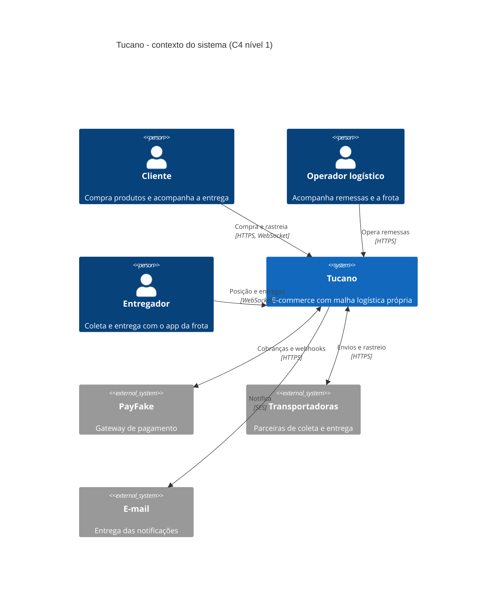
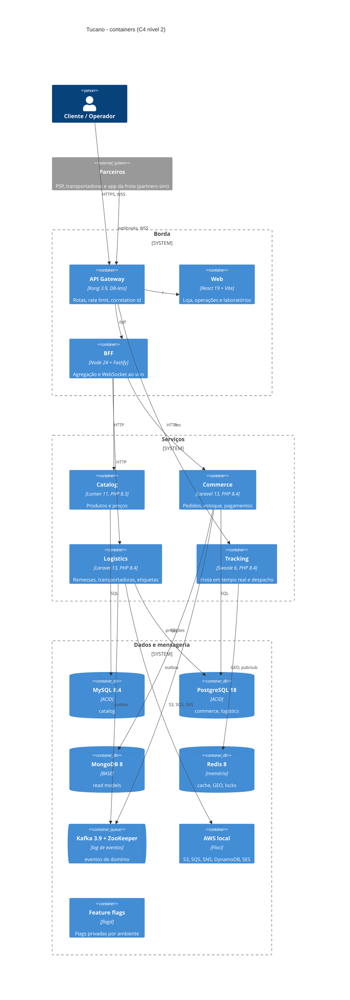
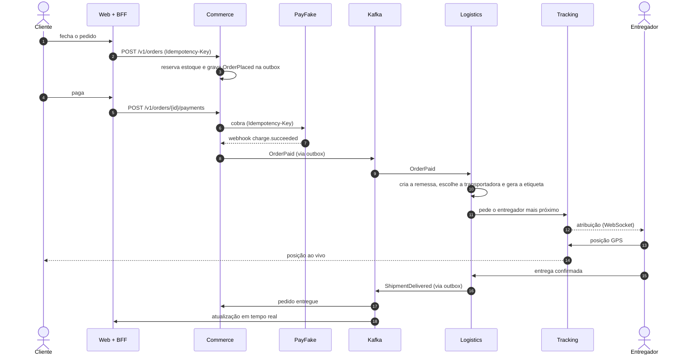

# Arquitetura

A **Tucano** é um e-commerce fictício que entrega o que vende com uma malha logística própria (a Tucano Express) e com transportadoras parceiras. O sistema roda num notebook e cobre os problemas que aparecem em entrevistas de system design: concorrência no estoque, pagamento com saga, eventos entre contextos, leitura com consistência eventual, tempo real e falhas de rede.

## O que este projeto quer ensinar

- **PHP em três runtimes**: PHP-FPM (Laravel e Lumen, modelo shared-nothing) e Swoole (processo de longa duração com corrotinas).
- **Node.js** para I/O concorrente, WebSocket e agregação (BFF).
- **DDD** estratégico (context map, linguagem ubíqua) e tático (agregados, value objects, eventos).
- **Arquitetura hexagonal** e casos de uso no estilo de Alistair Cockburn, com package-by-feature.
- **ACID vs BASE** lado a lado: PostgreSQL e MySQL na escrita; MongoDB, DynamoDB e Redis na leitura e no lookup.
- **Padrões de sistemas distribuídos**: outbox, inbox, saga, circuit breaker, idempotência, rate limit, cache-aside, DLQ.
- **Engenharia do caos** com hipóteses, injeção de falhas controlada e aprendizado registrado.

## Contexto (C4 nível 1)

O mundo externo (PSP, transportadoras e o app dos entregadores) é simulado pelo serviço `partners-sim`, que também expõe controles de caos.

## Containers (C4 nível 2)

## Por que cada peça existe

| Container | Tecnologia | Motivo | Status |
|---|---|---|---|
| `kong` | Kong Gateway 3.9 OSS, DB-less | borda única: rotas, rate limit, correlation id, cache e circuit breaking por health check | rodando, rotas `/bff`, `/api/catalog`, `/api/commerce`, `/api/logistics` e `/api/tracking` |
| `web` | React 19 + Vite | loja, console de operações, laboratórios e painel de caos | planejado |
| `bff` | Node 24 + Fastify | agrega dados para a web e empurra eventos do Kafka por WebSocket | esqueleto rodando (health, erros) |
| `catalog` | Lumen 11, PHP 8.3 | subdomínio de suporte, leitura intensa e cache-aside, no papel de serviço legado | produtos com cache-aside e snapshots no tópico compactado |
| `commerce` | Laravel 13, PHP 8.4 | núcleo transacional: pedidos, estoque, pagamentos e notificações | pedidos (fazer e consultar) com reserva de estoque e outbox |
| `logistics` | Laravel 13, PHP 8.4 | núcleo logístico: remessas, máquina de estados, transportadoras, etiquetas | esqueleto rodando (health, erros, flags) |
| `tracking` | Swoole 6, PHP 8.4 | milhares de conexões de GPS e WebSocket em um processo de longa duração | esqueleto rodando (health, erros) |
| `partners-sim` | Node 24 + Fastify | simula o mundo externo: PSP, transportadoras e app da frota, com controles de caos | esqueleto rodando (health, erros) |
| `nginx` | nginx 1.30 | servidor web das aplicações PHP-FPM | rodando, esperando os apps |
| `postgres` | PostgreSQL 18 | escrita ACID de commerce e logistics, com `uuidv7()` nativo | rodando |
| `mysql` | MySQL 8.4 | escrita ACID do catálogo (InnoDB, `REPEATABLE READ`) | rodando |
| `mongo` | MongoDB 8 | read models com consistência eventual (CQRS) | rodando |
| `redis` | Redis 8 | cache, GEO da frota, locks, rate limit e estado de circuit breaker | rodando |
| `kafka` + `zookeeper` | Apache Kafka 3.9.2 | backbone de eventos entre contextos | rodando |
| `floci` | Floci 2.1 | S3, SQS, SNS, DynamoDB e SES locais | rodando |
| `toxiproxy` | Toxiproxy 2.12 | injeção de latência, cortes e timeouts entre serviços e dependências | rodando |
| `mailpit` | Mailpit | caixa de entrada dos e-mails enviados pelo SES local | rodando |
| `flagd` | flagd 0.17 (OpenFeature) | flags privadas por ambiente, avaliadas no servidor | rodando |

## Fluxo principal: comprar e receber

## Para continuar

- [Context map](context-map.md): os contextos delimitados e como conversam.
- [Linguagem ubíqua](ubiquitous-language.md): o vocabulário do negócio e seus nomes no código.
- [Casos de uso](../use-cases/README.md): lista ator-objetivo e fichas no formato de Cockburn.
- [Eventos](events.md): tópicos, envelope CloudEvents e garantias de entrega.
- [Identificadores](identifiers.md): UUIDv7 e Snowflake.
- [Modelo de dados](data-model.md): DDL, tipos e constraints de cada banco.
- [Máquinas de estados](state-machines.md): pedido, pagamento e remessa, sem flags booleanas.
- [Topologia local](deployment.md): redes, proxies de caos e memória.
- [Feature flags](feature-flags.md): flags privadas por ambiente.
- [Decisões de arquitetura (ADRs)](../adr/README.md).
