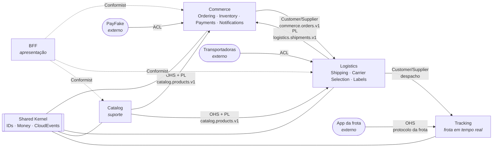

# Context map

O context map mostra **quem manda em quem**: qual contexto define a linguagem de cada integração e como nos protegemos dos modelos alheios. Os nomes dos padrões são os de Eric Evans (*Domain-Driven Design*) e Vaughn Vernon (*Implementing DDD*).

## Contextos

| Contexto | Tipo de subdomínio | Serviço | Estilo interno |
|---|---|---|---|
| **Catalog** | suporte | `catalog` (Lumen) | camadas simples + cache-aside |
| **Ordering** | núcleo | `commerce` (Laravel) | DDD tático + hexágono |
| **Inventory** | suporte | `commerce` | DDD tático + estratégias de reserva |
| **Payments** | genérico (terceirizado) | `commerce` | ACL em volta do PSP |
| **Notifications** | genérico | `commerce` | SNS → SQS → SES |
| **Shipping** | núcleo | `logistics` (Laravel) | DDD tático + hexágono + máquina de estados |
| **Carrier Selection** | núcleo (política) | `logistics` | Chain of Responsibility |
| **Labels** | suporte | `logistics` | job assíncrono (SQS → S3) |
| **Tracking** | núcleo (última milha) | `tracking` (Swoole) | hexágono enxuto, tempo real |

> Nem todo contexto merece a mesma cerimônia. O catálogo é um CRUD com cache: aplicar DDD tático ali seria custo sem retorno. É a distinção de Evans entre *core*, *supporting* e *generic subdomains*.

## Relações

| Upstream → Downstream | Padrão | O que isso significa aqui |
|---|---|---|
| Catalog → Commerce, Logistics | **Open Host Service + Published Language** | o catálogo publica o estado completo de cada produto num tópico compactado; quem consome mantém um snapshot local e não chama o catálogo na hora da compra |
| Commerce → Logistics | **Customer/Supplier** | a logística depende de `OrderPaid`; mudanças no evento são negociadas (versão nova de tópico se quebrar) |
| Logistics → Commerce | **Published Language** | o commerce acompanha o ciclo do pedido pelos eventos da remessa, sem conhecer o modelo interno da logística |
| Logistics → Tracking | **Customer/Supplier** | a logística pede o entregador mais próximo; o tracking decide como encontrá-lo |
| PayFake → Commerce | **Anticorruption Layer** | "charge", "webhook" e códigos do PSP são traduzidos para `Payment` e seus estados na borda do contexto |
| Transportadoras → Logistics | **Anticorruption Layer** | cada transportadora fala seu dialeto; o adapter converte tudo em transições da máquina de estados da remessa |
| App da frota → Tracking | **Open Host Service** | o protocolo WebSocket da frota é nosso e é documentado; o app se adapta a ele |
| BFF → serviços | **Conformist** | o BFF não tem domínio próprio: adota os modelos de quem consulta e só os combina para a tela |

## Shared Kernel

O pacote `tucano/shared-kernel` é pequeno de propósito: identificadores (UUIDv7 e Snowflake), `Money`, o envelope CloudEvents e o relógio. Tudo o que entra nele passa a exigir acordo de todos os contextos, por isso a regra é: **na dúvida, fica fora**. No lado Node, os mesmos contratos vivem em `contracts/` como JSON Schema.
