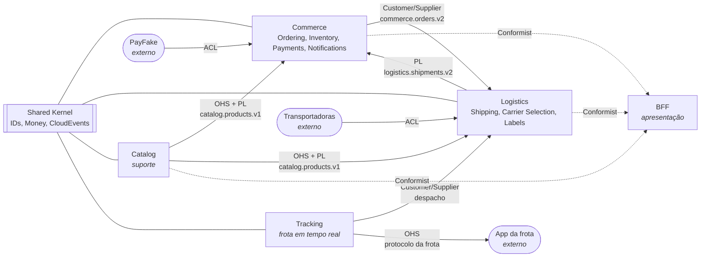

# Context map

O context map mostra, para cada integração, qual contexto é upstream, quem define a linguagem e como o downstream se protege do modelo alheio. Os nomes dos padrões vêm de Eric Evans, no livro Domain-Driven Design, e de Vaughn Vernon, em Implementing Domain-Driven Design.

No diagrama, cada seta vai do upstream para o downstream.

## Contextos

| Contexto | Tipo de subdomínio | Serviço | Estilo interno |
|---|---|---|---|
| **Catalog** | suporte | `catalog` (Lumen) | camadas simples + cache-aside |
| **Ordering** | núcleo | `commerce` (Laravel) | DDD tático + hexágono |
| **Inventory** | suporte | `commerce` | DDD tático + estratégias de reserva |
| **Payments** | genérico (terceirizado) | `commerce` | ACL em volta do PSP |
| **Notifications** | genérico | `commerce` | `SNS -> SQS -> SES` |
| **Shipping** | núcleo | `logistics` (Laravel) | DDD tático + hexágono + máquina de estados |
| **Carrier Selection** | núcleo (política) | `logistics` | Chain of Responsibility |
| **Labels** | suporte | `logistics` | job assíncrono (`SQS -> S3`) |
| **Tracking** | núcleo (última milha) | `tracking` (Swoole) | hexágono enxuto, tempo real |

> Não aplico a mesma cerimônia em todos os contextos. O catálogo é um CRUD com cache, e DDD tático ali só acrescentaria camadas. É a distinção de Evans entre core, supporting e generic subdomains.

## Relações

| Upstream para downstream | Padrão | O que isso significa aqui |
|---|---|---|
| Catalog para Commerce e Logistics | **Open Host Service + Published Language** | o catálogo publica o estado completo de cada produto num tópico compactado; quem consome mantém um snapshot local e não chama o catálogo na hora da compra |
| Commerce para Logistics | **Customer/Supplier** | a logística depende de `OrderPaid`; mudanças no evento são negociadas, e mudança que quebra contrato vira versão nova de tópico |
| Logistics para Commerce | **Published Language** | o commerce acompanha o ciclo do pedido pelos eventos da remessa, sem conhecer o modelo interno da logística |
| Tracking para Logistics | **Customer/Supplier** | a logística é a cliente: pede o entregador mais próximo, e o tracking, como fornecedor, decide como encontrá-lo |
| PayFake para Commerce | **Anticorruption Layer** | o vocabulário do PSP (charge, webhook e códigos próprios) é traduzido para `Payment` e seus estados na borda do contexto |
| Transportadoras para Logistics | **Anticorruption Layer** | cada transportadora tem seu próprio formato; o adapter converte tudo em transições da máquina de estados da remessa |
| Tracking para App da frota | **Open Host Service** | o protocolo WebSocket da frota é definido e documentado pelo Tracking; o app se adapta a ele |
| Serviços para o BFF | **Conformist** | o BFF não tem domínio próprio: adota os modelos de quem consulta e só os combina para a tela |

## Shared Kernel

O pacote `tucano/shared-kernel` é pequeno de propósito: identificadores (UUIDv7 e Snowflake), `Money`, o envelope CloudEvents e o relógio. Tudo o que entra nele passa a exigir acordo de todos os contextos, então a regra é incluir só o que todos precisam; na dúvida, fica fora. No lado Node, os mesmos contratos ficam em `contracts/`, como JSON Schema.
