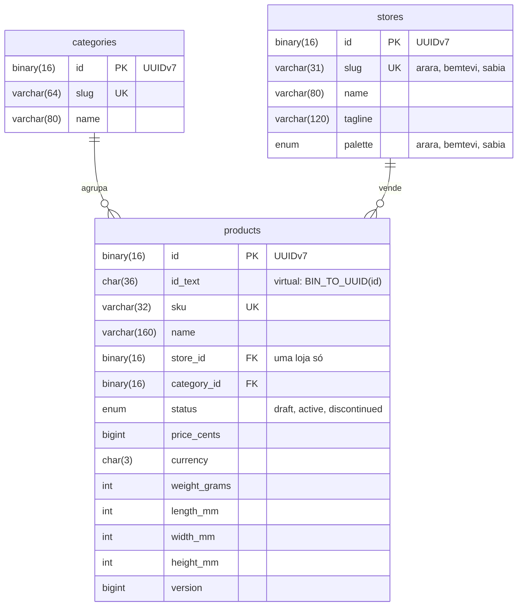
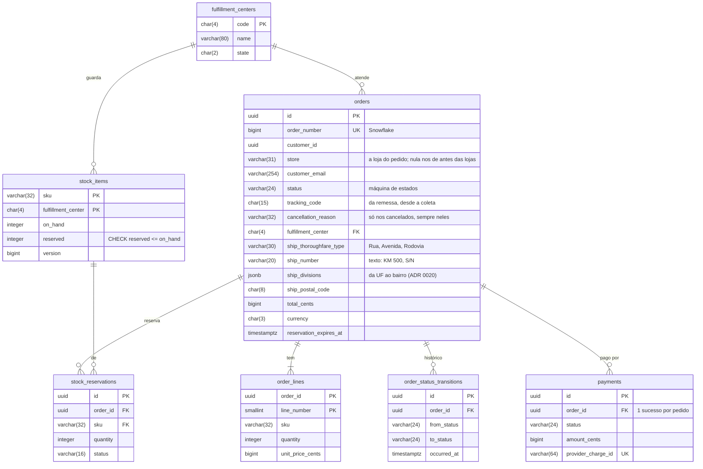
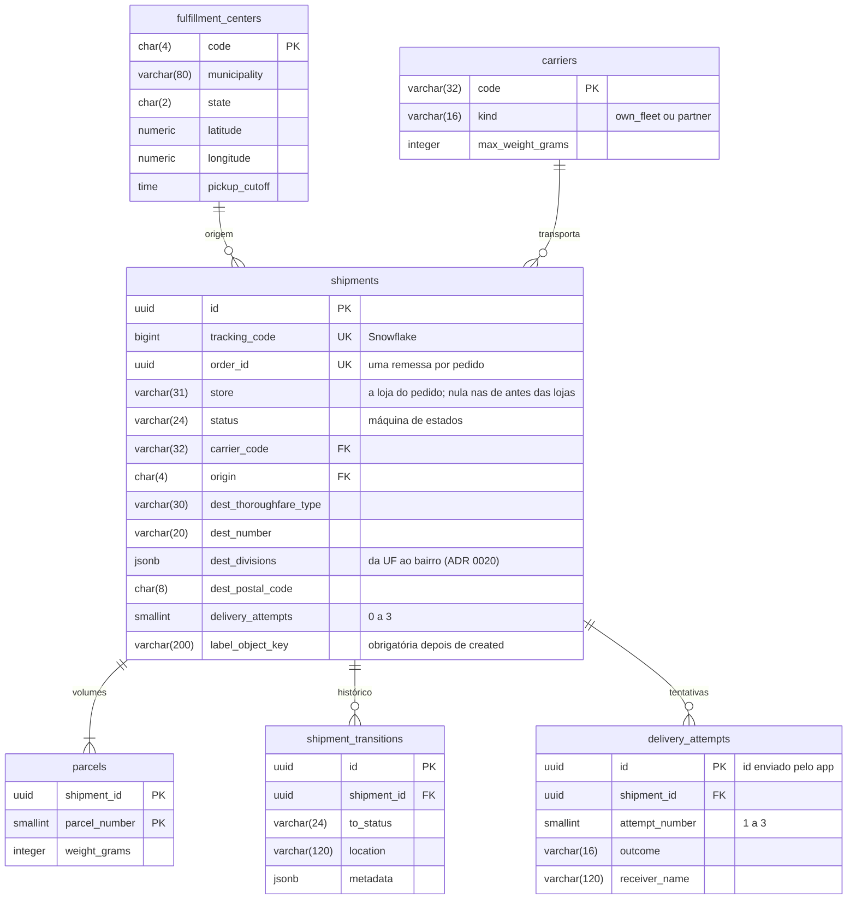

# Modelo de dados

Cada serviço é dono do seu schema, e as migrations ficam no próprio serviço (`services/<nome>/database/migrations`). Escrevi o DDL em SQL explícito dentro das migrations do Laravel (`DB::unprepared`), em vez do schema builder: assim cada constraint, índice parcial e comentário fica visível e revisável como SQL de verdade.

## Tipos: a regra geral

| Dado | Tipo | Por quê |
|---|---|---|
| identidade (UUIDv7) | `uuid` no PostgreSQL, `BINARY(16)` no MySQL | 16 bytes; nunca `CHAR(36)`, que ocupa mais que o dobro e compara como texto |
| número público (Snowflake) | `bigint` | cabe nos 63 bits; o formato para pessoas (`TX...`, `CHAR(15)`) é só de exibição |
| dinheiro | `bigint` em centavos + `char(3)` com a moeda ISO 4217 | sem `numeric` em ponto flutuante; a moeda tem tamanho fixo |
| UF | `char(2)` | tamanho fixo, com `CHECK (~ '^[A-Z]{2}$')` |
| CEP | `char(8)` | só dígitos, sem hífen, com `CHECK` |
| código de CD | `char(4)` | `GRU1`, `BHZ1` |
| hash SHA-256 | `char(64)` | hex de tamanho fixo |
| e-mail | `varchar(254)` | limite prático da RFC 5321 |
| SKU | `varchar(32)` | tamanho variável com limite real |
| estado de máquina | `varchar(24)` com `CHECK (status IN (...))` | mais fácil de evoluir que um `ENUM` nativo do PostgreSQL, que exige `ALTER TYPE` |
| estado no MySQL | `ENUM(...)` | acrescentar valor no fim da lista é só metadado no MySQL 8, e o valor ocupa 1 byte |
| datas | `timestamptz` | sempre com fuso; a aplicação grava em UTC |
| coordenadas | `numeric(9,6)` | precisão de uns 10 cm, com `CHECK` de faixa |

## Catalog (MySQL, banco `catalog`)



O catálogo fica no MySQL de propósito, para contrastar com o PostgreSQL dos outros serviços:

- **UUID em `BINARY(16)`**: o MySQL não tem tipo `uuid`. Gravo os 16 bytes e leio com `BIN_TO_UUID`. O `id_text` é uma coluna gerada `VIRTUAL`: calculada na leitura, sem ocupar disco, só para consulta à mão.
- **Índice clusterizado**: no InnoDB a tabela é a própria árvore B+ da chave primária. Com UUIDv4, cada insert cai num ponto aleatório da árvore e divide páginas; com UUIDv7, que cresce com o tempo, o insert vai sempre para o fim, como num auto increment. O `swap_flag` do `UUID_TO_BIN` existe para reordenar o UUIDv1, e o v7 não precisa dele.
- **`ENUM` no status**: aqui cabe, pelo motivo da tabela de tipos. Rascunho (`draft`) nunca sai do catálogo.
- **`CHECK` com `REGEXP_LIKE`**: o MySQL só passou a validar `CHECK` na 8.0.16; antes aceitava a sintaxe e ignorava. O `'c'` no fim força a comparação com maiúsculas, porque a collation `utf8mb4_0900_ai_ci` não diferencia maiúsculas nem acentos.
- **`DATETIME(6)` em UTC**: a sessão roda com `time_zone = '+00:00'`, então o `CURRENT_TIMESTAMP(6)` grava UTC. `DATETIME` não converte fuso; `TIMESTAMP` converteria, mas só vai até 2038.
- **`version`**: sobe a cada mudança. Quem copia o produto (os `product_snapshots` do commerce e do logistics) ignora versão mais velha do que a que já tem. A única exceção é a loja: uma cópia aceita, na mesma versão, a loja que ela ainda não sabia.
- **A loja de cada produto** ([ADR 0031](../adr/0031-a-store-is-a-tenant.md)): `store_id` aponta para `stores`, e o slug da loja é o que viaja nos eventos e nas rotas. A migração que criou a coluna pôs os produtos antigos na loja da categoria, em três passos (coluna nula, preenchimento, `NOT NULL`), e subiu a versão de cada um, para a republicação levar a loja às cópias. A paleta é um `ENUM` pelo mesmo motivo do status: uma lista fechada, que o design system da web define.
- **Erro com código do driver**: o MySQL devolve SQLSTATE genérico (`HY000`, `23000`) para quase tudo. Os testes conferem o código: `3819` (CHECK), `1062` (duplicata), `1452` (chave estrangeira), `1265` (valor fora do `ENUM` em modo strict) e, com as lojas, `1048` (coluna `NOT NULL` sem valor) e `1451` (loja que ainda tem produtos).

O catálogo não tem outbox: a publicação no tópico compactado é o dual write consciente do [ADR 0008](../adr/0008-transactional-outbox.md).

## Commerce (PostgreSQL, banco `commerce`)



Também existem `product_snapshots` (cópia local do catálogo, com a loja de cada produto), `outbox_messages`, `inbox_messages` e `idempotency_keys`, sem relação com as tabelas acima.

## Logistics (PostgreSQL, banco `logistics`)



Também existem `product_snapshots` (loja, peso e dimensões), `cancelled_orders` (pedidos pagos cancelados antes de ter remessa, para um `order.paid` reprocessado não despachar), `outbox_messages`, `inbox_messages` e `failed_jobs` (dono: a fila do Laravel).

## Read models (MongoDB)

O lado de leitura do CQRS mora no MongoDB, em um banco por serviço (`commerce_read` e `logistics_read`). Os documentos são desnormalizados para a tela que os consome: uma leitura por id, sem join. As migrations ficam em `services/<nome>/database/mongo` e criam cada coleção com validador `$jsonSchema` em modo `strict`, porque um banco sem schema obrigatório não significa dado sem contrato.

| Coleção | Chave | Índices | Alimentada por |
|---|---|---|---|
| `commerce_read.order_views` | `_id` = id do pedido (UUID binário) | `store + customerId + placedAt` (os pedidos do cliente em cada loja), `orderNumber` único | `commerce.orders.v2`, no grupo `commerce.order-projector` ([UC-ORD-08](../use-cases/UC-ORD-08-project-order-views.md)) |
| `logistics_read.shipment_timelines` | `_id` = id da remessa (UUID binário), com a loja quando o evento a traz | `trackingCode` único, `orderId` único | `logistics.shipments.v2` |

```json
{
  "_id": "UUID('01926f39-1d2c-7a8b-8c9d-0e1f2a3b4c5d')",
  "orderNumber": "NumberLong(97663530295234560)",
  "customerId": "UUID('01926f38-...')",
  "status": "shipped",
  "cancellationReason": null,
  "total": { "amount": "NumberLong(18990)", "currency": "BRL" },
  "lines": [{ "sku": "BOOK-DDD-001", "name": "Domain-Driven Design", "quantity": 1, "unitPrice": "NumberLong(18990)" }],
  "shipment": null,
  "placedAt": "ISODate('2026-09-27T12:00:00Z')",
  "updatedAt": "ISODate('2026-09-27T15:42:10Z')",
  "version": "NumberLong(3)"
}
```

O campo `version` guarda a versão do pedido que o documento mostra, e cada evento a conhece sozinho, porque cada status tem uma entrada só na máquina de estados: `order.placed` é a 1, `paid` a 2, `shipped` a 3, `delivered` e `returned` a 4, e `cancelled` vem logo depois do status em que o pedido estava. A projeção só escreve uma versão mais nova, e assim um evento repetido, atrasado ou relido não volta o documento para trás. O `shipment` fica `null` por enquanto: a lista mostra o status do pedido, e a tela do pedido conta a entrega.

## Redis

Um Redis só para a stack inteira. Cada serviço usa o próprio nome como prefixo das chaves (`catalog-`, `commerce-`, `logistics-`), e o cache do framework fica no banco lógico `1`, separado do `0`: um `cache:clear` não apaga nada além de cache.

| Chave (depois do prefixo) | Dono | TTL | Para quê |
|---|---|---|---|
| `product:v2:<sku>` | catalog | 270 a 330 s; 30 s para `missing` | cache-aside do produto, com a loja dele; o `v2` veio com a loja, porque o formato gravado mudou |
| `product-rebuild:<sku>` | catalog | 5 s | lock contra stampede: só quem o pega relê o MySQL |

## DynamoDB (Floci)

As tabelas nascem na subida do Floci, a partir de `infra/floci/dynamodb/*.json`. As duas são pagas por requisição e têm TTL no atributo `expiresAt`: o DynamoDB apaga o item vencido sozinho, sem job de limpeza.

| Tabela | Chave | Para quê |
|---|---|---|
| `tracking_lookup` | `trackingCode` (partição) | página pública de rastreio: uma leitura por código, sem tocar nos bancos dos serviços |
| `notification_log` | `pk` (partição) e `sk` (ordenação) | registro das notificações enviadas, para o mesmo evento não gerar dois e-mails |

O item do `tracking_lookup` guarda `store` (a loja da remessa, que a rota por loja confere), `status`, `updatedAt`, `carrier`, `destination` (município e UF), `steps` (a lista dos passos, que cresce com `list_append`), `shipmentId`, `seen` (o conjunto dos ids de evento já aplicados, que a condição do `UpdateItem` consulta para não repetir passo) e `expiresAt`, 90 dias depois do último passo.

## Objetos (S3 no Floci)

| Bucket | Chave | O que guarda |
|---|---|---|
| `tucano-labels` | `labels/<código de rastreio>.zpl` | a etiqueta da remessa em ZPL (`text/plain; charset=utf-8`); o job que tenta de novo sobrescreve o mesmo objeto, então nunca existem duas etiquetas da mesma remessa |

A chave do objeto fica em `shipments.label_object_key`. Os eventos não a carregam: onde a etiqueta mora é assunto da logística.

## Regras que moram no banco

O código também garante tudo isso, mas o banco é a última linha de defesa contra bug, concorrência e `UPDATE` feito na mão. Cada regra tem um teste de integração em `tests/Integration/SchemaConstraintsTest.php` do serviço.

| Regra | Como | Onde |
|---|---|---|
| não reservar mais do que existe | `CHECK (reserved <= on_hand)` | `stock_items` |
| no máximo um pagamento com sucesso por pedido | índice único parcial `WHERE status IN ('captured', 'refund_requested', 'refunded')` | `payments` |
| evento repetido não cria segunda remessa | `UNIQUE (order_id)` | `shipments` |
| nada sai do CD sem etiqueta | `CHECK (status IN ('created', 'cancelled') OR label_object_key IS NOT NULL)` | `shipments` |
| no máximo três tentativas | `CHECK (attempt_number BETWEEN 1 AND 3)` + `UNIQUE (shipment_id, attempt_number)` | `delivery_attempts` |
| entrega exige quem recebeu | `CHECK (outcome <> 'delivered' OR receiver_name IS NOT NULL)` | `delivery_attempts` |
| mesma chave de idempotência uma vez por escopo | `PRIMARY KEY (scope, key)` | `idempotency_keys` |
| um pagamento pendente por pedido | índice único parcial `WHERE status = 'pending'` | `payments` |
| um pagamento é conferido por uma conciliação só | `UPDATE ... WHERE id = (SELECT ... FOR UPDATE SKIP LOCKED)` sobre o índice parcial dos pagamentos sem desfecho | `payments` |
| um pedido é cancelado por um worker só | `SELECT ... FOR UPDATE SKIP LOCKED` sobre o índice parcial de pendências | `orders` |
| reserva só existe com pedido | chave estrangeira `DEFERRABLE INITIALLY DEFERRED`, conferida no `COMMIT` | `stock_reservations` |
| SKU no formato do catálogo, uma vez só | `CHECK (REGEXP_LIKE(sku, ...))` + `UNIQUE (sku)` | `products` (MySQL) |
| produto com peso e medidas | `CHECK (weight_grams > 0 AND ...)` | `products` (MySQL) |

Os índices parciais também servem à performance: o job que expira pedidos lê só `WHERE status = 'pending_payment'`, e o relay da outbox lê só `WHERE published_at IS NULL`. O índice fica do tamanho do trabalho pendente, não do histórico inteiro.

## Migrations e seeds na stack

Cada serviço tem um job `<serviço>-migrate` no compose, que roda `php artisan migrate --force --seed` e depois `php artisan mongo:migrate` uma vez antes da API subir (o mesmo papel de um Job no Kubernetes). Com várias réplicas da API, isso evita duas migrations concorrentes.

Os seeders são idempotentes: dados de referência (CDs, transportadoras, categorias) usam `upsert`, e o estoque usa `insertOrIgnore`, para que um novo `make up` nunca zere estoque ou reservas que os pedidos já movimentaram.

No PostgreSQL o `insertOrIgnore` vira `ON CONFLICT DO NOTHING`, que só ignora conflito de chave. No MySQL ele vira `INSERT IGNORE`, que também transforma erro de `CHECK` e de tipo em warning e segue em frente. Por isso os produtos do catálogo entram com um `upsert` que não altera nada numa SKU conhecida.

Os testes rodam contra os bancos `catalog_test`, `commerce_test` e `logistics_test` (`scripts/test-databases.sh`), porque o `RefreshDatabase` recria o schema e apagaria os dados da stack.
