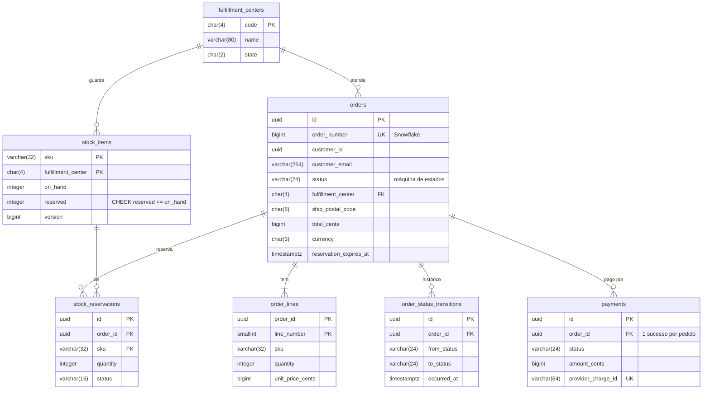
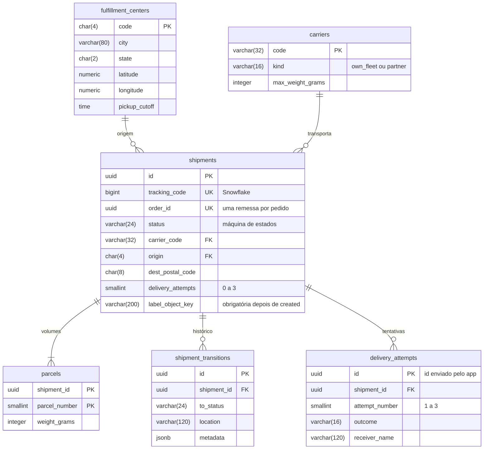

# Modelo de dados

Cada serviço é dono do seu schema, e as migrations ficam no próprio serviço (`services/<nome>/database/migrations`). Escrevi o DDL em SQL explícito dentro das migrations do Laravel (`DB::unprepared`), em vez do schema builder: assim cada constraint, índice parcial e comentário fica visível e revisável como SQL de verdade.

## Tipos: a regra geral

| Dado | Tipo | Por quê |
|---|---|---|
| identidade (UUIDv7) | `uuid` no PostgreSQL, `BINARY(16)` no MySQL | 16 bytes; nunca `CHAR(36)`, que ocupa mais que o dobro e compara como texto |
| número público (Snowflake) | `bigint` | cabe nos 63 bits; o formato para pessoas (`TX...`, `CHAR(15)`) é só de exibição |
| dinheiro | `bigint` em centavos + `char(3)` com a moeda ISO 4217 | sem `numeric` em ponto flutuante; a moeda tem tamanho fixo |
| UF | `char(2)` | tamanho fixo, com `CHECK (~ '^[A-Z]{2}$')` |
| CEP | `char(8)` | só dígitos, sem hífen, com `CHECK` |
| código de CD | `char(4)` | `GRU1`, `BHZ1` |
| hash SHA-256 | `char(64)` | hex de tamanho fixo |
| e-mail | `varchar(254)` | limite prático da RFC 5321 |
| SKU | `varchar(32)` | tamanho variável com limite real |
| estado de máquina | `varchar(24)` com `CHECK (status IN (...))` | mais fácil de evoluir que um `ENUM` nativo do PostgreSQL, que exige `ALTER TYPE` |
| datas | `timestamptz` | sempre com fuso; a aplicação grava em UTC |
| coordenadas | `numeric(9,6)` | precisão de uns 10 cm, com `CHECK` de faixa |

## Commerce (PostgreSQL, banco `commerce`)



Também existem `product_snapshots` (cópia local do catálogo), `outbox_messages`, `inbox_messages` e `idempotency_keys`, sem relação com as tabelas acima.

## Logistics (PostgreSQL, banco `logistics`)



Também existem `product_snapshots` (peso e dimensões), `outbox_messages`, `inbox_messages` e `failed_jobs` (dono: a fila do Laravel).

## Read models (MongoDB)

O lado de leitura do CQRS mora no MongoDB, em um banco por serviço (`commerce_read` e `logistics_read`). Os documentos são desnormalizados para a tela que os consome: uma leitura por id, sem join. As migrations ficam em `services/<nome>/database/mongo` e criam cada coleção com validador `$jsonSchema` em modo `strict`, porque um banco sem schema obrigatório não significa dado sem contrato.

| Coleção | Chave | Índices | Alimentada por |
|---|---|---|---|
| `commerce_read.order_views` | `_id` = id do pedido (UUID binário) | `customerId + placedAt` (histórico do cliente), `orderNumber` único | `commerce.orders.v1` e `logistics.shipments.v1` |
| `logistics_read.shipment_timelines` | `_id` = id da remessa (UUID binário) | `trackingCode` único, `orderId` único | `logistics.shipments.v1` |

```json
{
  "_id": "UUID('01926f39-1d2c-7a8b-8c9d-0e1f2a3b4c5d')",
  "orderNumber": "NumberLong(97663530295234560)",
  "customerId": "UUID('01926f38-...')",
  "status": "shipped",
  "total": { "amount": "NumberLong(18990)", "currency": "BRL" },
  "lines": [{ "sku": "BOOK-DDD-001", "name": "Domain-Driven Design", "quantity": 1, "unitPrice": "NumberLong(18990)" }],
  "shipment": { "trackingCode": "TX02PQRFBTW5G03", "status": "in_transit", "carrier": "ligeirinho" },
  "placedAt": "ISODate('2026-09-27T12:00:00Z')",
  "updatedAt": "ISODate('2026-09-27T15:42:10Z')",
  "version": "NumberLong(4)"
}
```

O campo `version` guarda a última mudança aplicada. A projeção só escreve se a mudança for mais nova (`VersionedDocuments`), e assim evento repetido ou fora de ordem não volta o documento para trás.

## Regras que moram no banco

O código também garante tudo isso, mas o banco é a última linha de defesa contra bug, concorrência e `UPDATE` feito na mão. Cada regra tem um teste de integração em `tests/Integration/SchemaConstraintsTest.php`.

| Regra | Como | Onde |
|---|---|---|
| não reservar mais do que existe | `CHECK (reserved <= on_hand)` | `stock_items` |
| no máximo um pagamento com sucesso por pedido | índice único parcial `WHERE status IN ('captured', 'refund_requested', 'refunded')` | `payments` |
| evento repetido não cria segunda remessa | `UNIQUE (order_id)` | `shipments` |
| nada sai do CD sem etiqueta | `CHECK (status IN ('created', 'cancelled') OR label_object_key IS NOT NULL)` | `shipments` |
| no máximo três tentativas | `CHECK (attempt_number BETWEEN 1 AND 3)` + `UNIQUE (shipment_id, attempt_number)` | `delivery_attempts` |
| entrega exige quem recebeu | `CHECK (outcome <> 'delivered' OR receiver_name IS NOT NULL)` | `delivery_attempts` |
| mesma chave de idempotência uma vez por escopo | `PRIMARY KEY (scope, key)` | `idempotency_keys` |

Os índices parciais também servem à performance: o job que expira pedidos lê só `WHERE status = 'pending_payment'`, e o relay da outbox lê só `WHERE published_at IS NULL`. O índice fica do tamanho do trabalho pendente, não do histórico inteiro.

## Migrations e seeds na stack

Cada serviço tem um job `<serviço>-migrate` no compose, que roda `php artisan migrate --force --seed` e depois `php artisan mongo:migrate` uma vez antes da API subir (o mesmo papel de um Job no Kubernetes). Com várias réplicas da API, isso evita duas migrations concorrentes.

Os seeders são idempotentes: dados de referência (CDs, transportadoras) usam `upsert`, e o estoque usa `insertOrIgnore`, para que um novo `make up` nunca zere estoque ou reservas que os pedidos já movimentaram.

Os testes rodam contra os bancos `commerce_test` e `logistics_test` (`scripts/test-databases.sh`), porque o `RefreshDatabase` recria o schema e apagaria os dados da stack.
