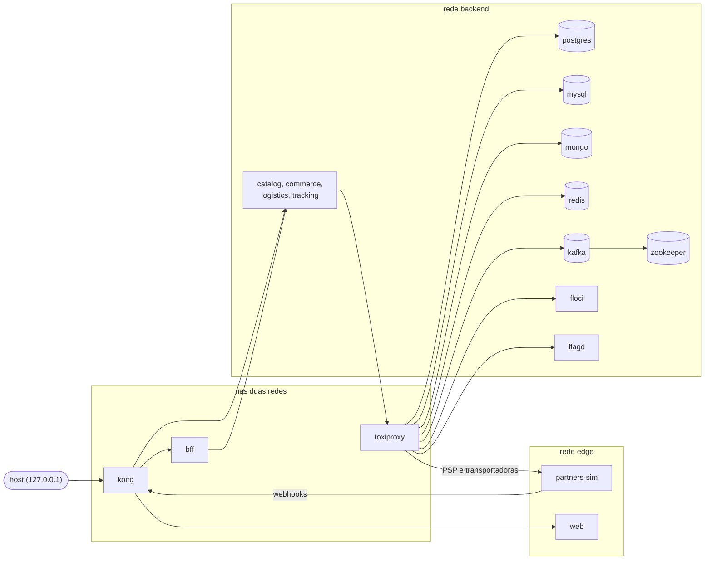

# Topologia local

Como a stack é montada no Docker Compose: redes, portas e o caminho que cada conexão faz. Para o dia a dia (subir, descer, comandos), veja [o ambiente local](../operations/local-environment.md).

## Redes

Separei duas redes para o laboratório se parecer com uma rede de verdade:

- **edge** é a parte "internet": o `partners-sim`, que simula PSP, transportadoras e o app dos entregadores, só enxerga o Kong. Ele não alcança banco nenhum.
- **backend** é a rede interna, com os serviços e as dependências.
- Kong, BFF e Toxiproxy ficam nas duas. O Kong é a porta de entrada, e o Toxiproxy faz o papel do proxy de saída quando um serviço chama um parceiro.

## Runtime PHP

Os serviços PHP partem de uma imagem base própria (`infra/php-base`), construída uma vez por versão com `make base`:

| Imagem | Usada por | O que tem |
|---|---|---|
| `chaos-playground/php-base:8.4` | commerce, logistics, tracking | PHP-FPM 8.4 no Alpine com apcu, bcmath, intl, mongodb, opcache, pcntl, pdo_mysql, pdo_pgsql, rdkafka, redis, sockets e zip |
| `chaos-playground/php-base:8.3` | catalog (Lumen) | as mesmas extensões sobre o PHP 8.3 |

Compilar essas extensões leva uns 5 minutos por versão. Com a base separada, isso acontece uma vez só, e os serviços compartilham as camadas no disco.

Na frente dos apps FPM fica um nginx só, com uma porta por app (`8081` catalog, `8082` commerce, `8083` logistics). Ele não tem o código: todo request vai para o `public/index.php` do app via FastCGI. O `fastcgi_pass` usa variável e o resolver do Docker (`127.0.0.11`), porque com o nome fixo o nginx nem sobe quando um app está fora e ainda guarda o IP antigo depois de um restart. Com a variável, ele responde 502 enquanto o app está fora e volta sozinho quando o container sobe de novo.

O FPM roda com `pm.max_children = 6`: cada processo filho atende um request por vez (shared-nothing), então isso é o teto de concorrência e também de memória por container.

## Toxiproxy no meio do caminho

As aplicações não falam direto com as dependências: toda conexão passa por um proxy do Toxiproxy. Assim dá para injetar latência, cortar a conexão ou limitar banda de um par serviço/dependência sem reiniciar nada, e o blast radius de cada experimento fica pequeno.

| Proxy | Escuta em | Destino | Quem usa |
|---|---|---|---|
| `commerce-postgres` | `toxiproxy:15432` | `postgres:5432` | commerce |
| `logistics-postgres` | `toxiproxy:15433` | `postgres:5432` | logistics |
| `catalog-mysql` | `toxiproxy:13306` | `mysql:3306` | catalog |
| `mongo` | `toxiproxy:17017` | `mongo:27017` | projetores |
| `redis` | `toxiproxy:16379` | `redis:6379` | serviços PHP |
| `kafka` | `toxiproxy:19092` | `kafka:19093` | produtores e consumidores |
| `floci` | `toxiproxy:14566` | `floci:4566` | SDKs da AWS |
| `flagd` | `toxiproxy:18013` | `flagd:8013` | avaliação de flags |
| `payfake` | `toxiproxy:14001` | `partners-sim:4000` | commerce |
| `carriers` | `toxiproxy:14002` | `partners-sim:4000` | logistics |
| `tracking` | `toxiproxy:19501` | `tracking:9501` | logistics (despacho) |

`payfake` e `carriers` apontam para o mesmo container de propósito: são proxies separados para eu poder degradar o PSP sem mexer nas transportadoras.

## Os três listeners do Kafka

O cliente Kafka conecta no bootstrap, recebe nos metadados o endereço **anunciado** pelo broker e passa a usar esse endereço. Cada tipo de cliente precisa receber um endereço que ele consegue resolver, por isso o broker tem três listeners (`infra/kafka/server.properties`):

| Listener | Escuta | Anuncia | Quem usa |
|---|---|---|---|
| `INTERNAL` | `0.0.0.0:9092` | `kafka:9092` | tráfego entre brokers, `kafka-init`, Kafka UI |
| `PROXIED` | `0.0.0.0:19093` | `toxiproxy:19092` | aplicações, sempre passando pelo Toxiproxy |
| `EXTERNAL` | `0.0.0.0:29092` | `localhost:29092` | ferramentas rodando no host |

Se o `PROXIED` anunciasse `kafka:19093`, o cliente faria o bootstrap pelo proxy e depois iria direto ao broker, e os experimentos de caos no Kafka simplesmente não teriam efeito.

## Memória

Uso medido com a stack parada (sem tráfego), numa VM de 4 GB:

| Container | Uso | Limite |
|---|---|---|
| kafka | 304 MB | 640 MB |
| mysql | 246 MB | 512 MB |
| mongo | 235 MB | 512 MB |
| kong | 102 MB | 256 MB |
| zookeeper | 92 MB | 192 MB |
| floci | 65 MB | 256 MB |
| postgres | 33 MB | 256 MB |
| flagd | 18 MB | 64 MB |
| mailpit | 9 MB | 64 MB |
| redis | 8 MB | 128 MB |
| toxiproxy | 4 MB | 64 MB |
| catalog, commerce, logistics (cada) | 15 a 25 MB | 256 MB |
| bff, partners-sim (cada) | 33 MB | 96 MB |
| nginx | 5 MB | 64 MB |
| **total** | **cerca de 1,3 GB** | |

Os ajustes que mantêm isso baixo: heap fixo no Kafka (256 MB) e no ZooKeeper (64 MB), buffer pool de 64 MB e `performance_schema` desligado no MySQL, cache do WiredTiger em 256 MB no MongoDB e um único worker no Kong.
