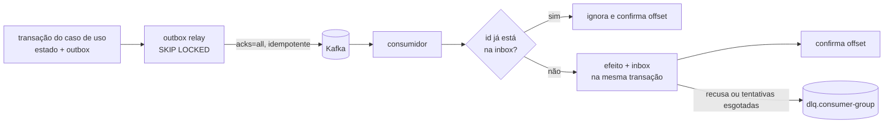

# Eventos

Os contextos conversam por **eventos de domínio** no Kafka, nunca lendo o banco um do outro. Filas e tópicos da AWS local (SQS e SNS) ficam com o trabalho assíncrono e o fan-out de notificações.

## Envelope: CloudEvents 1.0

Todo evento no Kafka é um [CloudEvent](https://github.com/cloudevents/spec) em modo estruturado: o JSON inteiro vai no value da mensagem, com o header `content-type: application/cloudevents+json`.

```json
{
  "specversion": "1.0",
  "id": "01926f3a-8c1e-7b2d-9f4a-3c5e6d7f8a9b",
  "source": "/commerce",
  "type": "tucano.commerce.order.paid",
  "subject": "01926f39-1d2c-7a8b-8c9d-0e1f2a3b4c5d",
  "time": "2026-09-27T12:00:04.567Z",
  "datacontenttype": "application/json",
  "correlationid": "4f1c2b7e-...#12",
  "causationid": "01926f39-77aa-7c01-9d2e-5f6a7b8c9d0e",
  "data": {
    "orderId": "01926f39-1d2c-7a8b-8c9d-0e1f2a3b4c5d",
    "orderNumber": "97663530295234560",
    "paidAt": "2026-09-27T12:00:04.501Z"
  }
}
```

| Atributo | Regra |
|---|---|
| `id` | UUIDv7 gerado quando o evento é criado; é a chave de deduplicação dos consumidores |
| `type` | `tucano.<contexto>.<agregado>.<fato no passado>` |
| `subject` | id do agregado; também é a chave da mensagem no Kafka |
| `correlationid` | o mesmo do request que originou o fluxo (vem do Kong) |
| `causationid` | `id` do evento ou comando que causou este |

O schema do envelope está em [`contracts/events/cloudevent.schema.json`](../../contracts/events/cloudevent.schema.json). Os schemas do `data` de cada evento entram em `contracts/events/` junto com o produtor, e os testes de contrato do produtor validam o evento contra o envelope e contra o schema do `data`:

| Evento | Schema do `data` |
|---|---|
| `tucano.catalog.product.snapshot` | [`catalog.product.snapshot.schema.json`](../../contracts/events/catalog.product.snapshot.schema.json) |
| `tucano.commerce.order.placed` | [`commerce.order.placed.schema.json`](../../contracts/events/commerce.order.placed.schema.json) |
| `tucano.commerce.order.paid` | [`commerce.order.paid.schema.json`](../../contracts/events/commerce.order.paid.schema.json) |
| `tucano.commerce.order.cancelled` | [`commerce.order.cancelled.schema.json`](../../contracts/events/commerce.order.cancelled.schema.json) |
| `tucano.logistics.shipment.created` | [`logistics.shipment.created.schema.json`](../../contracts/events/logistics.shipment.created.schema.json) |
| `tucano.logistics.shipment.cancelled` | [`logistics.shipment.cancelled.schema.json`](../../contracts/events/logistics.shipment.cancelled.schema.json) |
| `tucano.logistics.shipment.ready_for_pickup` | [`logistics.shipment.ready_for_pickup.schema.json`](../../contracts/events/logistics.shipment.ready_for_pickup.schema.json) |
| `tucano.logistics.shipment.picked_up` | [`logistics.shipment.picked_up.schema.json`](../../contracts/events/logistics.shipment.picked_up.schema.json) |
| `tucano.logistics.shipment.in_transit` | [`logistics.shipment.in_transit.schema.json`](../../contracts/events/logistics.shipment.in_transit.schema.json) |
| `tucano.logistics.shipment.out_for_delivery` | [`logistics.shipment.out_for_delivery.schema.json`](../../contracts/events/logistics.shipment.out_for_delivery.schema.json) |
| `tucano.logistics.shipment.delivered` | [`logistics.shipment.delivered.schema.json`](../../contracts/events/logistics.shipment.delivered.schema.json) |
| `tucano.logistics.shipment.delivery_failed` | [`logistics.shipment.delivery_failed.schema.json`](../../contracts/events/logistics.shipment.delivery_failed.schema.json) |
| `tucano.logistics.shipment.returning` | [`logistics.shipment.returning.schema.json`](../../contracts/events/logistics.shipment.returning.schema.json) |
| `tucano.logistics.shipment.returned` | [`logistics.shipment.returned.schema.json`](../../contracts/events/logistics.shipment.returned.schema.json) |

Enquanto um tópico `.v1` esvazia, a forma antiga do evento fica congelada ao lado da atual, com a versão no nome: [`commerce.order.paid.v1.schema.json`](../../contracts/events/commerce.order.paid.v1.schema.json) e [`logistics.shipment.created.v1.schema.json`](../../contracts/events/logistics.shipment.created.v1.schema.json).

## Tópicos

| Tópico | Chave | Produtor | Retenção | Eventos |
|---|---|---|---|---|
| `catalog.products.v1` | `productId` | `catalog` | compactado | `tucano.catalog.product.snapshot` (estado completo do produto) |
| `commerce.orders.v2` | `orderId` | `commerce` | 7 dias | `order.placed`, `order.paid`, `order.cancelled`, `order.shipped`, `order.delivered`, `order.returned` |
| `logistics.shipments.v2` | `shipmentId` | `logistics` | 7 dias | `shipment.created`, `shipment.ready_for_pickup`, `shipment.picked_up`, `shipment.in_transit`, `shipment.out_for_delivery`, `shipment.delivered`, `shipment.delivery_failed`, `shipment.returning`, `shipment.returned`, `shipment.cancelled` |
| `commerce.orders.v1` e `logistics.shipments.v1` | as mesmas | ninguém, desde a ADR 0020 | 7 dias | os eventos de antes do endereço novo, até esvaziar |
| `dlq.<consumer-group>` | a original | consumidores | 14 dias | mensagens que falharam depois de todas as tentativas |

Todos os tópicos têm 3 partições. A chave garante que os eventos de um mesmo agregado caiam na mesma partição e sejam lidos na ordem em que foram publicados. Não existe ordem garantida entre tópicos diferentes.

### Por que o catálogo usa tópico compactado

O catálogo publica o estado do produto, não a mudança (event-carried state transfer). Com `cleanup.policy=compact`, o Kafka mantém indefinidamente a última versão de cada chave. Um consumidor novo lê o tópico do início e monta o snapshot completo do catálogo sem chamar a API de ninguém.

## Consumer groups

| Consumer group | Lê | Faz |
|---|---|---|
| `commerce.catalog-sync` | `catalog.products.v1` | atualiza os snapshots de produto usados no checkout |
| `logistics.catalog-sync` | `catalog.products.v1` | atualiza peso e dimensões usados na escolha da transportadora |
| `logistics.order-intake` | `commerce.orders.v1` e `.v2` | cria a remessa em `order.paid` e a cancela em `order.cancelled` |
| `logistics.label-requests` | `logistics.shipments.v1` e `.v2` | põe na fila `label-jobs` (SQS) o pedido de etiqueta de cada remessa criada |
| `logistics.pickup-bookings` | `logistics.shipments.v1` e `.v2` | agenda a coleta na transportadora de cada remessa pronta |
| `commerce.shipment-sync` | `logistics.shipments.v2` | avança o pedido (enviado, entregue, devolvido) e dispara estornos |
| `commerce.order-projector` | `commerce.orders.v2` | mantém o read model de pedidos no MongoDB |
| `logistics.timeline-projector` | `logistics.shipments.v2` | mantém a linha do tempo no MongoDB e o lookup público no DynamoDB |
| `commerce.notification-router` | `commerce.orders.v2`, `logistics.shipments.v2` | decide o que vira notificação e publica no SNS |
| `bff.live` | `commerce.orders.v2`, `logistics.shipments.v2` | empurra atualizações para o navegador via WebSocket |

## Quando o contrato quebra

A [ADR 0010](../adr/0010-cloudevents-contracts.md) manda a mudança que quebra contrato para um tópico novo, e o endereço da [ADR 0020](../adr/0020-address-by-thoroughfare-and-divisions.md) foi a primeira: o `order.paid` trocou `street`, `district`, `city` e `state` por logradouro e divisões, e o `shipment.created` passou a levar as divisões até o município. Fiz a troca nesta ordem:

1. Criei os tópicos `.v2` ao lado dos `.v1` e congelei o schema antigo com `.v1` no nome.
2. Os consumidores passaram a ler as duas versões. Quem lê o `order.paid` do `.v1` traduz o endereço antigo (`LegacyShippingAddress`): o tipo sai da primeira palavra do `street`, o `district` vira bairro e o `city` vira município.
3. Os produtores passaram a publicar só no `.v2`. Não existe ordem entre os dois tópicos, e a logística aguenta isso porque já aceitava um cancelamento chegar antes do pagamento.
4. Quando o lag de todos os consumer groups no `.v1` zerar, a leitura do `.v1`, o tradutor e os schemas congelados saem num PR próprio, e a retenção de 7 dias apaga o resto.

O lag de um grupo, tópico por tópico:

```bash
docker compose exec kafka /opt/kafka/bin/kafka-consumer-groups.sh --bootstrap-server kafka:9092 \
  --describe --group logistics.order-intake
```

## Garantias de entrega



- **Produção**: o caso de uso grava o estado e o evento na mesma transação (Transactional Outbox). O relay publica com `acks=all` e produtor idempotente e só então marca a mensagem como publicada. Se o relay cair no meio, a mensagem é publicada de novo: a entrega é at-least-once.
- **Consumo**: cada consumidor registra o `id` do evento na tabela de inbox junto com o efeito. Evento repetido é ignorado; o offset só é confirmado depois do processamento.
- **Falhas**: cada tipo tem sua resposta, sempre com backoff exponencial e jitter. Mensagem ilegível ou recusa do domínio (`PermanentFailure`) vai direto para `dlq.<consumer-group>`, com o erro nos headers. Conexão perdida com o banco tenta sem limite: a partição espera o banco voltar, porque desistir mandaria uma mensagem boa para a DLQ, e a seguinte falharia igual. Qualquer outra falha tem tentativas contadas e, esgotadas, vai para a DLQ. Um `SIGTERM` no meio das tentativas não confirma o offset, e a mensagem volta depois do restart.

## Evolução de schema

- Dentro de `v1`, só mudanças aditivas (campos novos e opcionais). Consumidores são tolerant readers e ignoram o que não conhecem.
- Mudança que quebra contrato vira tópico novo (`v2`), publicado em paralelo até todos os consumidores migrarem.

## Mensageria na AWS local

| Recurso | Tipo | Para quê |
|---|---|---|
| `customer-notifications` | SNS | fan-out das notificações para os canais |
| `email-notifications` | SQS (+ DLQ) | assinante do SNS; o worker do commerce envia e-mail pelo SES |
| `push-notifications` | SQS | assinante do SNS com filtro (só marcos da entrega); o BFF transforma em aviso na tela |
| `label-jobs` | SQS (+ DLQ) | fila de jobs do Laravel que gera as etiquetas e as guarda no S3 |

Kafka e SQS resolvem problemas diferentes. O Kafka é um **log**: várias leituras independentes do mesmo evento, reprocessamento e ordem por chave. O SQS é uma **fila de trabalho**: cada mensagem é processada uma vez por um consumidor e sai da fila.
