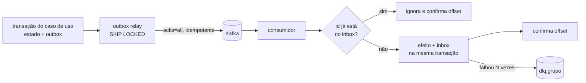

# Eventos

Os contextos conversam por **eventos de domínio** no Kafka, nunca lendo o banco um do outro. Filas e tópicos da AWS local (SQS e SNS) ficam com trabalho assíncrono e *fan-out* de notificações.

## Envelope: CloudEvents 1.0

Todo evento no Kafka é um [CloudEvent](https://github.com/cloudevents/spec) em modo estruturado: o JSON inteiro vai no *value* da mensagem, com o header `content-type: application/cloudevents+json`.

```json
{
  "specversion": "1.0",
  "id": "01926f3a-8c1e-7b2d-9f4a-3c5e6d7f8a9b",
  "source": "/commerce",
  "type": "tucano.commerce.order.paid",
  "subject": "01926f39-1d2c-7a8b-8c9d-0e1f2a3b4c5d",
  "time": "2026-09-27T12:00:04.567Z",
  "datacontenttype": "application/json",
  "correlationid": "4f1c2b7e-...#12",
  "causationid": "01926f39-77aa-7c01-9d2e-5f6a7b8c9d0e",
  "data": {
    "orderId": "01926f39-1d2c-7a8b-8c9d-0e1f2a3b4c5d",
    "orderNumber": "97663530295234560",
    "paidAt": "2026-09-27T12:00:04.501Z"
  }
}
```

| Atributo | Regra |
|---|---|
| `id` | UUIDv7 gerado quando o evento nasce; é a chave de deduplicação dos consumidores |
| `type` | `tucano.<contexto>.<agregado>.<fato no passado>` |
| `subject` | id do agregado; também é a **chave** da mensagem no Kafka |
| `correlationid` | o mesmo do request que originou tudo (vem do Kong) |
| `causationid` | `id` do evento ou comando que causou este |

O schema do envelope está em [`contracts/events/cloudevent.schema.json`](../../contracts/events/cloudevent.schema.json). Os schemas do `data` de cada evento entram em `contracts/events/` junto com o produtor, e os testes de contrato validam produtor e consumidor contra eles.

## Tópicos

| Tópico | Chave | Produtor | Retenção | Eventos |
|---|---|---|---|---|
| `catalog.products.v1` | `productId` | catalog | **compactado** | `tucano.catalog.product.snapshot` (estado completo do produto) |
| `commerce.orders.v1` | `orderId` | commerce | 7 dias | `order.placed`, `order.paid`, `order.cancelled`, `order.shipped`, `order.delivered`, `order.returned` |
| `logistics.shipments.v1` | `shipmentId` | logistics | 7 dias | `shipment.created`, `shipment.ready_for_pickup`, `shipment.picked_up`, `shipment.in_transit`, `shipment.out_for_delivery`, `shipment.delivered`, `shipment.delivery_failed`, `shipment.returning`, `shipment.returned`, `shipment.cancelled` |
| `dlq.<consumer-group>` | a original | consumidores | 14 dias | mensagens que falharam depois de todas as tentativas |

Todos os tópicos têm 3 partições. A chave garante que os eventos de um mesmo agregado caiam na mesma partição e sejam lidos **na ordem** em que foram publicados. Não existe ordem garantida entre tópicos diferentes.

### Por que o catálogo usa tópico compactado

O catálogo publica o **estado** do produto, não a mudança (*event-carried state transfer*). Com `cleanup.policy=compact`, o Kafka guarda para sempre a última versão de cada chave. Um consumidor novo lê o tópico do início e monta o snapshot completo do catálogo, sem chamar a API de ninguém.

## Grupos de consumidores

| Grupo | Lê | Faz |
|---|---|---|
| `commerce.catalog-sync` | `catalog.products.v1` | atualiza os snapshots de produto usados no checkout |
| `logistics.catalog-sync` | `catalog.products.v1` | atualiza peso e dimensões usados na escolha da transportadora |
| `logistics.order-intake` | `commerce.orders.v1` | cria a remessa em `order.paid` e a cancela em `order.cancelled` |
| `commerce.shipment-sync` | `logistics.shipments.v1` | avança o pedido (enviado, entregue, devolvido) e dispara estornos |
| `commerce.order-projector` | `commerce.orders.v1` | mantém o read model de pedidos no MongoDB |
| `logistics.timeline-projector` | `logistics.shipments.v1` | mantém a linha do tempo no MongoDB e o lookup público no DynamoDB |
| `commerce.notification-router` | `commerce.orders.v1`, `logistics.shipments.v1` | decide o que vira notificação e publica no SNS |
| `bff.live` | `commerce.orders.v1`, `logistics.shipments.v1` | empurra atualizações para o navegador via WebSocket |

## Garantias de entrega



- **Produção**: o caso de uso grava o estado e o evento na **mesma transação** (Transactional Outbox). O relay publica com `acks=all` e produtor idempotente e só então marca a mensagem como publicada. Se cair no meio, publica de novo: a entrega é *at-least-once*.
- **Consumo**: cada consumidor registra o `id` do evento na tabela de *inbox* junto com o efeito. Evento repetido é ignorado; o offset só é confirmado depois do processamento.
- **Falhas**: novas tentativas com *backoff* exponencial e *jitter*. Esgotadas as tentativas, a mensagem vai para `dlq.<grupo>` com o erro nos headers, e o consumidor segue em frente em vez de travar a partição.

## Evolução de schema

- Dentro de `v1`, só mudanças **aditivas** (campos novos e opcionais). Consumidores são *tolerant readers* e ignoram o que não conhecem.
- Mudança que quebra contrato vira tópico novo (`v2`), publicado em paralelo até todos os consumidores migrarem.

## Mensageria na AWS local

| Recurso | Tipo | Para quê |
|---|---|---|
| `customer-notifications` | SNS | *fan-out* das notificações para os canais |
| `email-notifications` | SQS (+ DLQ) | assinante do SNS; o worker do commerce envia e-mail pelo SES |
| `push-notifications` | SQS | assinante do SNS **com filtro** (só marcos da entrega); o BFF transforma em aviso na tela |
| `label-jobs` | SQS (+ DLQ) | fila de jobs do Laravel que gera as etiquetas e as guarda no S3 |

Kafka e SQS resolvem problemas diferentes: Kafka é um **log** (várias leituras independentes do mesmo evento, *replay*, ordem por chave); SQS é uma **fila de trabalho** (cada mensagem é processada uma vez por um consumidor e some).
