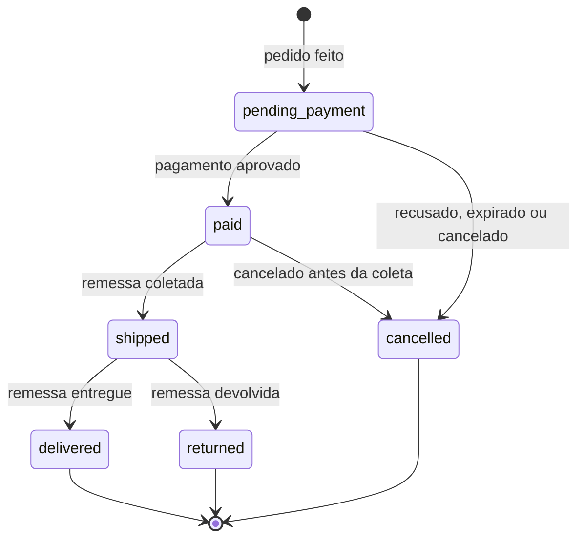
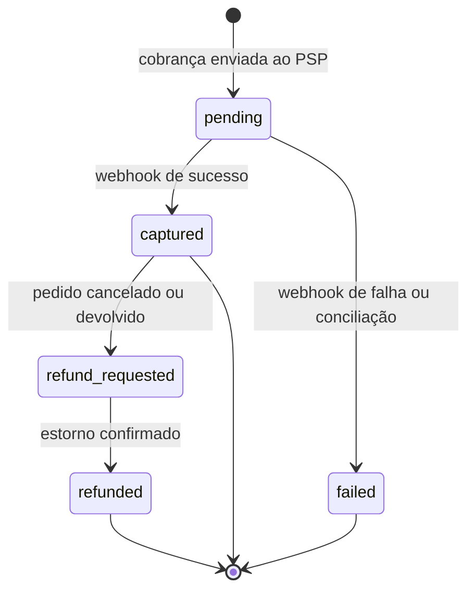
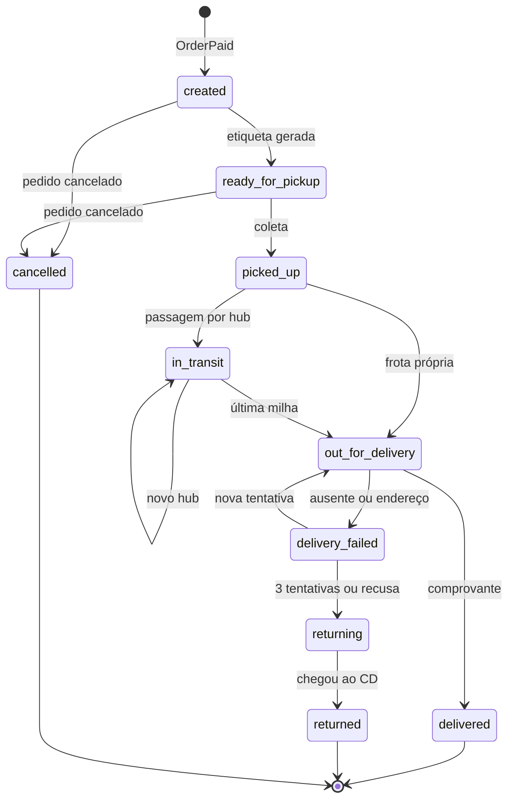
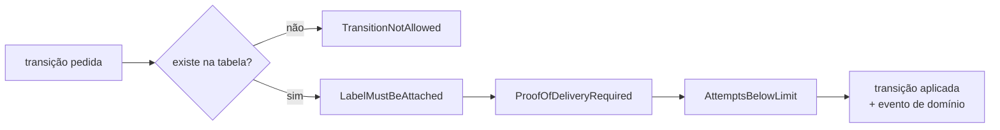

# Máquinas de estado

## O problema das flags booleanas

Um pedido modelado com `is_paid`, `is_shipped` e `is_cancelled` tem 2³ = 8 combinações possíveis, mas só algumas fazem sentido. Nada impede `is_cancelled = true` e `is_shipped = true` ao mesmo tempo, e cada `if` do sistema precisa se defender disso.

| is_paid | is_shipped | is_cancelled | Faz sentido? |
|---|---|---|---|
| false | false | false | sim, aguardando pagamento |
| true | false | false | sim, pago |
| true | true | false | sim, enviado |
| false | true | false | **não**: enviado sem pagar |
| true | true | true | **não**: enviado e cancelado |
| ... | ... | ... | ... |

A saída é **um único campo de estado** com as transições explícitas: estados impossíveis deixam de ser representáveis. Datas como "quando foi entregue" vêm do histórico de transições, não de colunas soltas.

## Estruturas por stack

| Onde | Estrutura | Por quê |
|---|---|---|
| PHP (domínio) | `enum` *backed* + tabela de transições com `match` | o `match` sobre enum é exaustivo: faltou um caso, o PHPStan acusa e o runtime lança `UnhandledMatchError` |
| PHP (regras dependentes de dados) | guards em **Chain of Responsibility** | cada regra ("precisa de comprovante", "no máximo 3 tentativas") é uma classe pequena e testável, encadeada na ordem certa |
| PostgreSQL | coluna `status` com `CHECK` + tabela de histórico *append-only* | o banco também recusa estados inválidos, e o histórico vira trilha de auditoria |
| TypeScript (web, BFF) | *discriminated unions* | o compilador obriga a tratar cada estado; nada de `isLoading && !isError` |

Alternativas conhecidas no ecossistema PHP: o padrão **State** do GoF (uma classe por estado), `symfony/workflow` e `spatie/laravel-model-states`. Aqui preferimos enum + tabela porque mantém o domínio sem dependências e a máquina inteira cabe numa tela.

## Pedido (Ordering)

`paid → cancelled` e `shipped → returned` disparam a **compensação** da saga: estorno do pagamento e, no primeiro caso, cancelamento da remessa.

## Pagamento (Payments)

## Remessa (Shipping)

É a máquina de estados principal do projeto.

### Transições e guards

A tabela responde **se** uma transição existe; os guards respondem se ela pode acontecer **com estes dados**.

| De | Para | Guards |
|---|---|---|
| `created` | `ready_for_pickup` | a etiqueta precisa estar anexada |
| `created`, `ready_for_pickup` | `cancelled` | — |
| `ready_for_pickup` | `picked_up` | — |
| `picked_up`, `in_transit` | `in_transit` | o hub precisa ser informado |
| `picked_up`, `in_transit` | `out_for_delivery` | — |
| `delivery_failed` | `out_for_delivery` | menos de 3 tentativas |
| `out_for_delivery` | `delivered` | comprovante de entrega obrigatório |
| `out_for_delivery` | `delivery_failed` | motivo obrigatório |
| `delivery_failed` | `returning` | 3 tentativas ou recusa do destinatário |
| `returning` | `returned` | — |

Os guards formam uma corrente (*Chain of Responsibility*): cada elo verifica uma regra e passa adiante; o primeiro que recusar interrompe a transição com um erro de domínio que diz o motivo.

Cada transição aplicada:

1. muda o estado do agregado;
2. acrescenta uma linha ao histórico (`shipment_transitions`);
3. registra um evento de domínio (`ShipmentDelivered`, `DeliveryAttemptFailed`...), que sai pela outbox.
