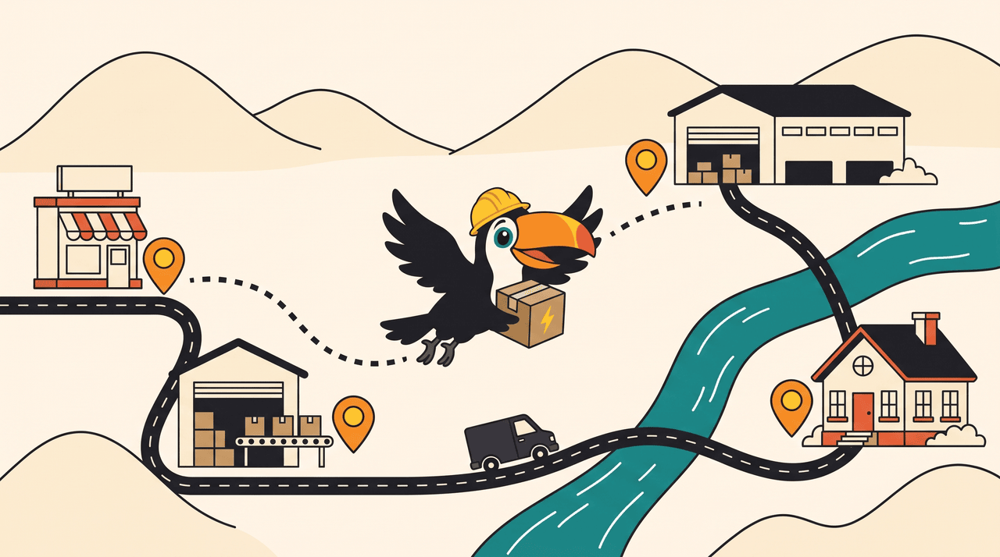

# 1. A Tucano e a jornada de um pedido

A Tucano é uma plataforma que hospeda lojas: a Arara Livros, a Bem-te-vi Eletrônicos e a Sabiá Casa e Esporte, cada uma com a sua marca e a sua vitrine. As lojas dividem o que é da plataforma, os centros de distribuição, o pagamento e a entrega, feita com a frota própria, a Tucano Express, ou com três transportadoras parceiras. O negócio é inventado; o problema, não. Um pedido atravessa estoque, pagamento, etiqueta, coleta, hubs e porta de casa, e em cada passagem de mão alguma coisa pode dar errado. Por isso escolhi esse domínio: ele é pequeno o bastante para caber na minha máquina e grande o bastante para ter todas as falhas que interessam.

## Quem participa

| Ator | O que quer | Onde vive |
|---|---|---|
| Cliente | escolher uma loja, ver o catálogo dela, comprar, pagar e acompanhar a entrega | a web, pelo BFF |
| Administrador do catálogo | publicar produto numa loja, mudar preço, tirar de linha | API do catalog |
| PayFake, o PSP | receber a cobrança e dizer, por webhook, se ela passou | partners-sim |
| CarrierFake, as transportadoras | coletar, passar por hubs, entregar ou devolver, avisando por webhook | partners-sim |
| O relógio | vencer reservas, conciliar pagamentos e jornadas, vigiar o que parou | workers do commerce e da logistics |

Os parceiros são simulados de propósito. O `partners-sim` finge ser o mundo lá fora e aceita comandos de caos: atrasar, recusar, perder webhook, sumir com uma cobrança. É assim que eu provoco, sob demanda, o que no trabalho só aparece às três da manhã.

## Os contextos

Um serviço por subdomínio, não um por entidade ([ADR 0002](../adr/0002-services-per-subdomain.md)):

| Contexto | Serviço | O que decide |
|---|---|---|
| Catálogo | `catalog` (Lumen) | que lojas existem e o que cada uma vende, com que preço e medidas; faz o papel de sistema legado |
| Pedidos, estoque e pagamentos | `commerce` (Laravel) | se o pedido fecha, se o estoque segura, se o dinheiro entrou |
| Logística | `logistics` (Laravel) | quem leva, qual etiqueta, onde a encomenda está, quando algo travou |
| Frota ao vivo | `tracking` (Swoole) | onde está o entregador que leva a encomenda, enquanto ela está a caminho da porta ([UC-TRK-03](../use-cases/UC-TRK-03-follow-delivery-live.md)) |
| Apresentação | `bff` (Node) e `web` (React) | que tela mostrar, com que palavras, e qual o próximo passo |

Cada contexto tem a sua linguagem, e as palavras mudam de sentido na fronteira: para o commerce, "shipped" é um status do pedido; para a logistics, é um momento da jornada da remessa. O [context map](../architecture/context-map.md) mostra quem fala com quem e com que padrão, e a [linguagem ubíqua](../architecture/ubiquitous-language.md) guarda o vocabulário.

## Um pedido do começo ao fim

1. A pessoa escolhe uma loja, depois um produto, e abre o checkout. O BFF pergunta ao catálogo e monta o formulário do pedido.
2. O commerce **reserva o estoque** num centro de distribuição e grava o pedido como aguardando pagamento, com 15 minutos para pagar ([UC-ORD-01](../use-cases/UC-ORD-01-place-order.md), [UC-INV-01](../use-cases/UC-INV-01-reserve-stock.md)).
3. A pessoa paga. O commerce manda a cobrança ao PSP por trás de um circuit breaker e responde na hora: o resultado chega depois, por webhook assinado ([UC-PAY-01](../use-cases/UC-PAY-01-pay-order.md), [UC-PAY-02](../use-cases/UC-PAY-02-settle-payment.md)).
4. Pago, o pedido publica `order.paid` pela outbox. A logistics cria a remessa, escolhe a transportadora e pede a etiqueta, que um worker gera em ZPL e guarda no S3 ([UC-SHP-01](../use-cases/UC-SHP-01-create-shipment.md) a [UC-SHP-03](../use-cases/UC-SHP-03-generate-label.md)).
5. A transportadora coleta, passa por hubs, sai para entrega e entrega, ou tenta três vezes e devolve. Cada passo chega por webhook e vira um evento de `logistics.shipments.v2` ([UC-SHP-04](../use-cases/UC-SHP-04-record-pickup.md) a [UC-SHP-08](../use-cases/UC-SHP-08-return-to-sender.md)).
6. O pedido acompanha a remessa um passo atrás e aprende o código de rastreio na coleta ([UC-ORD-04](../use-cases/UC-ORD-04-follow-shipment.md)). Numa devolução, o pagamento vai para estorno na mesma transação.
7. A web mostra tudo isso sem recarregar: a tela do pedido se atualiza sozinha enquanto algo está para acontecer, e a página de rastreio lê uma cópia no DynamoDB, por chave ([UC-SHP-10](../use-cases/UC-SHP-10-track-by-code.md)). Quando a encomenda sai com a frota própria, a página mostra o entregador chegando, ao vivo: o aparelho dele informa a posição a cada segundo, e o tracking a empurra por WebSocket para quem acompanha aquele código ([UC-TRK-03](../use-cases/UC-TRK-03-follow-delivery-live.md)).
8. Depois, a pessoa acha o pedido em "Meus pedidos" da loja, onde cada perfil de cliente vê só os seus, e cada loja só os dela ([UC-ORD-05](../use-cases/UC-ORD-05-view-orders.md)). A lista lê uma cópia no MongoDB, que um projetor mantém a partir dos eventos do pedido ([UC-ORD-08](../use-cases/UC-ORD-08-project-order-views.md)), e a tela de cada pedido conta a história inteira: as etapas, do pedido feito à entrega, e um histórico que junta o que o commerce e a logística sabem.

Quando alguma peça falha no meio, os casos de uso "do relógio" põem ordem: a reserva vence e devolve o estoque ([UC-ORD-03](../use-cases/UC-ORD-03-expire-unpaid-orders.md)), a conciliação pergunta ao PSP o que ficou sem resposta ([UC-PAY-03](../use-cases/UC-PAY-03-reconcile-payments.md)), a conciliação da jornada pergunta à transportadora o que se perdeu ([UC-SHP-12](../use-cases/UC-SHP-12-reconcile-journeys.md)), e a vigia avisa uma pessoa quando nenhuma tentativa resolve ([UC-SHP-13](../use-cases/UC-SHP-13-watch-stalled-journeys.md)).

## Os casos de uso

Escrevi cada caso de uso no formato de Alistair Cockburn: ator, objetivo, garantias mínimas e de sucesso, cenário principal e extensões. A [lista ator-objetivo](../use-cases/README.md) tem todos. O que mais me importa neles são as **garantias mínimas**: o que o sistema promete mesmo quando tudo dá errado. "Um pedido devolvido nunca fica com o pagamento" é uma frase de negócio, e ela está num caso de uso, num teste e numa transação.

Do documento ao código o caminho é curto e verificado. Cada caso de uso vira um port de entrada com nome no estilo de Cockburn (`ForPlacingOrders`) e uma classe marcada com `#[UseCase('UC-ORD-01')]`, e um teste de arquitetura falha se uma classe marcada não tem ficha.

## Uma loja nunca vê a outra

As lojas dividem os serviços, os bancos e os tópicos, e cada uma é uma coluna, `store`, em todo dado que é dela: produtos, pedidos, remessas, páginas de rastreio ([ADR 0031](../adr/0031-a-store-is-a-tenant.md)). É o modelo de pool, o mais barato de operar e o que mais exige cuidado, porque um filtro esquecido vaza dados de uma loja para outra. Por isso cada serviço cobra o isolamento no próprio dado, e não confia em quem chama: um pedido de outra loja responde o mesmo 404 de um pedido que não existe.

A loja está no endereço, `/stores/sabia/...`, e o Kong dá a cada loja o seu serviço e o seu limite de requests. Uma loja em promoção gasta o limite dela, e a vizinha nem sente ([ADR 0032](../adr/0032-the-edge-per-store-limits-and-its-single-point.md)). O experimento `a-store-in-a-rush` mede isso: sem o limite, a Sabiá ficou várias vezes mais lenta enquanto a Arara lotava.

## O que ficou de fora, de propósito

- **Senha.** O navegador guarda perfis de cliente numa sessão que o BFF assina, e trocar de perfil faz o papel de entrar com outra conta. O isolamento é de verdade: um perfil não abre nem lista o pedido de outro ([ADR 0030](../adr/0030-each-customer-sees-only-its-orders.md)). Autenticação, com provedor de identidade e recuperação de conta, é um assunto inteiro, e não é o que este laboratório quer ensinar agora.
- **Carrinho com vários produtos.** O commerce aceita até 20 itens num pedido; a web compra um produto por vez. O limite é da tela, não do domínio.
- **Dinheiro de verdade.** O PSP é simulado, e os cartões são tokens de teste. Nenhum número de cartão entra no sistema ([ADR 0024](../adr/0024-sensitive-data-behind-a-proxy.md)).

Próximo capítulo: [as stacks e as ferramentas que ligam tudo](02-stacks.md).
