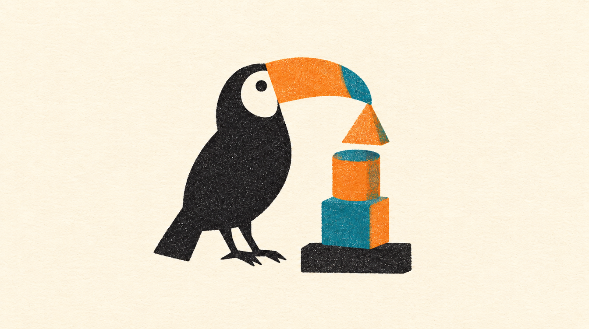

# 2. Stacks e ferramentas transversais

O projeto calibra e relembra stacks. Cada linguagem está onde o trabalho dela faz mais sentido, e não onde ficaria mais bonito num diagrama. E cada ferramenta transversal entrou porque um problema de verdade pedia, nunca para completar uma lista.

## As linguagens, e por que cada uma está onde está

| Onde | Stack | Por que ela, aqui |
|---|---|---|
| `commerce` e `logistics` | PHP 8.4, Laravel 13 | o núcleo transacional: muita regra, muito banco, muito caso de uso. O Laravel dá container, filas, migrations e HTTP maduros, e o hexágono mantém o framework na borda |
| `catalog` | PHP 8.3, Lumen 11 | faz o papel de sistema legado: um framework menor, uma versão de PHP atrás. Obriga o shared kernel a rodar em duas versões, como acontece em qualquer empresa com mais de três anos |
| `tracking` | PHP 8.4, Swoole 6 | o tempo real da frota pede um processo que fica de pé e segura milhares de conexões. Swoole mostra o PHP fora do modelo de "um request, um processo" ([ADR 0013](../adr/0013-swoole-for-fleet-tracking.md)) |
| `bff` e `partners-sim` | Node 24, Fastify 5, TypeScript | o trabalho deles é esperar I/O. O event loop faz isso sem um processo por conexão, e o Node roda TypeScript direto, sem build ([ADR 0014](../adr/0014-node-for-bff-and-partners.md)) |
| `web` | React 19, TypeScript, Vite | um intérprete de telas: ele não conhece o fluxo, só desenha o que o BFF manda ([ADR 0023](../adr/0023-server-driven-ui-with-siren.md)) |

Poliglotia tem preço: mais ferramenta para manter, mais idioma para lembrar. Eu pago esse preço porque o objetivo é justamente relembrar cada stack no seu melhor uso. O que eu não aceito é cada linguagem com a sua convenção: erro é RFC 9457 em todas, log é uma linha JSON com `correlation_id` em todas, configuração segue a mesma regra de nomes em todas ([ADR 0021](../adr/0021-configuration-from-the-environment.md)).

## As ferramentas transversais

| Ferramenta | Papel | O que ela resolve aqui |
|---|---|---|
| Kong 3.9 | a borda | uma porta só para a web, o BFF e as APIs, e o `X-Correlation-Id` que amarra os logs de todos os serviços de um request ([ADR 0006](../adr/0006-kong-db-less.md)) |
| Kafka 3.9, com ZooKeeper | os eventos entre contextos | o commerce publica `order.paid` sem saber quem ouve; a logistics consome no ritmo dela, e um consumidor que cai volta de onde parou ([ADR 0004](../adr/0004-kafka-with-zookeeper.md)) |
| PostgreSQL 18 | escrita ACID de commerce e logistics | transações de verdade, `SKIP LOCKED` para dividir trabalho, `uuidv7()` nativo e `CHECK` que guarda regra de negócio no banco |
| MySQL 8.4 | escrita do catálogo legado | o banco que o sistema antigo já usava, com UUID em `BINARY(16)` |
| MongoDB 8 | leituras BASE | as projeções que aceitam alguns segundos de atraso: a lista de pedidos, a linha do tempo da remessa |
| Redis 8 | cache e memória curta | o cache-aside do catálogo e a janela que impede o mesmo alerta de sair duas vezes |
| Floci | AWS local | S3 para as etiquetas, SQS para a fila delas, DynamoDB para a página pública de rastreio ([ADR 0005](../adr/0005-floci-local-aws.md)) |
| Toxiproxy 2.12 | o caos em cada fio | toda conexão de serviço passa por ele, então dá para pôr latência ou cortar qualquer dependência de qualquer serviço |
| flagd 0.17 e OpenFeature | feature flags | liga e desliga comportamento por ambiente, e as flags de caos só existem fora da produção ([ADR 0015](../adr/0015-feature-flags-openfeature-flagd.md)) |
| Mailpit | e-mail de mentira | o alerta das jornadas paradas chega numa caixa de verdade, que eu abro no navegador |
| Ansible | a máquina nova | um comando prepara o Mac ou o Linux e sobe a stack até os health checks passarem |

## O casamento

Uma ferramenta sozinha não conta a história; a costura entre elas conta. Três costuras aparecem em todo lugar:

- **A escrita e o evento andam juntos.** O pedido e a linha da outbox entram na mesma transação do PostgreSQL. Um relay lê a outbox e publica no Kafka. Do outro lado, o consumidor marca o id do evento numa tabela de inbox na mesma transação do efeito. Resultado: nenhum evento some se o Kafka cair, e nenhum efeito acontece duas vezes se o evento chegar duas vezes ([ADR 0008](../adr/0008-transactional-outbox.md)).
- **Um id atravessa tudo.** O Kong carimba o `X-Correlation-Id`, o BFF repassa, os serviços PHP gravam em cada log, a outbox copia para a extensão `correlationid` do CloudEvent, e o consumidor do outro lado continua usando o mesmo id. Um `grep` acha a história inteira de um clique.
- **O caos mora no meio.** Os serviços não falam direto com banco, fila ou parceiro: falam com o Toxiproxy, que repassa. Por isso um laboratório corta o PostgreSQL de um serviço só, ou deixa o PSP lento sem tocar em código.

## O que cada stack me relembra

- **PHP**: o modelo "nada compartilhado" do PHP-FPM, em que cada request começa do zero, contra o processo de longa duração do Swoole, em que um vazamento de memória fica. Tipos estritos, classes `readonly`, enums com comportamento e `private(set)`.
- **Laravel**: container, middleware, filas, migrations e HTTP. E como deixar tudo isso do lado de fora do domínio.
- **Node**: o event loop, `AbortSignal` para prazo, e TypeScript rodando direto no Node, com a disciplina de usar só sintaxe que some.
- **React**: estado derivado do servidor em vez de estado inventado no cliente, acessibilidade de verdade (foco, anúncio, contraste) e um app que não conhece as próprias rotas.

Próximo capítulo: [a natureza da informação](03-informacao.md).
