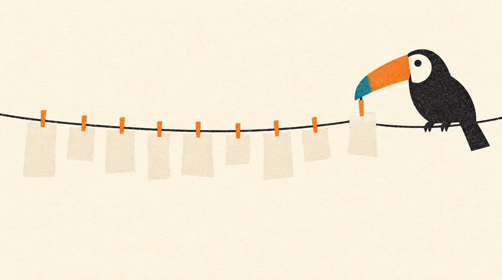

# 3. A natureza da informação

Antes de escolher banco, fila ou cache, eu pergunto de que tipo é a informação. Quem é o dono dela? Ela pode chegar atrasada? Pode chegar duas vezes? É de uma pessoa? A resposta decide a ferramenta, e não o contrário.

## Cada fato tem um dono só

| Informação | Dono | Cópias | Pode atrasar? |
|---|---|---|---|
| produto, preço e medidas | `catalog` (MySQL) | a cópia do commerce (preço para o pedido) e a da logistics (peso e medidas para montar os volumes e escolher quem leva), pelo tópico compactado `catalog.products.v1` | a cópia sim; o pedido usa o preço da cópia, e isso está escrito no caso de uso |
| pedido e o seu status | `commerce` (PostgreSQL) | a lista de pedidos no MongoDB (`order_views`) | a lista sim; a tela de um pedido não, e por isso lê o PostgreSQL |
| estoque e reservas | `commerce` (PostgreSQL) | nenhuma | não: é aqui que o overselling acontece ou não |
| pagamento | `commerce` (PostgreSQL), com o PSP como fonte da palavra final | nenhuma | o resultado chega por webhook, e a conciliação vai buscar o que não chegou |
| remessa e jornada | `logistics` (PostgreSQL), com a transportadora como fonte do que aconteceu na rua | a linha do tempo no MongoDB e a página pública no DynamoDB | as cópias sim, alguns segundos |

A regra é simples: **a cópia pode atrasar, mas nunca decide.** Quem decide lê o dono. A página de rastreio lê a cópia no DynamoDB, por chave, porque ali alguns segundos de atraso não fazem mal e a leitura precisa aguentar muita gente. Já a reserva de estoque só existe no PostgreSQL, dentro de uma transação, porque ali um segundo de atraso vende a mesma unidade duas vezes.

## ACID onde decide, BASE onde mostra

Escrita que decide alguma coisa vai para um banco com transação de verdade: PostgreSQL no commerce e na logistics, MySQL no catálogo. Leitura que só mostra vai para onde ela é barata e escala: MongoDB para listas e linhas do tempo, DynamoDB para a página pública ([ADR 0012](../adr/0012-acid-writes-base-reads.md)).

O custo é ter duas representações do mesmo fato e um caminho entre elas. Esse caminho é um evento, e ele pode falhar, repetir ou chegar fora de ordem. Então cada projeção deduplica pelo id do evento e sabe se reconstruir do zero.

## Eventos são fatos, no passado

`order.paid`, `shipment.picked_up`, `shipment.delivered`. Um evento conta o que já aconteceu e não muda depois. É a ideia que Greg Young repete desde que deu nome ao CQRS: a informação de um negócio é, antes de tudo, uma sequência de fatos, e o estado atual é uma conta feita sobre eles. Um fato errado não se apaga, se corrige com outro fato: um pagamento que volta é um estorno, e não um pagamento que deixou de existir. Por isso o histórico de status do pedido só ganha linha nova. Todos usam o envelope CloudEvents, e o formato do `data` de cada tipo está em JSON Schema em `contracts/events`, conferido no CI ([ADR 0010](../adr/0010-cloudevents-contracts.md)).

Quando um contrato precisa quebrar, ele não quebra no lugar: nasce um tópico novo (`logistics.shipments.v2`), e os consumidores migram no ritmo deles. O catálogo usa um tópico compactado, em que o Kafka guarda só a última versão de cada produto: quem chega depois lê o estado atual sem precisar da história inteira.

## Quando a rede se parte

Eric Brewer apresentou em 2000 a conjectura que virou o teorema CAP: quando a rede se parte, um sistema distribuído precisa escolher entre responder com o que tem (disponibilidade) e recusar para não errar (consistência). Doze anos depois, ele mesmo lembrou que essa escolha não é uma só para o sistema inteiro: ela se faz operação por operação. Na Tucano, a mesma queda de banco leva a escolhas diferentes, e cada uma tem um experimento que prova:

| Operação | O que ela escolhe | O que acontece sem o banco dela | Experimento |
|---|---|---|---|
| fechar um pedido | consistência: sem o PostgreSQL, não há como prometer estoque | o commerce recusa na hora, com `503` e `Retry-After`, em 0,13 s | [`commerce-database-out`](../../chaos/experiments/commerce-database-out.json) |
| rastrear uma entrega | disponibilidade: a cópia no DynamoDB pode estar alguns segundos atrás | o rastreio continua respondendo, em 0,03 s | [`tracking-without-its-database`](../../chaos/experiments/tracking-without-its-database.json) |
| abrir uma tela da web | isolamento: cada tela depende só dos serviços dela | com o commerce cortado, só as telas do commerce respondem `503`, e o catálogo continua abrindo | [`commerce-cut-from-the-web`](../../chaos/experiments/commerce-cut-from-the-web.json) |

Daniel Abadi completou a ideia em 2012 com o PACELC: mesmo sem partição, sobra a escolha entre latência e consistência. É a mesma conta da tabela do começo deste capítulo: a lista de pedidos aceita atraso para ser barata, e a tela de um pedido específico paga a leitura no PostgreSQL para mostrar o fato.

Dá para ver essa conta na tela. Ligue a flag `chaos.commerce.order-projector-paused` e compre alguma coisa: o pedido abre na hora, com todo o histórico, e "Meus pedidos" ainda não sabe dele. Desligue a flag, e ele aparece na lista em uns 2 s. O passo a passo está no [laboratório de consistência](../architecture/feature-flags.md#o-laboratório-de-consistência).

## Identidade

- **UUIDv7** para identidade interna: gerado pelo domínio, sem ir ao banco, e ordenado no tempo, o que mantém o índice feliz. Fica em `uuid` no PostgreSQL e em `BINARY(16)` no MySQL, nunca em `CHAR(36)`.
- **Snowflake** para o que uma pessoa lê ou fala ao telefone: o número do pedido em decimal (`97856663872212992`) e o código de rastreio em Base32 de Crockford (`TX02PX83TXC5G00`), que evita letras que se confundem. O próprio código diz quando e em que processo nasceu ([ADR 0007](../adr/0007-uuidv7-and-snowflake.md), [identificadores](../architecture/identifiers.md)).

## Tempo, dinheiro e tipos

- **Tempo** é UTC, gravado em `timestamptz`, trafegado em RFC 3339, e mostrado no fuso de quem lê só na tela. O relógio é um port: nos testes ele fica parado onde o teste mandar.
- **Dinheiro** é inteiro em centavos (`BIGINT`) com a moeda ao lado (`CHAR(3)`, ISO 4217). Nunca `float`. A tela recebe o valor e o texto pronto, `{"amount": 15990, "currency": "BRL", "formatted": "R$ 159,90"}`, para quem calcula e para quem lê.
- **Tipos no banco** dizem a verdade: `CHAR(n)` só para o que tem tamanho fixo (UF em `CHAR(2)`, CEP em `CHAR(8)`, centro de distribuição em `CHAR(4)`, código de rastreio em `CHAR(15)`), `VARCHAR(n)` com o limite real (SKU em `VARCHAR(32)`, e-mail em `VARCHAR(254)`), e `TEXT` para texto livre. Regra de negócio que dá para escrever como `CHECK` fica no banco também: "só pedido que saiu tem código de rastreio", "todo pedido cancelado diz por quê".
- **Endereço** é um conjunto de peças, não uma string: logradouro com tipo e nome, número em texto (porque existe `KM 500` e `S/N`) e as divisões do estado para baixo ([ADR 0020](../adr/0020-address-by-thoroughfare-and-divisions.md)).

## Tudo pode chegar duas vezes

Numa rede, "entregue exatamente uma vez" não existe; existe "entregue pelo menos uma vez" e um receptor que aguenta repetição. Por isso:

- Todo consumidor de evento marca o id na inbox, na mesma transação do efeito.
- Todo `POST` que cria alguma coisa exige `Idempotency-Key`: a mesma chave com o mesmo corpo devolve o mesmo resultado, e com outro corpo é recusada.
- Webhook de parceiro é deduplicado pelo id do evento do parceiro.

## Informação de pessoa

Nome, e-mail, documento de quem recebe e token de cartão são de outra categoria. Eles moram dentro de um `Sensitive`, que se imprime como máscara (`A*** S***`, `a***@example.com`) em log, erro e dump, e só entrega o valor por `reveal()`, nos pontos onde ele precisa sair: o banco, o evento, a etiqueta, o PSP. Um teste falha se `reveal()` aparecer em qualquer outro lugar ([ADR 0024](../adr/0024-sensitive-data-behind-a-proxy.md)).

E o melhor dado pessoal é o que nem circula: quem recebeu a encomenda nunca vai para um tópico, e a leitura pública do pedido mostra o cliente mascarado.

Próximo capítulo: [o playground do caos](04-caos.md).
