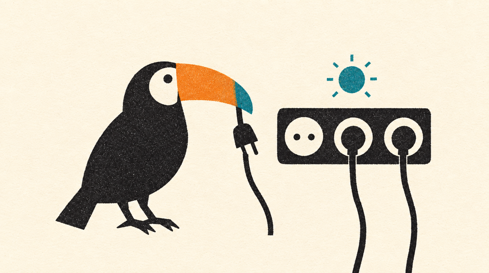

# 4. O playground do caos



É aqui que o projeto ganha o nome. Construir o sistema é metade do trabalho; a outra metade é quebrar de propósito e ver se ele se comporta como eu achava. Quase sempre não se comporta, e é aí que o laboratório paga o que custou.

## O método

Cada laboratório segue o mesmo roteiro, emprestado dos princípios de engenharia do caos:

1. **Escrevo o que eu espero** antes de quebrar: "com o PSP lento, o checkout continua respondendo".
2. **Provoco uma falha do mundo real**, uma de cada vez: latência, corte de rede, banco reiniciando, parceiro que perde aviso.
3. **Meço** com números, não com impressão: quantas reservas, quantos segundos, quantos eventos na DLQ.
4. **Mudo o código** quando a realidade discorda da expectativa, e o laboratório conta o que mudou e por quê.

A diferença para a engenharia do caos de produção é o tamanho do estrago possível: aqui ele cabe na minha máquina, então eu posso ser mais agressivo e repetir quantas vezes quiser.

## As três alavancas

| Alavanca | O que quebra | Como |
|---|---|---|
| Toxiproxy | a rede entre um serviço e qualquer dependência dele: banco, Redis, Kafka, flagd, PSP, transportadora, e agora o BFF com cada serviço | `make proxies` lista; um `curl` na API dele põe latência, corta ou limita banda |
| Flags `chaos.*` | comportamento dentro do serviço: atrasar o gateway de pagamento, pausar o relay da outbox ou o projetor dos pedidos, falhar parte das etiquetas | `make flag key=... variant=...`, pelo flagd, sem reiniciar nada; o `ProductionGuard` as desliga em produção |
| API `/_chaos` do partners-sim | o mundo lá fora: o PSP recusa, demora ou perde cobrança; a transportadora perde webhook ou demora entre passos | um `PUT` com a taxa de cada falha |

## Os laboratórios

| Laboratório | O que eu quebrei | O que descobri, e o que mudou no código |
|---|---|---|
| [Overselling](../labs/overselling.md) | oito e depois trinta compradores disputando cinco unidades, com cinco estratégias de reserva atrás do mesmo port | as quatro estratégias corretas venderam exatamente as unidades que existiam; a ingênua segurou 483 reservas para 100 unidades. Cada estratégia virou um adapter, escolhido por flag, e o teste de concorrência roda no CI |
| [Circuit breaker](../labs/circuit-breaker.md) | 3 s de latência no PSP, com timeout de 2 s | sem proteção, cada pagamento prende um processo do PHP-FPM; com o breaker, depois de cinco falhas o commerce responde em milissegundos com 503 e `Retry-After`, e o PSP ganha tempo para voltar |
| [Conciliação de pagamentos](../labs/payment-reconciliation.md) | webhooks descartados e cobranças que somem no PSP | o webhook empurra, a conciliação puxa. Nasceu o estado `abandoned`, para desistir de esperar sem fechar a porta ao PSP ([ADR 0019](../adr/0019-abandoned-payments-accept-late-outcomes.md)) |
| [Banco fora do ar](../labs/database-outage.md) | o PostgreSQL reinicia com relay e consumidores no meio do trabalho | o relay não voltava e o consumidor desistia cedo, mandando para a DLQ mensagens que não tinham defeito nenhum. Agora os dois refazem a conexão, e a partição espera o banco em vez de pular mensagens ([ADR 0017](../adr/0017-wait-for-the-database-not-the-dlq.md)) |
| [Fila de etiquetas](../labs/label-queue.md) | o bucket do S3 falha durante a geração das etiquetas | cada peça tenta de novo do seu jeito: o job com backoff, o `failed_jobs` com o que desistiu, e o replay do Kafka para o que sumiu antes da fila ([ADR 0018](../adr/0018-async-work-starts-from-the-event.md)) |
| [Webhooks perdidos](../labs/lost-carrier-events.md) | a transportadora derruba parte dos avisos | entrega em ordem mais perda de mensagem trava a jornada inteira, não só o passo perdido. Nasceu a conciliação com o histórico da transportadora e a vigia das jornadas paradas, que alerta sem repetir a mesma notícia |

## O caos mais recente: a porta da web

O BFF fala com cada serviço pelo seu próprio proxy. Com o commerce cortado, a tela do pedido responde 503 com `Retry-After` e uma frase em português, enquanto o catálogo continua abrindo. Com seis segundos de latência no catálogo, o BFF desiste em cinco e diz a mesma coisa. Cada queda deixa uma linha `warn` com o correlation id, o serviço, a chamada e o tempo gasto.

```bash
curl -s -X POST localhost:8474/proxies/bff-commerce -d '{"enabled": false}'   # corta
curl -si localhost:8000/bff/v1/orders/<id> | grep -i retry-after                 # 503, tente em 5 s
curl -s localhost:8000/bff/v1/products -o /dev/null -w '%{http_code}\n'          # 200: o catálogo segue
curl -s -X POST localhost:8474/proxies/bff-commerce -d '{"enabled": true}'    # religa
```

## O que eu levo de todos eles

- **Timeout em toda chamada.** A falha mais cara não é a que responde erro: é a que não responde.
- **Desfecho desconhecido é o estado normal da rede.** Toda operação que cruza um fio pode ter dado certo sem eu saber. Idempotência de um lado e conciliação do outro transformam "não sei" em "já sei".
- **Retry não é estratégia, é tática.** Tentar de novo resolve o que é passageiro; o que é permanente precisa de uma pessoa, e o sistema precisa avisar essa pessoa uma vez só.
- **Conexão de longa duração é estado.** O PHP-FPM ganha resiliência de graça por começar do zero a cada request; um worker precisa merecer a dele.

Próximo capítulo: [abstrações que seguram a entropia](05-abstracoes.md).
