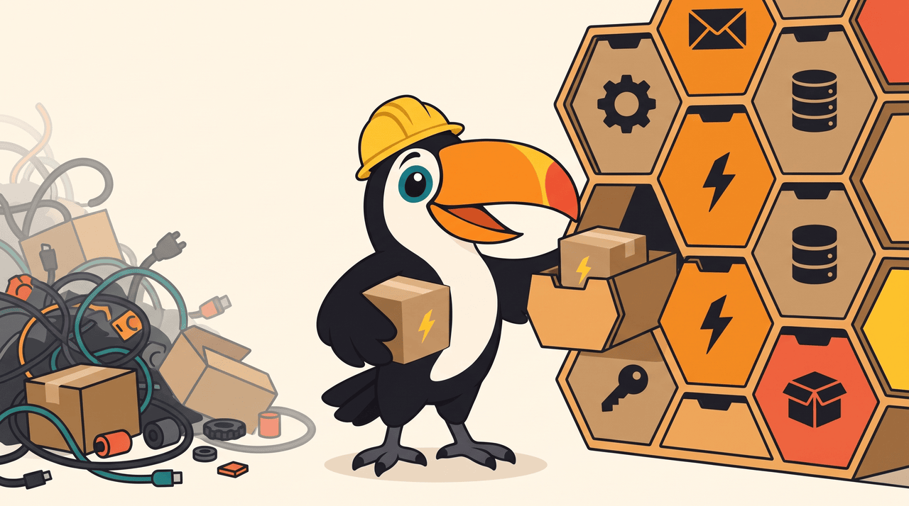

# 5. Abstrações que seguram a entropia

Código cresce para o emaranhado sozinho, sem ninguém querer. Cada atalho parece barato no dia e cobra juros depois. As abstrações deste projeto existem para uma coisa só: fazer uma mudança continuar local conforme o sistema cresce. Quando uma abstração não ajuda nisso, ela não entra.

A pergunta que eu faço antes de criar uma é a de David Parnas, de 1972: que decisão aqui tem mais chance de mudar? Essa decisão ganha uma parede em volta, e o resto do código passa a depender da parede, não da decisão.

## O hexágono, pacote por pacote

Cada serviço PHP é dividido por assunto (`Ordering`, `Inventory`, `Payments` no commerce; `Shipping`, `Timeline`, `CarrierSelection` na logistics), e cada assunto tem as mesmas três camadas ([ADR 0003](../adr/0003-package-by-feature-hexagonal.md)):

| Camada | O que mora nela | Pode depender de |
|---|---|---|
| `Domain` | agregados, value objects, máquinas de estados, eventos, erros | só do shared kernel |
| `Application` | os casos de uso e os ports: `Driving` (o que o mundo pede, como `ForPlacingOrders`) e `Driven` (o que o caso de uso precisa, como `ForStoringOrders`) | do domínio e do shared kernel |
| `Adapter` | HTTP, Kafka, PostgreSQL, S3, PSP, flags: tudo que fala com o mundo | de tudo, inclusive dos fornecedores |

O domínio não sabe que existe Laravel, Kafka ou AWS. Um caso de uso pergunta a um port, e um adapter responde. Trocar o PostgreSQL de um repositório, ou o flagd por outra fonte de flags, muda um adapter e mais nada. O Deptrac cobra essas direções no CI, e desde o [ADR 0022](../adr/0022-vendors-live-in-adapters.md) cobra também que SDK de fornecedor (AWS, Guzzle, MongoDB, Ramsey, RdKafka, OpenFeature) só apareça nos adapters.

## Fachadas entre pacotes

Dois pacotes do mesmo serviço também só se encontram pela porta da frente. Quando o Payments precisa cancelar um pedido recusado, um adapter do lado do Payments chama um port de entrada do Ordering; ele nunca abre o repositório do outro nem importa um adapter alheio. O teste `PackagesMeetThroughTheirFacadesTest` falha se alguém atravessar a parede. No TypeScript a mesma regra aparece como barrel: cada módulo tem um `index.ts` que diz o que ele exporta, e um teste falha se outro módulo importar um arquivo de dentro dele.

## Tipos que carregam regra

- **Value objects** com construtores nomeados: `Money::of(15990, Currency::brl())`, `TrackingCode::of('TX02PX83TXC5G00')`, `PersonName::of('Ana Souza')`. Um valor inválido não nasce, então o resto do código não precisa desconfiar dele. Objeto de muitas partes, como o endereço, nasce por builder.
- **Enums ricos**, com comportamento: `OrderStatus` sabe para onde pode ir, `DispatchMode` sabe a corrente de regras de cada modo de despacho, `DataCategory` sabe se mascarar e a que lei responde. Máquina de estados é um enum com transições, nunca um punhado de booleanos (`is_paid`, `is_shipped`) que deixam existir combinações impossíveis ([ADR 0011](../adr/0011-state-machines-without-flags.md)).
- **Proxy para o que é sensível**: `Sensitive` guarda nome, e-mail, documento e token de cartão e só entrega o valor por `reveal()` ([ADR 0024](../adr/0024-sensitive-data-behind-a-proxy.md)).

O melhor efeito dos tipos aparece quando o sistema muda. Um status novo no pedido é um caso novo no enum, e a partir daí o PHPStan aponta cada `match` que não trata o caso, o banco recusa o valor até a migration mexer no `CHECK`, e o TypeScript do BFF recusa compilar até a tabela de rótulos ganhar a linha em português. A lista do que mudar deixa de depender da memória de alguém.

## Copiar às vezes é melhor que compartilhar

A plataforma Node (erros, logs, correlation id, health) é uma cópia idêntica no bff e no partners-sim, e não uma biblioteca compartilhada ([ADR 0016](../adr/0016-copied-node-platform.md)). O mesmo vale para o `ProblemDetails` do commerce e da logistics. Uma biblioteca compartilhada acopla o ritmo de versão dos dois lados; uma cópia com um `diff` no CI dá a mesma garantia de igualdade sem a cerimônia. O shared kernel do PHP, ao contrário, é compartilhado de propósito, e fica pequeno de propósito: dinheiro, endereço, identidade, tempo, privacidade.

## Quem cobra

Regra que ninguém confere vira sugestão. As regras deste projeto são conferidas pelo CI, e cada uma quebra o build quando é violada:

| Fitness function | O que ela cobra |
|---|---|
| Deptrac | a direção das dependências entre camadas, e fornecedor só nos adapters |
| `PackagesMeetThroughTheirFacadesTest` | pacotes se encontram só pelos ports do outro lado |
| `UseCasesAreDocumentedTest` | toda classe com `#[UseCase]` tem a sua ficha em `docs/use-cases` |
| `SensitiveDataLeavesOnPurposeTest` | `reveal()` só nos adapters, nos eventos e nas exceções com motivo |
| `scripts/check-config.py` | compose, código e a referência de configuração concordam em cada variável, e duração diz a unidade no nome |
| contratos em JSON Schema | cada evento publicado nos testes bate com o seu schema, e cada tela de exemplo bate com o schema Siren |
| as telas do BFF | cada exemplo do contrato sai byte a byte da função que responde a web |
| `architecture.test.ts` (bff) | módulos só pelos barrels, fundações sem telas, features sem ciclo |
| `no-hardcoded-urls.test.ts` (web) | a única URL escrita à mão no app é o prefixo do BFF |
| `diff` no CI | as cópias da plataforma Node e do `ProblemDetails` continuam iguais |
| `pr-policy` | o fluxo do Git Flow (de onde para onde cada branch pode ir) e o título do PR em Conventional Commits |

Cada uma dessas regras nasceu de um problema que eu vi acontecer, aqui ou no trabalho. Nenhuma foi colocada "por boa prática".

Próximo capítulo: [conceitos, ganhos e custos](06-conceitos.md).
