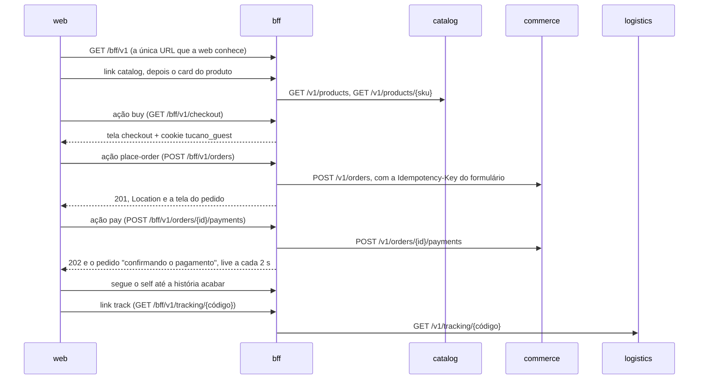

# bff

A porta da web da Tucano, em Node 24 com Fastify 5 e TypeScript executado direto pelo Node. Cada resposta é uma **tela** em [Siren](https://github.com/kevinswiber/siren): o que mostrar, o que a pessoa pode fazer a seguir e para onde cada coisa leva. A web desenha o que chega e segue links e ações; ela nunca monta uma URL nem decide um fluxo. É server-driven UI por hipermídia (HATEOAS), e o porquê está no [ADR 0023](../../docs/adr/0023-server-driven-ui-with-siren.md).

O vocabulário das telas, com um exemplo real de cada uma, está no [contrato](../../contracts/http/bff/README.md). Os exemplos não são ilustração: os testes do BFF montam cada tela com a mesma função que responde a web e comparam com o arquivo, então contrato, BFF e web não se desencontram sem um teste ficar vermelho.

## Um pedido pelos olhos da web



Para ver acontecer, com a stack no ar, dá para andar pela loja só com `curl` e `jq`, seguindo o que cada tela oferece:

```bash
curl -s localhost:8000/bff/v1 | jq '{title, actions: [.actions[].name], links: [.links[].href]}'
curl -s localhost:8000/bff/v1/products | jq '.entities[].properties | {sku, name, price: .price.formatted}'
curl -s -i 'localhost:8000/bff/v1/tracking?code=%20tx02px83txc5goo%20' | grep -i location
```

## Como está organizado

| Caminho | O que tem | Pode usar |
|---|---|---|
| `src/hypermedia/` | o vocabulário Siren: tipos, relações do RFC 8288, endereços, dinheiro, tom, tela, leitor de formulário | `platform` |
| `src/upstream/` | a camada anticorrupção: o único lugar que conhece o JSON do catalog, do commerce e da logistics | `platform` |
| `src/storefront/` | início, catálogo e produto | as fundações e o barrel de `tracking` |
| `src/checkout/` | checkout, o formulário do pedido e o cliente convidado | as fundações e os barrels de `storefront` e `orders` |
| `src/orders/` | a tela do pedido, com a tabela de status, e o pagamento | as fundações |
| `src/tracking/` | a página da entrega e o rastreio por código | as fundações |
| `src/platform/` | a cola com o Fastify: correlation id, logs, problem details, `DomainError` e health checks | nada |
| `src/app.ts`, `src/config.ts`, `src/server.ts` | a montagem, a configuração e o ponto de entrada | tudo |

Cada pasta tem um `index.ts` que diz o que ela exporta, e um módulo só alcança outro por esse barrel. O `test/architecture.test.ts` cobra isso, cobra que as fundações não conheçam nenhuma tela e que as features não formem ciclo. É a mesma regra que o `PackagesMeetThroughTheirFacadesTest` cobra nos serviços PHP: o barrel é o contrato do módulo, e o resto pode mudar sem pedir licença a ninguém.

As telas são funções puras: recebem o que os serviços responderam, já lido e tipado, e devolvem um valor. Só as rotas conhecem o Fastify.

## As decisões, com o que cada uma custa

**Hipermídia em vez de GraphQL.** O fluxo mora no servidor: a web não sabe que depois do checkout vem o pagamento, ela só segue a ação que chegou. Uma regra nova (um passo de endereço, um cartão a mais) muda o BFF e mais ninguém. O custo é uma web genérica, que desenha componentes por classe, e um contrato de vocabulário que precisa de cuidado para não inchar.

**As palavras moram no BFF.** Rótulos de status, nomes de categoria e de transportadora, avisos e mensagens de erro saem daqui, em português. Os serviços continuam falando código (`pending_payment`, `correio-nacional`) e a web continua sem texto de negócio. O custo é repetir alguns nomes que o catálogo e a logística também guardam; um código que o BFF ainda não conhece aparece como código até ganhar nome.

**Uma camada anticorrupção.** O `upstream/` lê o JSON de cada serviço campo a campo, com o mesmo espírito do `EventFields` do PHP. Um serviço que muda o contrato sem avisar vira um 500 com uma linha de log que diz a chamada e o campo, em vez de um `undefined` passeando pela tela. Um campo novo que um serviço antigo ainda não manda (o `trackingCode` antes do commerce aprender a guardá-lo) chega como `null`.

**Cada tela cai sozinha.** Toda chamada tem um prazo para a troca inteira, corpo incluído (`UPSTREAM_TIMEOUT_MS`). Sem resposta a tempo, erro de rede ou um 502, 503 ou 504 viram 503 com `Retry-After` e uma frase em português. O ready do BFF não pergunta aos serviços: com o commerce fora, o catálogo continua abrindo. Cada serviço tem o seu proxy no Toxiproxy (`bff-catalog`, `bff-commerce` e `bff-logistics`), então um laboratório corta uma tela de cada vez.

**Idempotência de ponta a ponta.** Cada formulário que muda alguma coisa nasce com uma chave nova (UUIDv7) num campo escondido, e o BFF a repassa ao commerce como `Idempotency-Key`. Um clique duplo ou um retry manda a mesma chave e recebe o mesmo pedido. Uma recusa não prende a chave, então a pessoa corrige o campo e manda o mesmo formulário de novo.

**Um cliente convidado por navegador.** O laboratório não tem login, e o commerce quer um id de cliente. O checkout dá ao navegador um UUIDv7 no cookie `tucano_guest` (`HttpOnly`, `SameSite=Lax`, `Path=/bff`, `Secure` em produção), e todo pedido daquele navegador vai com ele. É por isso que um retry manda o mesmo corpo com a mesma chave. Num sistema de verdade, o id viria da sessão de quem entrou, nunca do navegador; aqui ele é um pseudônimo funcional, necessário para o checkout, e não diz nada sobre a pessoa.

**Cartão é token, nunca número.** O formulário de pagamento oferece os tokens do PayFake (`tok_visa`, `tok_decline`, `tok_insufficient`), e o BFF recusa qualquer outra coisa antes de chamar o commerce. Nem o BFF nem o commerce veem um número de cartão, o que os deixa fora do escopo de dados de cartão do PCI DSS.

**Tela nenhuma vai para cache.** As respostas saem com `Cache-Control: no-store`, porque cada tela carrega chaves feitas para ela, e um cache compartilhado que entregasse a mesma tela a duas pessoas as faria dividir uma chave.

## Por que Node aqui

A decisão está no [ADR 0014](../../docs/adr/0014-node-for-bff-and-partners.md). O trabalho do BFF é esperar I/O: chamadas a outros serviços, e mais tarde conexões WebSocket que ficam abertas. O event loop de um processo Node de longa duração resolve isso sem um processo por conexão. Comparar com o PHP-FPM, onde cada request começa do zero, faz parte do estudo.

## TypeScript sem build

Não existe etapa de build. O Node 24 executa os arquivos `.ts` direto: antes de rodar, ele troca as anotações de tipo por espaços em branco (type stripping). Linhas e colunas não mudam, então o stack trace aponta para o lugar certo sem source map, e o código que roda é exatamente o que está no repositório.

O preço é usar só sintaxe que some sem deixar código para trás:

- Nada de `enum`, `namespace` com código, parameter properties (`constructor(private readonly x: X)`) nem decorators. Para conjuntos fechados uso union de string literal ou objeto `as const`; para estados, discriminated unions.
- Import relativo com a extensão real (`./app.ts`) e `import type` para o que é só tipo. O Node não sabe o que é tipo e o que é valor, então não tem como adivinhar.
- O Node não lê o `tsconfig.json` e não checa tipo nenhum. Quem checa é o `tsc --noEmit`, com `erasableSyntaxOnly` recusando a sintaxe que o Node não executaria.
- Arquivo `.ts` dentro de `node_modules` não roda, então toda dependência precisa publicar JavaScript. Path alias do `tsconfig` e JSX também ficam de fora.

O `tsc` é o TypeScript 7, o compilador nativo escrito em Go. Ele só checa tipos e não gera nada, então a versão do compilador não muda o que roda.

## Endpoints

Pelo Kong, tudo fica sob `/bff`: o Kong tira o prefixo, então o BFF serve `/v1`, e os links que ele manda já saem com `/bff/v1`.

| Rota | O que responde |
|---|---|
| `GET /v1` | a tela de início, com o rastreio por código e o link do catálogo |
| `GET /v1/products?page=` | o catálogo, com `next` e `prev` quando existem |
| `GET /v1/products/{sku}` | o produto, com a ação `buy` enquanto ele está à venda |
| `GET /v1/checkout?sku=&quantity=` | o checkout, com o formulário do pedido; dá o cookie do cliente convidado |
| `POST /v1/orders` | `201`, `Location` e a tela do pedido |
| `GET /v1/orders/{id}` | o pedido; com `?awaiting=payment`, acompanha o pagamento |
| `POST /v1/orders/{id}/payments` | `202`, `Location` e o pedido acompanhando o pagamento |
| `GET /v1/tracking?code=` | `303` para a página da entrega |
| `GET /v1/tracking/{código}` | a página da entrega, com a linha do tempo; enquanto uma encomenda da frota própria está a caminho da porta, também o link `live` para o entregador ao vivo |
| `GET /health/live` e `GET /health/ready` | o processo está de pé; o ready não depende dos serviços |

Todo erro sai como `application/problem+json` (RFC 9457) com os campos dos serviços PHP: `type`, `title`, `status`, `detail`, `instance` e `correlationId`. Os erros que o BFF cria falam com a pessoa, em português, no `detail`, e um formulário com problemas volta com `errors`, as mensagens por campo, todas de uma vez. Um `DomainError` pode levar `retryAfterSeconds`, que vira o header `Retry-After`, e um 503 de domínio mostra o `detail`, porque diz o que fazer; só o erro inesperado esconde o detalhe e manda o stack para o log.

O link `live` da página da entrega aponta para fora do BFF: `TRACKING_LIVE_PATH` (por padrão `/api/tracking/v1/live`) é o WebSocket do tracking, na mesma origem, pelo Kong ([ADR 0028](../../docs/adr/0028-live-delivery-by-tracking-code.md)). O BFF não segura nenhuma conexão longa; ele só diz, pela hipermídia, onde a web encontra a posição, e só quando ela existe. O exemplo `tracking-live.json` do contrato mostra a tela com o link.

O `X-Correlation-Id` que o Kong coloca no request vira o id do request no Fastify, volta na resposta e segue para cada serviço chamado, então um id só amarra os logs de todos. Uma chamada que falha deixa uma linha `warn` com o serviço, a chamada, o tempo gasto e o erro.

## Configuração

| Variável | Default | Para quê |
|---|---|---|
| `APP_NAME` | `bff` | campo `service` dos logs |
| `APP_ENV` | `production` | `local`, `staging` ou `production`; qualquer outro valor roda como `production`, a mesma regra dos serviços PHP. Em `production`, o cookie do convidado é `Secure` |
| `HOST` | `0.0.0.0` | interface onde o servidor escuta |
| `PORT` | `3000` | porta HTTP |
| `LOG_LEVEL` | `info` | `fatal`, `error`, `warn`, `info`, `debug`, `trace` ou `silent` |
| `CATALOG_URL`, `COMMERCE_URL` e `LOGISTICS_URL` | `http://toxiproxy:18081`, `:18082` e `:18083` | onde cada serviço atende, cada um pelo seu proxy |
| `UPSTREAM_TIMEOUT_MS` | `5000` | a troca inteira com um serviço; fica acima dos 2 s que o commerce dá ao PSP |

Valor inválido impede a subida: o processo sai com código 1 e uma linha `fatal` que lista cada problema. Variável vazia conta como não definida. A referência de todas as variáveis da stack está em [`docs/operations/configuration.md`](../../docs/operations/configuration.md).

## Rodando os checks

Para não depender do Node instalado na máquina, o `make` roda tudo no mesmo `node:24-alpine` da imagem:

```bash
make check s=bff      # npm ci, lint, typecheck e testes
make logs s=bff
```

| Script | O que faz |
|---|---|
| `npm run check` | lint, typecheck e testes, na mesma ordem do CI |
| `npm test` | `node --test` nos `*.test.ts` de `test/` |
| `npm run typecheck` | `tsc --noEmit` |
| `npm run lint` | Biome: formatação, lint e ordem dos imports |
| `npm run format` | aplica as correções do Biome |
| `npm start` | sobe o servidor; `npm run dev` faz o mesmo e reinicia a cada mudança (`node --watch`) |

Os testes não usam rede de verdade além da própria máquina: `test/screens.test.ts` compara cada tela com o exemplo do contrato, `test/journeys.test.ts` sobe um servidor falso que faz o papel dos três serviços e percorre compra, pagamento e rastreio, inclusive com serviço lento, fora do ar e com contrato quebrado, e `test/architecture.test.ts` guarda as fronteiras dos módulos.

A pasta `src/platform/` é idêntica à do [`partners-sim`](../partners-sim/README.md) de propósito, e a CI compara as cópias ([ADR 0016](../../docs/adr/0016-copied-node-platform.md)).

A imagem sai de `docker build -f services/bff/Dockerfile -t chaos-playground/bff .`, da raiz. Ela leva só as dependências de produção, roda como o usuário `node` e trata o `SIGTERM` do `docker stop`: para de aceitar conexões, termina os requests em andamento e sai.

## O que vem depois

- **Tela viva empurrada**: a posição do entregador já chega na hora, pelo tracking; o resto da tela viva ainda pede de novo a cada poucos segundos. Um consumer group `bff.live` lendo `commerce.orders.v2` e `logistics.shipments.v2` pode avisar o navegador na hora, e a tela só busca quando algo mudou.
- **Circuit breaker por serviço**: o timeout já protege a web de um serviço lento; um breaker em memória pouparia o serviço doente de receber chamadas enquanto se recupera.
- **Flags de interface**: avaliadas in-process com o provider do flagd, e a web recebe só o valor já resolvido.
