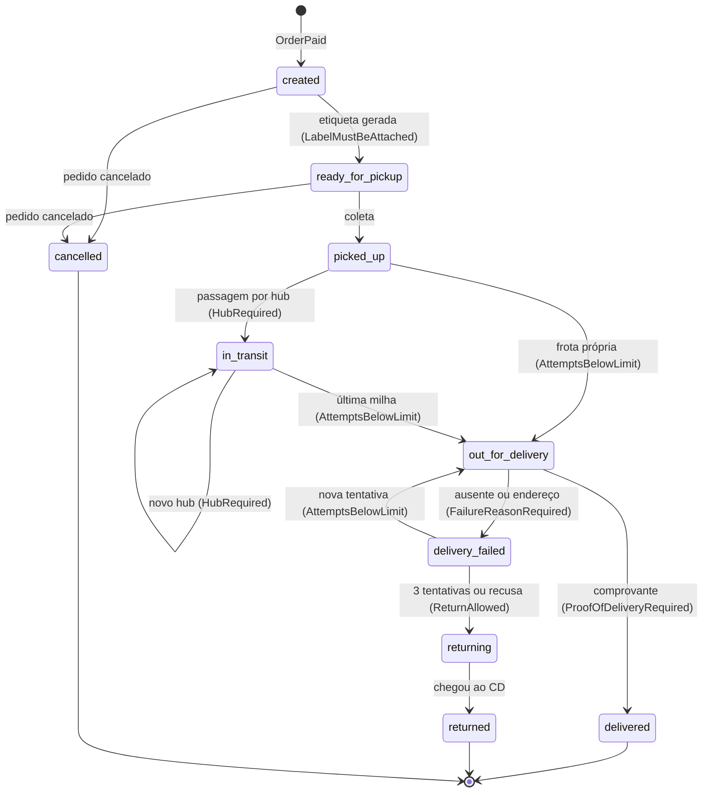
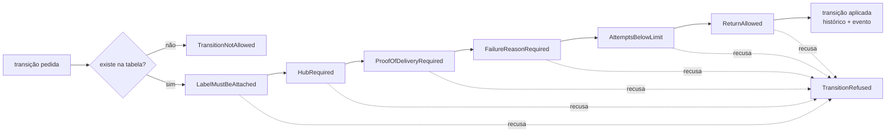
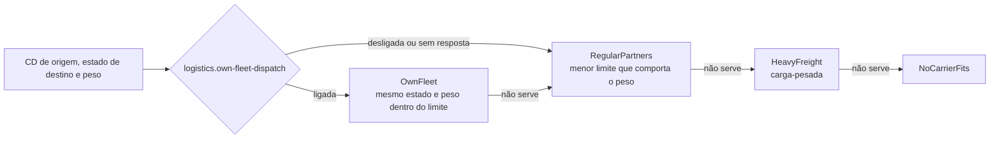
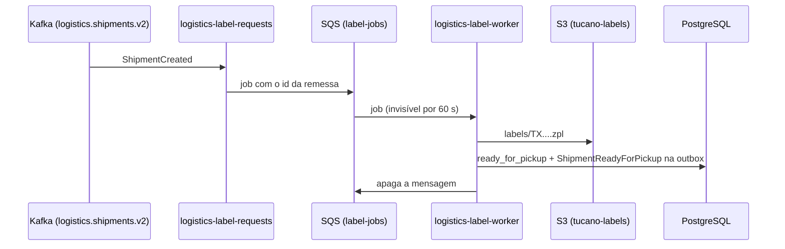

# logistics

Serviço de remessas da Tucano, em Laravel 13 sobre PHP 8.4 (FPM). Aqui fica o núcleo logístico: criar a remessa quando o pedido é pago, escolher a transportadora, gerar a etiqueta e conduzir a entrega pela máquina de estados até o cliente (ou de volta ao CD).

A estrutura é a mesma do [commerce](../commerce/README.md), de propósito: dois núcleos, um jeito só de organizar. Hoje a remessa nasce do `order.paid`, pode ser cancelada pelo `order.cancelled` e ganha a etiqueta pela fila SQS; a coleta e a entrega entram nas próximas fatias.

## Como está organizado

| Pasta | O que tem |
|---|---|
| `src/Shipping` | a remessa e a máquina de estados inteira, a cópia local do catálogo (peso e dimensões) e o consumidor dos eventos de pedido |
| `src/CarrierSelection` | a corrente de regras que escolhe a transportadora |
| `src/Shared` | os ports que todos os pacotes usam: transação, inbox, outbox e o relay |
| `app/` | cola com o Laravel: health checks, correlation id, problem details e o provider de plataforma |
| `config/platform.php` | flags, Snowflake (worker 11) e nome do serviço |
| `config/messaging.php` | brokers do Kafka, pelo Toxiproxy |
| `tests/Contract` | os eventos publicados e as fixtures consumidas, validados contra `contracts/events` |
| `tests/Architecture` | fitness functions (casos de uso documentados) |
| `deptrac.yaml` | regra de dependência entre as camadas |

Cada pacote tem o hexágono completo, descrito em [`src/README.md`](src/README.md). O Shipping chega na escolha de transportadora pelo port de saída `ForChoosingCarriers`, e o adapter `CarrierSelectionChoices` chama o port de entrada do CarrierSelection com valores simples. Na volta, o adapter também traduz as recusas do CarrierSelection em `NoCarrierChosen`, com a mesma categoria, então o Shipping não conhece nenhum tipo do outro pacote. Se a escolha virar um serviço, só o adapter muda.

## A máquina de estados da remessa

É a máquina principal do projeto e segue a tabela de [`docs/architecture/state-machines.md`](../../docs/architecture/state-machines.md). O estado é um backed enum (`ShipmentStatus`) com a tabela num `match` exaustivo; nenhuma flag booleana. Entre parênteses está o guard que cada transição atravessa.



A tabela diz se a transição existe; os guards dizem se ela pode acontecer com os dados que chegaram. Os guards formam uma corrente (Chain of Responsibility): cada um é uma classe pequena, com um `if` só, que confere a própria regra e passa o pedido adiante. O primeiro que recusar lança `TransitionRefused` com o motivo.



- Falta de evidência (etiqueta, hub, comprovante ou motivo da falha) é `InvalidInput`; estourar as tentativas ou voltar sem justificativa é `Conflict`. Transição fora da tabela é `TransitionNotAllowed`, também `Conflict`.
- Cada transição aplicada muda o estado, sobe a versão, acrescenta uma linha ao histórico (`shipment_transitions`, com o motivo e o hub) e registra um evento de domínio. O tipo do evento é o nome do estado alcançado (`tucano.logistics.shipment.picked_up`), exatamente a lista de `docs/architecture/events.md`.
- A máquina inteira já mora no domínio e cada transição e cada guard têm teste de unidade, mas por enquanto só `created`, `ready_for_pickup` e `cancelled` são movidos por casos de uso.

## Criar e cancelar a remessa

O worker `logistics:order-intake` lê `commerce.orders.v2` no consumer group `logistics.order-intake`. O endereço chega no modelo da [ADR 0020](../../docs/adr/0020-address-by-thoroughfare-and-divisions.md) e vira o destino da remessa pelo `Address::fromArray`.

| Evento | O que acontece |
|---|---|
| `order.paid` | cria a remessa ([UC-SHP-01](../../docs/use-cases/UC-SHP-01-create-shipment.md)): um volume por item do pedido (peso unitário vezes a quantidade, e as unidades empilhadas na altura), transportadora pela corrente, código de rastreio, remessa em `created` e `ShipmentCreated` na outbox |
| `order.cancelled` de pedido pago | cancela a remessa que ainda está no CD ([UC-SHP-09](../../docs/use-cases/UC-SHP-09-cancel-shipment.md)) e grava `ShipmentCancelled` na outbox; sem remessa ainda, registra o pedido em `cancelled_orders`, e um `order.paid` que chegue depois (replay da DLQ) não despacha |
| `order.cancelled` de pedido não pago | ignorado sem tocar no banco: pedido que não foi pago nunca teve remessa |
| os outros | ignorados |

A marca na inbox, a remessa com os volumes e o histórico, e o evento na outbox entram na mesma transação. Evento repetido encontra a marca e não muda nada; o `UNIQUE (order_id)` de `shipments` é a última barreira.

Quando algo dá errado, a categoria do erro de domínio decide o destino da mensagem:

| Situação | Destino |
|---|---|
| evento ilegível (fora do contrato) | `dlq.logistics.order-intake` na hora, sem retry |
| produto ainda sem snapshot (`Unavailable`) | retry com backoff por até meio minuto, porque a cópia do catálogo pode estar chegando junto (os dois workers sobem ao mesmo tempo); se persistir, DLQ |
| nenhuma transportadora serve, CD desconhecido, remessa que já saiu do CD | DLQ na hora, com um warning no log, porque uma pessoa precisa olhar |
| conexão com o banco perdida | retry sem limite: a partição espera o banco voltar, e cada tentativa sai em warning no log |
| outra falha inesperada | retry com backoff; se persistir, DLQ |

O correlation id do pedido segue para o log e para o evento publicado, e o `causationid` do evento novo é o id do evento de pedido que o causou.

## A escolha da transportadora

A escolha ([UC-SHP-02](../../docs/use-cases/UC-SHP-02-choose-carrier.md)) é outra corrente de regras sobre a tabela `carriers`. Os limites de peso vêm da tabela; as regras ficam no código.



- A frota própria (`tucano-express`) só entrega no estado do CD de origem e até o limite dela.
- Entre os parceiros regulares, leva o de menor limite que ainda comporta o peso; no empate, o menor código. Os caminhões grandes ficam livres para o que só eles levam.
- A flag é um ops toggle: desligada, ela tira o primeiro elo da corrente. Se o flagd não responder, o fallback também é desligada, porque parceiro entrega em qualquer lugar.

## Código de rastreio

O código é um Snowflake do `SnowflakeGenerator`, guardado em `BIGINT` e mostrado como `TX` mais 13 símbolos em Base32 de Crockford (`TX02PQRFBTW5G03`). O worker 11 é o PHP-FPM e o 12 é o `logistics-order-intake`, então o próprio código diz em que processo e em que milissegundo a remessa nasceu.

## Endpoints

| Rota | Pelo Kong | O que faz |
|---|---|---|
| `GET /health/live` | `/api/logistics/health/live` | o processo está de pé |
| `GET /health/ready` | `/api/logistics/health/ready` | PostgreSQL e Redis respondem, com a latência de cada um |

Erros saem como `application/problem+json` (RFC 9457), no mesmo formato do commerce.

## Workers

Os workers usam a mesma imagem da API, cada um com um comando de longa duração, e param com `SIGTERM` depois de terminar a mensagem atual. O compose declara `stop_signal: SIGTERM` porque a imagem base herda o `SIGQUIT` do PHP-FPM.

| Serviço no compose | Comando | O que faz |
|---|---|---|
| `logistics-outbox-relay` | `php artisan logistics:relay-outbox` | publica a outbox em `logistics.shipments.v2` com `FOR UPDATE SKIP LOCKED`; a flag `chaos.logistics.outbox-relay-paused` pausa a publicação sem derrubar o processo |
| `logistics-catalog-sync` | `php artisan logistics:sync-catalog` | mantém peso e dimensões em `product_snapshots` a partir de `catalog.products.v1` ([UC-SHP-11](../../docs/use-cases/UC-SHP-11-sync-catalog.md)); snapshot ilegível vai para `dlq.logistics.catalog-sync` |
| `logistics-order-intake` | `php artisan logistics:order-intake` | cria e cancela remessas a partir de `commerce.orders.v2`; roda com `SNOWFLAKE_WORKER_ID=12` |
| `logistics-label-requests` | `php artisan logistics:request-labels` | ponte entre o log e a fila: cada `ShipmentCreated` de `logistics.shipments.v2` vira um job na fila `label-jobs` (SQS); com o SQS fora, a partição espera |
| `logistics-label-worker` | `php artisan queue:work sqs --queue=label-jobs` | gera a etiqueta em ZPL, grava no S3 e move a remessa para `ready_for_pickup` ([UC-SHP-03](../../docs/use-cases/UC-SHP-03-generate-label.md)); três tentativas, e depois `failed_jobs` |
| `logistics-journey-reconciler` | `php artisan logistics:reconcile-journeys` | compara com o histórico da transportadora cada remessa que passa 60 s sem notícia e aplica os passos que faltam ([UC-SHP-12](../../docs/use-cases/UC-SHP-12-reconcile-journeys.md)) |
| `logistics-pickup-bookings` | `php artisan logistics:book-pickups` | agenda a coleta na transportadora de cada remessa pronta ([UC-SHP-04](../../docs/use-cases/UC-SHP-04-record-pickup.md)), com o id da remessa como `Idempotency-Key`; com a transportadora fora, a partição espera |

## A etiqueta

A etiqueta sai em ZPL, a linguagem das impressoras térmicas: é texto, e a impressora desenha o código de barras Code 128 do código de rastreio. Ela vai para o bucket `tucano-labels`, em `labels/<código de rastreio>.zpl`, e só então a remessa passa para `ready_for_pickup`, com o `ShipmentReadyForPickup` na outbox.



- O Kafka é o log e o SQS a fila de trabalho: o pedido de etiqueta parte do evento que a outbox já garantiu, sem dual write.
- O job tenta três vezes (espera 5 s e depois 20 s), com timeout de 30 s, abaixo da visibilidade de 60 s da fila. Esgotadas as tentativas, ele fica em `failed_jobs`, e o `php artisan queue:retry all` o devolve à fila. Um worker que morre no meio não registra nada; depois de três entregas, o SQS move a mensagem para `label-jobs-dlq`.
- A flag `chaos.logistics.label-failure-rate` faz parte das gravações falhar. O experimento está no [laboratório da fila de etiquetas](../../docs/labs/label-queue.md).

## A jornada até a porta

Com a etiqueta pronta, o `logistics-pickup-bookings` agenda a coleta na CarrierFake, que faz o papel de todas as transportadoras do laboratório. Daí em diante quem conta a jornada é a transportadora, por webhook assinado (`POST /v1/webhooks/carriers`, com `Carrier-Signature`), e cada evento vira um passo da máquina de estados:

| Evento da transportadora | Passo da remessa | Caso de uso |
|---|---|---|
| `parcel.picked_up` | `picked_up` | [UC-SHP-04](../../docs/use-cases/UC-SHP-04-record-pickup.md) |
| `parcel.hub_scanned` | `in_transit`, com o hub no histórico | [UC-SHP-05](../../docs/use-cases/UC-SHP-05-record-hub-scan.md) |
| `parcel.out_for_delivery` | `out_for_delivery`, com o número da visita | [UC-SHP-06](../../docs/use-cases/UC-SHP-06-dispatch-for-delivery.md) |
| `parcel.delivered` | `delivered`, com o comprovante em `delivery_attempts` | [UC-SHP-07](../../docs/use-cases/UC-SHP-07-record-delivery-outcome.md) |
| `parcel.delivery_failed` | `delivery_failed`, com o motivo em `delivery_attempts` | [UC-SHP-07](../../docs/use-cases/UC-SHP-07-record-delivery-outcome.md) |
| `parcel.returning` e `parcel.returned` | `returning` e `returned` | [UC-SHP-08](../../docs/use-cases/UC-SHP-08-return-to-sender.md) |

- Os cinco casos de uso dividem o `ShipmentProgress`: numa transação só, a marca na inbox, a remessa travada pelo código de rastreio, o passo pelos guards, o histórico, a visita e o evento na outbox. Um passo recusado desfaz tudo, inclusive a marca na inbox.
- A transportadora manda os eventos de uma remessa um de cada vez. Um evento que chega antes da vez dele (porque o anterior se perdeu ou atrasou) recebe `409`, e a transportadora reenvia depois.
- Quem recebeu a encomenda fica em `delivery_attempts`; os eventos publicados não levam o nome nem o documento.
- Um webhook perdido trava a jornada até o `logistics-journey-reconciler` passar: depois de 60 s sem notícia, ele lê o histórico da transportadora e aplica, em ordem, os passos que faltam, pelos mesmos casos de uso do webhook ([UC-SHP-12](../../docs/use-cases/UC-SHP-12-reconcile-journeys.md)). O webhook e o histórico chegam no mesmo JSON, e o `CarrierFakeEvents` traduz os dois para `CarrierEvent`.
- Um hub scan que chega depois da saída para entrega é notícia velha: a máquina pode pular hubs, então ele vira `obsolete`, fica marcado na inbox e não move nada. O [laboratório dos webhooks perdidos](../../docs/labs/lost-carrier-events.md) conta como achei esse caso.

## Eventos publicados

| Evento | Contrato do `data` |
|---|---|
| `tucano.logistics.shipment.created` | [`logistics.shipment.created.schema.json`](../../contracts/events/logistics.shipment.created.schema.json) |
| `tucano.logistics.shipment.cancelled` | [`logistics.shipment.cancelled.schema.json`](../../contracts/events/logistics.shipment.cancelled.schema.json) |
| `tucano.logistics.shipment.ready_for_pickup` | [`logistics.shipment.ready_for_pickup.schema.json`](../../contracts/events/logistics.shipment.ready_for_pickup.schema.json) |
| `tucano.logistics.shipment.picked_up` | [`logistics.shipment.picked_up.schema.json`](../../contracts/events/logistics.shipment.picked_up.schema.json) |
| `tucano.logistics.shipment.in_transit` | [`logistics.shipment.in_transit.schema.json`](../../contracts/events/logistics.shipment.in_transit.schema.json) |
| `tucano.logistics.shipment.out_for_delivery` | [`logistics.shipment.out_for_delivery.schema.json`](../../contracts/events/logistics.shipment.out_for_delivery.schema.json) |
| `tucano.logistics.shipment.delivered` | [`logistics.shipment.delivered.schema.json`](../../contracts/events/logistics.shipment.delivered.schema.json) |
| `tucano.logistics.shipment.delivery_failed` | [`logistics.shipment.delivery_failed.schema.json`](../../contracts/events/logistics.shipment.delivery_failed.schema.json) |
| `tucano.logistics.shipment.returning` | [`logistics.shipment.returning.schema.json`](../../contracts/events/logistics.shipment.returning.schema.json) |
| `tucano.logistics.shipment.returned` | [`logistics.shipment.returned.schema.json`](../../contracts/events/logistics.shipment.returned.schema.json) |

O `ShipmentCreated` leva o destino até o município, com as divisões de estado e município e o CEP. O tópico guarda os eventos por uma semana e nenhum consumidor precisa do logradouro, do número nem do nome de quem recebe, então esses dados ficam no banco da logística. Todo evento da máquina de estados tem contrato.

## Rodando

```bash
make up
make check s=logistics   # Pint, Larastan nível 8, Deptrac e PHPUnit contra a stack
make logs s=logistics
```

O banco é o `logistics`, no mesmo PostgreSQL do commerce mas com role própria: o role `logistics` não consegue nem conectar no banco do commerce. É database-per-service numa instância compartilhada, com o isolamento garantido por permissão. Os testes rodam no `logistics_test`, para não apagar os dados da stack.

## Decisões do runtime

- **Snowflake no FPM**: cada filho do pool é um processo isolado, então a sequência fica no APCu (`ApcuSequence`). Workers de CLI usam `InMemorySequence`.
- **Flags**: `Flagd::connect` com cache em APCu no FPM e em memória no CLI. Ambiente desconhecido conta como produção.
- **Dependências passam pelo Toxiproxy** (`DB_HOST=toxiproxy`, `DB_PORT=15433`, `KAFKA_BROKERS=toxiproxy:19092`), para os experimentos de caos funcionarem sem mudar nada no serviço.
